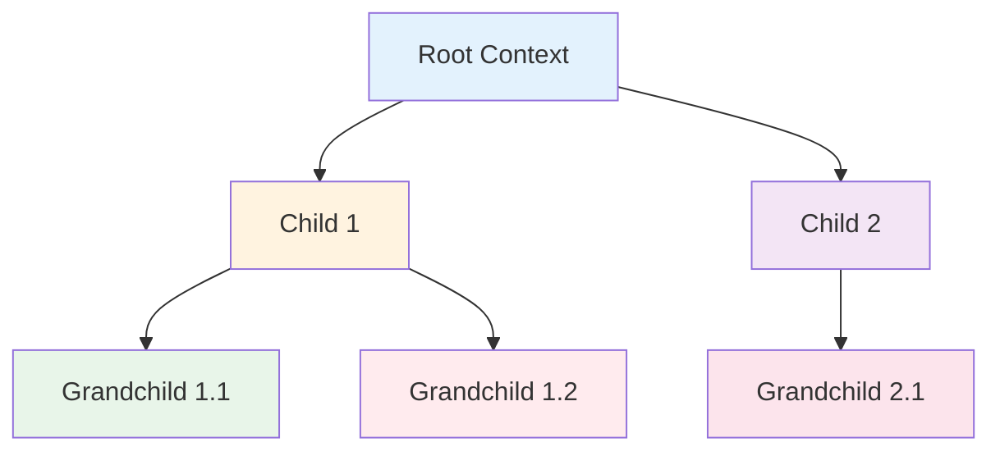

import { Badge } from "@rspress/core/theme";
import { Callout } from "@rspress/core/theme-original";

# Context

<Badge text="高级内容" type="danger" />

context 包是 Go 中实现取消、超时和传递请求范围数据的标准方式。

## Context 基础

<Badge text="中级开发者" type="warning" />

### Context 接口

```go
type Context interface {
    // 返回 context 被取消的时间
    Deadline() (deadline time.Time, ok bool)

    // 返回一个只读 channel，当 context 被取消时关闭
    Done() <-chan struct{}

    // 返回 context 的错误原因
    Err() error

    // 返回 context 关联的值
    Value(key interface{}) interface{}
}
```

### 创建 Context

```go
package main

import (
    "context"
    "fmt"
    "time"
)

func main() {
    // Background - 根 context
    ctx := context.Background()
    fmt.Println("Background:", ctx)

    // TODO - 用于不确定何时完成的操作
    ctx = context.TODO()
    fmt.Println("TODO:", ctx)

    // WithCancel - 可取消的 context
    ctx, cancel := context.WithCancel(context.Background())
    defer cancel()  // 确保资源被释放

    // WithTimeout - 带超时的 context
    ctx, cancel = context.WithTimeout(context.Background(), 5*time.Second)
    defer cancel()

    // WithDeadline - 带截止时间的 context
    deadline := time.Now().Add(10 * time.Second)
    ctx, cancel = context.WithDeadline(context.Background(), deadline)
    defer cancel()

    // WithValue - 带值的 context
    ctx = context.WithValue(context.Background(), "key", "value")
    fmt.Println("Value:", ctx.Value("key"))
}
```

## 取消机制

<Badge text="中级开发者" type="warning" />

### 基本取消

```go
package main

import (
    "context"
    "fmt"
    "time"
)

func operation(ctx context.Context) {
    for {
        select {
        case <-ctx.Done():
            fmt.Println("操作被取消:", ctx.Err())
            return
        default:
            fmt.Println("工作中...")
            time.Sleep(500 * time.Millisecond)
        }
    }
}

func main() {
    // 创建可取消的 context
    ctx, cancel := context.WithCancel(context.Background())

    // 在 goroutine 中使用
    go operation(ctx)

    // 模拟运行一段时间后取消
    time.Sleep(2 * time.Second)
    cancel()

    // 等待 goroutine 结束
    time.Sleep(time.Second)
}
```

### 超时取消

```go
package main

import (
    "context"
    "fmt"
    "time"
)

func main() {
    // 3 秒后自动取消
    ctx, cancel := context.WithTimeout(context.Background(), 3*time.Second)
    defer cancel()

    ch := make(chan string)

    go func() {
        time.Sleep(5 * time.Second)  // 模拟耗时操作
        ch <- "完成"
    }()

    select {
    case <-ctx.Done():
        fmt.Println("超时:", ctx.Err())
    case result := <-ch:
        fmt.Println("结果:", result)
    }
}
```

<Callout type="warning">
**重要**：调用 cancel() 是重要的，即使 context 已超时，也需要释放资源。
</Callout>

## 传递值

<Badge text="高级开发者" type="danger" />

### Context Values

```go
package main

import (
    "context"
    "fmt"
)

// 定义 context key 类型（避免冲突）
type contextKey string

const (
    userIDKey   contextKey = "userID"
    requestIDKey contextKey = "requestID"
)

func processRequest(ctx context.Context) {
    // 获取用户 ID
    if userID := ctx.Value(userIDKey); userID != nil {
        fmt.Printf("用户 ID: %v\n", userID)
    }

    // 获取请求 ID
    if requestID := ctx.Value(requestIDKey); requestID != nil {
        fmt.Printf("请求 ID: %v\n", requestID)
    }
}

func main() {
    // 创建带值的 context
    ctx := context.Background()
    ctx = context.WithValue(ctx, userIDKey, 12345)
    ctx = context.WithValue(ctx, requestIDKey, "req-67890")

    processRequest(ctx)
}
```

<Callout type="danger">
**警告**：context values 应该用于传递请求范围的数据，如请求 ID、用户认证信息等。不要用于传递可选参数。
</Callout>

### 最佳实践

```go
// ❌ 不推荐：使用 context 传递函数参数
func Bad(ctx context.Context) {
    data := ctx.Value("data").([]string)
    // ...
}

// ✅ 推荐：使用函数参数
func Good(data []string) {
    // ...
}

// context 只用于取消、超时、传递请求范围数据
func Better(ctx context.Context, data []string) {
    select {
    case <-ctx.Done():
        return
    default:
        // 处理 data
    }
}
```

## 实战模式

<Badge text="高级开发者" type="danger" />

### 模式 1: HTTP 服务超时

```go
package main

import (
    "context"
    "fmt"
    "io"
    "net/http"
    "time"
)

func fetchURL(ctx context.Context, url string) ([]byte, error) {
    // 创建带超时的 request
    req, err := http.NewRequestWithContext(ctx, "GET", url, nil)
    if err != nil {
        return nil, err
    }

    client := &http.Client{}
    resp, err := client.Do(req)
    if err != nil {
        return nil, err
    }
    defer resp.Body.Close()

    return io.ReadAll(resp.Body)
}

func main() {
    // 3 秒超时
    ctx, cancel := context.WithTimeout(context.Background(), 3*time.Second)
    defer cancel()

    data, err := fetchURL(ctx, "https://example.com")
    if err != nil {
        fmt.Println("错误:", err)
        return
    }

    fmt.Println("获取了", len(data), "字节")
}
```

### 模式 2: 数据库查询超时

```go
package main

import (
    "context"
    "fmt"
    "time"
    "database/sql"
)

type User struct {
    ID    int
    Name  string
    Email string
}

func GetUser(ctx context.Context, db *sql.DB, id int) (*User, error) {
    var user User
    query := `SELECT id, name, email FROM users WHERE id = $1`

    // QueryRowContext 会使用 context 的取消和超时
    err := db.QueryRowContext(ctx, query, id).Scan(
        &user.ID,
        &user.Name,
        &user.Email,
    )

    if err != nil {
        return nil, err
    }

    return &user, nil
}

func main() {
    db, _ := sql.Open("postgres", "dsn")
    defer db.Close()

    // 5 秒超时
    ctx, cancel := context.WithTimeout(context.Background(), 5*time.Second)
    defer cancel()

    user, err := GetUser(ctx, db, 123)
    if err != nil {
        if err == context.DeadlineExceeded {
            fmt.Println("查询超时")
        } else {
            fmt.Println("查询失败:", err)
        }
        return
    }

    fmt.Printf("用户: %+v\n", user)
}
```

### 模式 3: 并发任务取消

```go
package main

import (
    "context"
    "fmt"
    "sync"
    "time"
)

func worker(ctx context.Context, id int, wg *sync.WaitGroup) {
    defer wg.Done()

    for {
        select {
        case <-ctx.Done():
            fmt.Printf("Worker %d: 被取消\n", id)
            return
        default:
            fmt.Printf("Worker %d: 工作中...\n", id)
            time.Sleep(500 * time.Millisecond)
        }
    }
}

func main() {
    ctx, cancel := context.WithCancel(context.Background())

    var wg sync.WaitGroup
    for i := 1; i <= 3; i++ {
        wg.Add(1)
        go worker(ctx, i, &wg)
    }

    // 2 秒后取消所有 worker
    time.Sleep(2 * time.Second)
    cancel()

    wg.Wait()
    fmt.Println("所有 worker 已停止")
}
```

### 模式 4: 级联 Context

```go
package main

import (
    "context"
    "fmt"
    "time"
)

func handleRequest(ctx context.Context) error {
    // 为子操作添加超时
    ctx, cancel := context.WithTimeout(ctx, 2*time.Second)
    defer cancel()

    // 模拟子操作
    select {
    case <-time.After(3 * time.Second):
        fmt.Println("操作完成")
        return nil
    case <-ctx.Done():
        return ctx.Err()
    }
}

func main() {
    // 父 context - 10 秒超时
    parentCtx, parentCancel := context.WithTimeout(context.Background(), 10*time.Second)
    defer parentCancel()

    err := handleRequest(parentCtx)
    if err != nil {
        fmt.Println("请求失败:", err)
    }
}
```

## Context 传播规则

<Badge text="高级开发者" type="danger" />

### 传播规则

```go
// 1. 父 context 被取消时，所有子 context 自动取消
parent, cancel := context.WithCancel(context.Background())
child1, _ := context.WithCancel(parent)
child2, _ := context.WithCancel(parent)

cancel()  // 取消父 context
// child1 和 child2 也被取消

// 2. 父 context 超时时，子 context 不能延长超时时间
parent, _ := context.WithTimeout(context.Background(), 5*time.Second)
child, _ := context.WithTimeout(parent, 10*time.Second)  // 无效：5秒后仍会取消

// 3. 子 context 可以在父 context 之前取消
parent, cancel := context.WithCancel(context.Background())
child, childCancel := context.WithCancel(parent)

childCancel()  // 只取消子 context
// parent 仍然有效
```

### Context 树



## 性能考虑

<Badge text="高级开发者" type="danger" />

### Context 开销

```go
// context 创建和传递的开销很小
func BenchmarkContext(b *testing.B) {
    ctx := context.Background()
    b.ResetTimer()

    for i := 0; i < b.N; i++ {
        // 每次迭代都创建新的 context
        ctx, _ := context.WithTimeout(ctx, time.Hour)
        _ = ctx
    }
}

// 结果：每次操作约 50-100ns
```

### 避免 Value 过度使用

```go
// ❌ 不好：使用 context.Value 传递参数
func process(ctx context.Context) {
    config := ctx.Value("config").(*Config)
    data := ctx.Value("data").([]byte)
    // ...
}

// ✅ 好：直接传递参数
func process(config *Config, data []byte) {
    // ...
}
```

## 常见陷阱

<Badge text="所有开发者" type="info" />

### 陷阱 1: 忘记调用 cancel

```go
// ❌ 忘记 cancel，资源泄漏
ctx, _ := context.WithTimeout(context.Background(), 5*time.Second)
// 忘记 defer cancel()

// ✅ 总是 defer cancel
ctx, cancel := context.WithTimeout(context.Background(), 5*time.Second)
defer cancel()
```

### 陷阱 2: 检查 ctx.Done()

```go
// ❌ 没有检查 context
func badFunc(ctx context.Context) {
    for {
        // 长时间运行，不检查取消
        time.Sleep(time.Second)
    }
}

// ✅ 定期检查 context
func goodFunc(ctx context.Context) {
    ticker := time.NewTicker(100 * time.Millisecond)
    defer ticker.Stop()

    for {
        select {
        case <-ctx.Done():
            return
        case <-ticker.C:
            // 处理
        }
    }
}
```

### 陷阱 3: 存储 context

```go
// ❌ 不要存储 context
type Server struct {
    ctx context.Context  // 错误！
}

// ✅ 在需要时传递
func (s *Server) HandleRequest(ctx context.Context) error {
    // ...
}
```

## 练习

<Badge text="实战练习" type="success" />

### 练习：实现带超时的 HTTP 客户端

实现一个支持重试和超时的 HTTP 客户端：

```go
// TODO: 实现
type HTTPClient struct {
    timeout time.Duration
    retries int
}

func (c *HTTPClient) Do(ctx context.Context, req *http.Request) (*http.Response, error) {
    // 实现重试逻辑
    // 每次重试使用独立的 timeout
}
```

<details>
<summary>查看答案</summary>

```go
package main

import (
    "context"
    "fmt"
    "io"
    "net/http"
    "time"
)

type HTTPClient struct {
    client  *http.Client
    timeout time.Duration
    retries int
}

func NewHTTPClient(timeout time.Duration, retries int) *HTTPClient {
    return &HTTPClient{
        client:  &http.Client{Timeout: timeout},
        timeout: timeout,
        retries: retries,
    }
}

func (c *HTTPClient) Do(ctx context.Context, req *http.Request) (*http.Response, error) {
    var lastErr error
    var resp *http.Response

    for attempt := 0; attempt <= c.retries; attempt++ {
        if attempt > 0 {
            // 指数退避
            backoff := time.Duration(attempt) * 100 * time.Millisecond
            select {
            case <-time.After(backoff):
            case <-ctx.Done():
                return nil, ctx.Err()
            }
        }

        // 为每次尝试创建独立的超时
        attemptCtx, cancel := context.WithTimeout(ctx, c.timeout)

        // 克隆 request 并设置新的 context
        attemptReq := req.Clone(attemptCtx)
        resp, lastErr = c.client.Do(attemptReq)

        cancel()

        if lastErr == nil {
            return resp, nil
        }

        // 检查是否应该重试
        if !shouldRetry(lastErr) {
            return nil, lastErr
        }
    }

    return nil, lastErr
}

func shouldRetry(err error) bool {
    // 网络错误重试，其他不重试
    if err == nil {
        return false
    }
    return true
}

func main() {
    client := NewHTTPClient(5*time.Second, 3)

    req, _ := http.NewRequest("GET", "https://example.com", nil)

    ctx, cancel := context.WithTimeout(context.Background(), 30*time.Second)
    defer cancel()

    resp, err := client.Do(ctx, req)
    if err != nil {
        fmt.Println("请求失败:", err)
        return
    }
    defer resp.Body.Close()

    data, _ := io.ReadAll(resp.Body)
    fmt.Println("响应:", string(data))
}
```

</details>

---

## 总结

### 关键要点

| 读者水平 | 核心要点 |
|---------|---------|
| <Badge text="中级开发者" type="warning" /> | 使用 WithTimeout/WithDeadline 实现超时。总是调用 cancel()。 |
| <Badge text="高级开发者" type="danger" /> | 理解 context 传播规则。避免过度使用 context.Value。 |

### 速查表

```go
// 创建
context.Background()
context.TODO()
context.WithCancel(parent)
context.WithTimeout(parent, d)
context.WithDeadline(parent, t)
context.WithValue(parent, key, val)

// 使用
<-ctx.Done()
ctx.Err()
ctx.Value(key)
```

### 下一步

- [← 时间处理](./time.mdx)
- [数学与随机 →](./math-rand.mdx)
