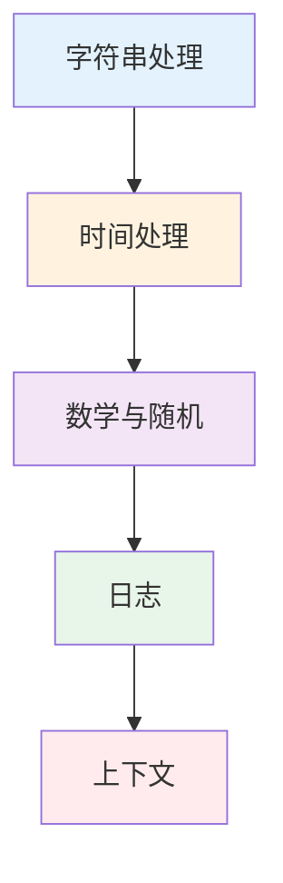

import { Badge } from "@rspress/core/theme";

# Standard Library

<Badge text="实用工具" type="success" />

Go 标准库提供了丰富的功能，从字符串处理到网络编程，几乎涵盖了日常开发的所有需求。

## 学习路径



## 模块概览

| 模块 | 内容 | 难度 |
|------|------|------|
| [字符串处理](./strings-strconv.mdx) | strings、strconv 包 | <Badge text="初级" type="tip" /> |
| [时间处理](./time.mdx) | time 包、时间格式化 | <Badge text="初级" type="tip" /> |
| [数学与随机](./math-rand.mdx) | math、rand 包 | <Badge text="初级" type="tip" /> |
| [日志](./log.mdx) | log 包、结构化日志 | <Badge text="中级" type="warning" /> |
| [上下文](./context.mdx) | context 包、取消机制 | <Badge text="高级" type="danger" /> |

## 核心包介绍

### strings - 字符串操作

```go
// 常用操作
strings.Contains("hello", "ell")  // true
strings.HasPrefix("hello", "he")  // true
strings.HasSuffix("hello", "lo")  // true
strings.Index("hello", "l")       // 2
strings.Join([]string{"a", "b"}, ",")  // "a,b"
strings.Split("a,b,c", ",")       // ["a", "b", "c"]
strings.Replace("hello", "l", "L", -1)  // "heLLo"
strings.ToLower("HELLO")          // "hello"
strings.TrimSpace("  hello  ")    // "hello"
```

### strconv - 类型转换

```go
// 字符串转数值
i, _ := strconv.Atoi("42")
f, _ := strconv.ParseFloat("3.14", 64)
b, _ := strconv.ParseBool("true")

// 数值转字符串
s := strconv.Itoa(42)
s = strconv.FormatFloat(3.14, 'f', 2, 64)
s = strconv.FormatBool(true)
```

### time - 时间处理

```go
// 获取当前时间
now := time.Now()

// 格式化时间（注意：Go 使用特定参考时间）
fmt.Println(now.Format("2006-01-02 15:04:05"))

// 解析时间
t, _ := time.Parse("2006-01-02", "2024-03-15")

// 时间计算
t.Add(24 * time.Hour)       // 加一天
t.Sub(now)                   // 时间差
```

### context - 上下文

```go
// 创建带超时的上下文
ctx, cancel := context.WithTimeout(context.Background(), 5*time.Second)
defer cancel()

// 在 goroutine 中使用
go func() {
    select {
    case <-ctx.Done():
        fmt.Println("操作超时")
    }
}()
```

## 读者指南

### <Badge text="初级开发者" type="tip" />

1. [字符串处理](./strings-strconv.mdx) - strings、strconv 基础
2. [时间处理](./time.mdx) - time 包基础用法
3. [数学与随机](./math-rand.mdx) - 基本数学运算

### <Badge text="中级开发者" type="warning" />

1. [日志](./log.mdx) - 结构化日志
2. [上下文](./context.mdx) - context 理解和使用
3. 高级字符串操作

### <Badge text="高级开发者" type="danger" />

1. context 的高级用法
2. 性能优化
3. 自定义日志系统

## 快速参考

### 字符串操作

```go
// 查找
strings.Contains(s, substr)
strings.HasPrefix(s, prefix)
strings.Count(s, substr)

// 转换
strings.ToLower(s)
strings.ToUpper(s)
strings.TrimSpace(s)

// 分割和连接
strings.Split(s, sep)
strings.Join(elems, sep)
```

### 类型转换

```go
// 字符串 -> 数值
strconv.Atoi(s)
strconv.ParseFloat(s, 64)
strconv.ParseInt(s, 10, 64)

// 数值 -> 字符串
strconv.Itoa(i)
strconv.FormatFloat(f, 'f', -1, 64)
```

### 时间操作

```go
// 当前时间
time.Now()

// 格式化（重要：2006-01-02 15:04:05）
t.Format("2006-01-02")

// 解析
time.Parse("2006-01-02", s)

// 计算
t.Add(duration)
t.Sub(t2)
```

## 相关资源

- [Go 标准库文档](https://pkg.go.dev/std)
- [Strings 包](https://pkg.go.dev/strings)
- [Time 包](https://pkg.go.dev/time)

---

[← 返回 Go 首页](/golang/) | [开始学习：字符串处理 →](./strings-strconv.mdx)
