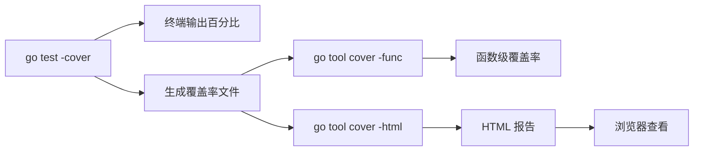

import { Badge } from "@rspress/core/theme";
import { Callout } from "@rspress/core/theme-original";

# Test Coverage

<Badge text="初级" type="info" /> <Badge text="Go 1.0+" type="info" />

测试覆盖率衡量代码被测试执行的程度，是评估测试质量的重要指标。

## 基础用法

### 查看覆盖率

```bash
# 显示覆盖率百分比
go test -cover

# 示例输出
# PASS
# coverage: 85.7% of statements
```

```go
// calc.go
package calc

func Add(a, b int) int {
    return a + b
}

func Subtract(a, b int) int {
    return a - b
}

func Multiply(a, b int) int {
    return a * b
}

// 部分测试的文件
// calc_test.go
package calc

import "testing"

func TestAdd(t *testing.T) {
    if Add(2, 3) != 5 {
        t.Error("Add(2, 3) != 5")
    }
}

func TestMultiply(t *testing.T) {
    if Multiply(2, 3) != 6 {
        t.Error("Multiply(2, 3) != 6")
    }
}
```

```bash
$ go test -cover
PASS
coverage: 66.7% of statements  # Subtract 未被测试
```

### 详细覆盖率报告

```bash
# 生成覆盖率文件
go test -coverprofile=coverage.out

# 生成 HTML 报告
go tool cover -html=coverage.out

# 在浏览器中打开
go tool cover -html=coverage.out -o coverage.html
```

### 按函数查看覆盖率

```bash
# 显示每个函数的覆盖率
go tool cover -func=coverage.out

# 输出示例
# calc.go:8:    Add          100.0%
# calc.go:12:   Subtract       0.0%
# calc.go:16:   Multiply     100.0%
# total:        statements    66.7%
```

## 覆盖率模式

```bash
# set: 默认模式，记录是否执行
go test -covermode=set -coverprofile=coverage.out

# count: 记录执行次数
go test -covermode=count -coverprofile=coverage.out

# atomic: 并发安全的计数模式
go test -covermode=atomic -coverprofile=coverage.out
```

<Callout type="info" title="模式选择">
  <strong>set</strong>：快速，适合一般检查

  <strong>count</strong>：可以看到热点代码，但不是并发安全的

  <strong>atomic</strong>：并发安全，适合并行测试，但有性能开销
</Callout>

## 覆盖率目标

### 常见标准

```bash
# 设置覆盖率目标
go test -coverprofile=coverage.out

# 检查是否达到目标
go tool cover -func=coverage.out | grep total
```

```go
// 在 CI/CD 中检查覆盖率
// check_coverage.go
package main

import (
    "fmt"
    "os"
    "os/exec"
    "strconv"
    "strings"
)

func checkCoverage(required float64) error {
    cmd := exec.Command("go", "test", "-coverprofile=coverage.out")
    if err := cmd.Run(); err != nil {
        return err
    }

    cmd = exec.Command("go", "tool", "cover", "-func=coverage.out")
    output, err := cmd.Output()
    if err != nil {
        return err
    }

    lines := strings.Split(string(output), "\n")
    for _, line := range lines {
        if strings.Contains(line, "total") {
            fields := strings.Fields(line)
            coverageStr := strings.TrimSuffix(fields[len(fields)-1], "%")
            coverage, err := strconv.ParseFloat(coverageStr, 64)
            if err != nil {
                return err
            }

            if coverage < required {
                return fmt.Errorf("覆盖率 %.1f%% 低于目标 %.1f%%", coverage, required)
            }
            fmt.Printf("✓ 覆盖率 %.1f%% 达标\n", coverage)
            break
        }
    }
    return nil
}

func main() {
    if err := checkCoverage(80.0); err != nil {
        fmt.Println(err)
        os.Exit(1)
    }
}
```

## 排除文件

```go
// +build !test_binary

// 通过构建标签排除测试文件
// 这不会计入覆盖率
package main

func main() {
    // 应用程序代码
}
```

```go
// buildexclude.go
// +build ignore

// 被 ignore 标记的文件不会编译
package main

func someHelper() string {
    return "helper"
}
```

## 包级别覆盖率

```bash
# 覆盖所有包
go test -coverprofile=coverage.out ./...

# 覆盖特定包及其依赖
go test -coverpkg=./internal/... -coverprofile=coverage.out

# 只覆盖特定包
go test -coverpkg=./mypackage -coverprofile=coverage.out
```

## 覆盖率可视化



## 实践示例

### 基础覆盖率检查

```go
// user/user.go
package user

type User struct {
    ID    string
    Name  string
    Email string
}

func (u *User) Validate() error {
    if u.ID == "" {
        return fmt.Errorf("ID is required")
    }
    if u.Name == "" {
        return fmt.Errorf("Name is required")
    }
    if u.Email == "" {
        return fmt.Errorf("Email is required")
    }
    if !strings.Contains(u.Email, "@") {
        return fmt.Errorf("invalid email format")
    }
    return nil
}

func (u *User) UpdateEmail(email string) error {
    if email == "" {
        return fmt.Errorf("email cannot be empty")
    }
    if !strings.Contains(email, "@") {
        return fmt.Errorf("invalid email format")
    }
    u.Email = email
    return nil
}

func (u *User) Delete() error {
    if u.ID == "" {
        return fmt.Errorf("cannot delete user without ID")
    }
    // 删除逻辑
    return nil
}
```

```go
// user/user_test.go
package user

import "testing"

func TestUser_Validate(t *testing.T) {
    tests := []struct {
        name    string
        user    *User
        wantErr bool
    }{
        {"valid user", &User{ID: "1", Name: "Alice", Email: "alice@example.com"}, false},
        {"missing ID", &User{Name: "Alice", Email: "alice@example.com"}, true},
        {"missing Name", &User{ID: "1", Email: "alice@example.com"}, true},
        {"missing Email", &User{ID: "1", Name: "Alice"}, true},
        {"invalid email", &User{ID: "1", Name: "Alice", Email: "invalid"}, true},
    }

    for _, tt := range tests {
        tt := tt
        t.Run(tt.name, func(t *testing.T) {
            err := tt.user.Validate()
            if (err != nil) != tt.wantErr {
                t.Errorf("Validate() error = %v, wantErr %v", err, tt.wantErr)
            }
        })
    }
}

func TestUser_UpdateEmail(t *testing.T) {
    user := &User{ID: "1", Name: "Alice", Email: "alice@example.com"}

    err := user.UpdateEmail("newemail@example.com")
    if err != nil {
        t.Errorf("UpdateEmail() error = %v", err)
    }

    if user.Email != "newemail@example.com" {
        t.Errorf("Email = %s, want newemail@example.com", user.Email)
    }
}
```

```bash
$ go test -coverprofile=coverage.out
PASS
coverage: 83.3% of statements
```

### 提高 Delete 方法覆盖率

```go
// 添加 Delete 的测试
func TestUser_Delete(t *testing.T) {
    tests := []struct {
        name    string
        user    *User
        wantErr bool
    }{
        {"valid user", &User{ID: "1", Name: "Alice"}, false},
        {"missing ID", &User{Name: "Alice"}, true},
    }

    for _, tt := range tests {
        tt := tt
        t.Run(tt.name, func(t *testing.T) {
            err := tt.user.Delete()
            if (err != nil) != tt.wantErr {
                t.Errorf("Delete() error = %v, wantErr %v", err, tt.wantErr)
            }
        })
    }
}
```

```bash
$ go test -coverprofile=coverage.out
PASS
coverage: 100.0% of statements
```

## 覆盖率最佳实践

<Callout type="warning" title="覆盖率目标">
  <strong>不要盲目追求 100% 覆盖率</strong>

  - 70-80%：良好的覆盖率目标
  - 80-90%：优秀，但边际成本增加
  - 90%+：考虑投入产出比

  <strong>覆盖率 ≠ 测试质量</strong>
  <ul>
    <li>高覆盖率不等于没有 bug</li>
    <li>测试的正确性比覆盖率更重要</li>
  </ul>
</Callout>

### 重点关注

```go
// ✅ 重要：核心业务逻辑
func CalculateTax(amount float64) float64 {
    if amount <= 0 {
        return 0
    }
    return amount * 0.1
}

// ✅ 重要：错误处理
func ProcessPayment(p *Payment) error {
    if p.Amount <= 0 {
        return fmt.Errorf("invalid amount")
    }
    if p.ID == "" {
        return fmt.Errorf("missing ID")
    }
    // 处理逻辑
    return nil
}

// ⚠️ 次要：简单的 getter
func (u *User) GetID() string {
    return u.ID
}
```

## 练习

1. **分析覆盖率**：为一个现有包生成覆盖率报告并分析未覆盖的代码

<details>
<summary>查看答案</summary>

```go
// validator.go
package validator

import "errors"

var (
    ErrEmptyInput = errors.New("input is empty")
    ErrTooShort   = errors.New("input too short")
    ErrTooLong    = errors.New("input too long")
)

func Validate(input string) error {
    if input == "" {
        return ErrEmptyInput
    }
    if len(input) < 3 {
        return ErrTooShort
    }
    if len(input) > 100 {
        return ErrTooLong
    }
    return nil
}

func ValidateWithRange(input string, min, max int) error {
    if input == "" {
        return ErrEmptyInput
    }
    if len(input) < min {
        return ErrTooShort
    }
    if len(input) > max {
        return ErrTooLong
    }
    return nil
}
```

```go
// validator_test.go
package validator

import "testing"

func TestValidate(t *testing.T) {
    tests := []struct {
        name    string
        input   string
        wantErr error
    }{
        {"empty", "", ErrEmptyInput},
        {"too short", "ab", ErrTooShort},
        {"valid", "abc", nil},
        {"too long", string(make([]byte, 101)), ErrTooLong},
    }

    for _, tt := range tests {
        tt := tt
        t.Run(tt.name, func(t *testing.T) {
            err := Validate(tt.input)
            if err != tt.wantErr {
                t.Errorf("Validate() error = %v, wantErr %v", err, tt.wantErr)
            }
        })
    }
}

// 添加对 ValidateWithRange 的测试
func TestValidateWithRange(t *testing.T) {
    tests := []struct {
        name    string
        input   string
        min, max int
        wantErr error
    }{
        {"empty", "", 3, 10, ErrEmptyInput},
        {"too short", "ab", 3, 10, ErrTooShort},
        {"valid", "abc", 3, 10, nil},
        {"too long", "abcdefghijk", 3, 10, ErrTooLong},
    }

    for _, tt := range tests {
        tt := tt
        t.Run(tt.name, func(t *testing.T) {
            err := ValidateWithRange(tt.input, tt.min, tt.max)
            if err != tt.wantErr {
                t.Errorf("ValidateWithRange() error = %v, wantErr %v", err, tt.wantErr)
            }
        })
    }
}
```

运行覆盖率分析：
```bash
$ go test -coverprofile=coverage.out
PASS
coverage: 100.0% of statements

$ go tool cover -func=coverage.out
validator.go:9:    Validate              100.0%
validator.go:21:   ValidateWithRange     100.0%
total:             statements            100.0%
```

**解释**：通过完整的测试覆盖了所有代码路径，包括所有错误情况。

</details>

---

[← 表驱动测试](./table-driven.mdx)
