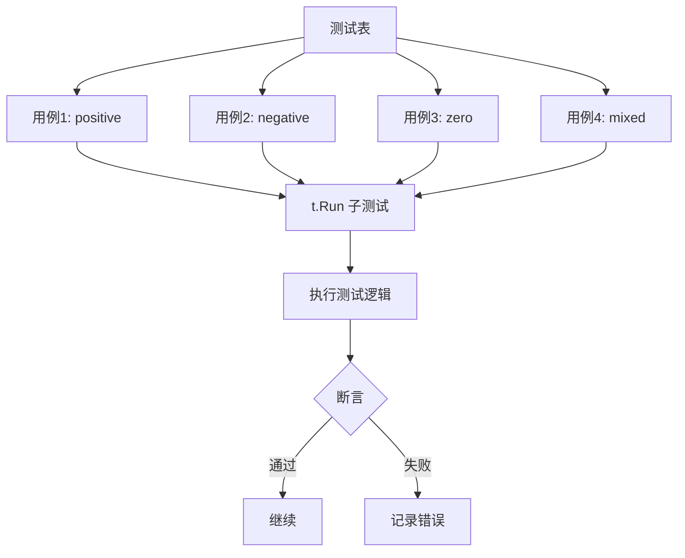

import { Badge } from "@rspress/core/theme";
import { Callout } from "@rspress/core/theme-original";

# Table-driven Testing

<Badge text="中级" type="warning" /> <Badge text="Go 1.0+" type="info" />

表驱动测试（Table-Driven Tests）是 Go 中最流行的测试模式，让你能够用一组测试用例覆盖多种场景。

## 基本结构

```go
func TestFunction(t *testing.T) {
    tests := []struct {
        name    string
        input   InputType
        want    OutputType
        wantErr bool
    }{
        // 测试用例
    }

    for _, tt := range tests {
        t.Run(tt.name, func(t *testing.T) {
            got, err := Function(tt.input)
            if (err != nil) != tt.wantErr {
                t.Errorf("Function() error = %v, wantErr %v", err, tt.wantErr)
                return
            }
            if got != tt.want {
                t.Errorf("Function() = %v, want %v", got, tt.want)
            }
        })
    }
}
```

## 基础示例

```go
package calc

import "testing"

func TestAdd(t *testing.T) {
    tests := []struct {
        name string
        a, b int
        want int
    }{
        {"positive", 2, 3, 5},
        {"negative", -2, -3, -5},
        {"zero", 0, 5, 5},
        {"mixed", -2, 3, 1},
    }

    for _, tt := range tests {
        tt := tt // 捕获循环变量（Go 1.22 之前需要）
        t.Run(tt.name, func(t *testing.T) {
            got := Add(tt.a, tt.b)
            if got != tt.want {
                t.Errorf("Add(%d, %d) = %d; want %d",
                    tt.a, tt.b, got, tt.want)
            }
        })
    }
}
```

## 执行结构



## 错误处理

```go
func TestDivide(t *testing.T) {
    tests := []struct {
        name    string
        a, b    float64
        want    float64
        wantErr bool
    }{
        {"normal", 10, 2, 5, false},
        {"divide by zero", 10, 0, 0, true},
        {"negative", -10, 2, -5, false},
    }

    for _, tt := range tests {
        tt := tt
        t.Run(tt.name, func(t *testing.T) {
            got, err := Divide(tt.a, tt.b)
            if (err != nil) != tt.wantErr {
                t.Errorf("Divide() error = %v, wantErr %v",
                    err, tt.wantErr)
                return
            }
            if !tt.wantErr && got != tt.want {
                t.Errorf("Divide() = %v, want %v", got, tt.want)
            }
        })
    }
}
```

## 复杂输入

```go
func TestParseUser(t *testing.T) {
    type Input struct {
        name  string
        email string
        age   int
    }

    tests := []struct {
        name    string
        input   Input
        want    *User
        wantErr bool
    }{
        {
            name: "valid user",
            input: Input{name: "Alice", email: "alice@example.com", age: 30},
            want: &User{Name: "Alice", Email: "alice@example.com", Age: 30},
            wantErr: false,
        },
        {
            name: "empty name",
            input: Input{name: "", email: "bob@example.com", age: 25},
            want: nil,
            wantErr: true,
        },
        {
            name: "invalid email",
            input: Input{name: "Bob", email: "invalid", age: 25},
            want: nil,
            wantErr: true,
        },
        {
            name: "negative age",
            input: Input{name: "Charlie", email: "charlie@example.com", age: -1},
            want: nil,
            wantErr: true,
        },
    }

    for _, tt := range tests {
        tt := tt
        t.Run(tt.name, func(t *testing.T) {
            got, err := ParseUser(tt.input.name, tt.input.email, tt.input.age)
            if (err != nil) != tt.wantErr {
                t.Errorf("ParseUser() error = %v, wantErr %v", err, tt.wantErr)
                return
            }
            if !reflect.DeepEqual(got, tt.want) {
                t.Errorf("ParseUser() = %v, want %v", got, tt.want)
            }
        })
    }
}
```

## 子测试嵌套

```go
func TestCalculator(t *testing.T) {
    calc := NewCalculator()

    t.Run("Add", func(t *testing.T) {
        tests := []struct {
            name string
            a, b int
            want int
        }{
            {"positive", 2, 3, 5},
            {"negative", -2, -3, -5},
        }

        for _, tt := range tests {
            tt := tt
            t.Run(tt.name, func(t *testing.T) {
                got := calc.Add(tt.a, tt.b)
                if got != tt.want {
                    t.Errorf("Add() = %d, want %d", got, tt.want)
                }
            })
        }
    })

    t.Run("Subtract", func(t *testing.T) {
        tests := []struct {
            name string
            a, b int
            want int
        }{
            {"positive", 5, 3, 2},
            {"negative", 3, 5, -2},
        }

        for _, tt := range tests {
            tt := tt
            t.Run(tt.name, func(t *testing.T) {
                got := calc.Subtract(tt.a, tt.b)
                if got != tt.want {
                    t.Errorf("Subtract() = %d, want %d", got, tt.want)
                }
            })
        }
    })
}
```

## Setup 和 Teardown

```go
func TestWithSetup(t *testing.T) {
    // Setup: 创建共享资源
    db := setupTestDB(t)
    defer db.Close()

    tests := []struct {
        name   string
        userID int
        want   *User
    }{
        {"exists", 1, &User{ID: 1, Name: "Alice"}},
        {"not exists", 999, nil},
    }

    for _, tt := range tests {
        tt := tt
        t.Run(tt.name, func(t *testing.T) {
            // 每个子测试都可以使用共享资源
            got := db.GetUser(tt.userID)
            if !reflect.DeepEqual(got, tt.want) {
                t.Errorf("GetUser() = %v, want %v", got, tt.want)
            }
        })
    }
}
```

## 并行子测试

```go
func TestParallelTable(t *testing.T) {
    tests := []struct {
        name string
        data string
    }{
        {"test1", "data1"},
        {"test2", "data2"},
        {"test3", "data3"},
    }

    for _, tt := range tests {
        tt := tt
        t.Run(tt.name, func(t *testing.T) {
            t.Parallel() // 并行执行

            result := Process(tt.data)
            if result != expected {
                t.Errorf("Process(%q) = %v", tt.data, result)
            }
        })
    }
}
```

## 最佳实践

### 命名规范

```go
// ✅ 好的命名
func TestUserService_GetUser_Success(t *testing.T) { }
func TestUserService_GetUser_NotFound(t *testing.T) { }
func TestUserService_GetUser_InvalidID(t *testing.T) { }

// ❌ 不好的命名
func TestUserService1(t *testing.T) { }
func TestUserService2(t *testing.T) { }
```

### 结构体设计

```go
// ✅ 清晰的字段命名
tests := []struct {
    name    string
    input   Input
    want    Output
    wantErr bool
}{
    // ...
}

// ❌ 模糊的字段命名
tests := []struct {
    a string
    b int
    c bool
    d string
}{
    // ...
}
```

### 使用辅助函数

```go
// 辅助函数简化测试代码
func assertEqual[T comparable](t *testing.T, got, want T, msg string) {
    t.Helper()
    if got != want {
        t.Errorf("%s: got %v, want %v", msg, got, want)
    }
}

func TestWithHelper(t *testing.T) {
    tests := []struct {
        name  string
        input int
        want  int
    }{
        {"double", 5, 10},
        {"triple", 5, 15},
    }

    for _, tt := range tests {
        tt := tt
        t.Run(tt.name, func(t *testing.T) {
            got := Double(tt.input)
            assertEqual(t, got, tt.want, "Double()")
        })
    }
}
```

<Callout type="warning" title="Go 1.22+ 注意事项">
  Go 1.22 引入了 range-over-func，<br />
  在 <code>for range</code> 循环中创建的闭包会自动捕获循环变量，<br />
  不再需要 <code>tt := tt</code> 的显式声明。
</Callout>

## 练习

1. **字符串处理测试**：为 TrimSpace 函数编写表驱动测试

<details>
<summary>查看答案</summary>

```go
package strings

import "testing"

func TestTrimSpace(t *testing.T) {
    tests := []struct {
        name string
        input string
        want string
    }{
        {"spaces both sides", "  hello  ", "hello"},
        {"tabs both sides", "\thello\t", "hello"},
        {"newlines both sides", "\nhello\n", "hello"},
        {"mixed whitespace", " \t\n hello \n\t ", "hello"},
        {"no spaces", "hello", "hello"},
        {"only spaces", "   ", ""},
        {"empty string", "", ""},
        {"spaces inside", "hello world", "hello world"},
    }

    for _, tt := range tests {
        tt := tt
        t.Run(tt.name, func(t *testing.T) {
            got := TrimSpace(tt.input)
            if got != tt.want {
                t.Errorf("TrimSpace(%q) = %q; want %q",
                    tt.input, got, tt.want)
            }
        })
    }
}
```

**解释**：使用表驱动测试覆盖了多种空白字符和边界情况。

</details>

2. **HTTP 处理器测试**：为 HTTP 处理器编写表驱动测试

<details>
<summary>查看答案</summary>

```go
package main

import (
    "net/http"
    "net/http/httptest"
    "testing"
)

func TestHandler(t *testing.T) {
    handler := NewHandler()

    tests := []struct {
        name           string
        method         string
        path           string
        expectedStatus int
        expectedBody   string
    }{
        {"GET root", "GET", "/", 200, "Hello, World!"},
        {"GET about", "GET", "/about", 200, "About page"},
        {"POST root", "POST", "/", 405, "Method Not Allowed"},
        {"GET not found", "GET", "/notfound", 404, "Not Found"},
    }

    for _, tt := range tests {
        tt := tt
        t.Run(tt.name, func(t *testing.T) {
            req := httptest.NewRequest(tt.method, tt.path, nil)
            rec := httptest.NewRecorder()

            handler.ServeHTTP(rec, req)

            if rec.Code != tt.expectedStatus {
                t.Errorf("status = %d, want %d",
                    rec.Code, tt.expectedStatus)
            }

            if rec.Body.String() != tt.expectedBody {
                t.Errorf("body = %q, want %q",
                    rec.Body.String(), tt.expectedBody)
            }
        })
    }
}
```

**解释**：使用 httptest 包模拟 HTTP 请求和响应，表驱动测试覆盖多种请求场景。

</details>

---

[← 断言与验证](./assertions.mdx) | [测试覆盖率 →](./coverage.mdx)
