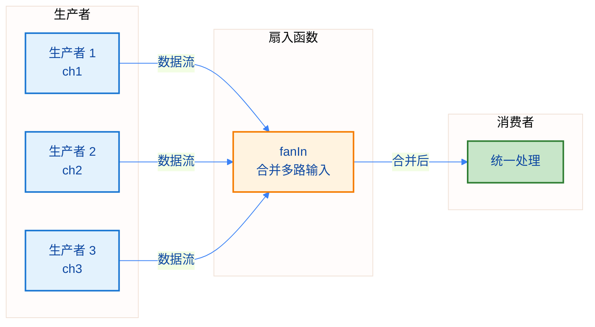
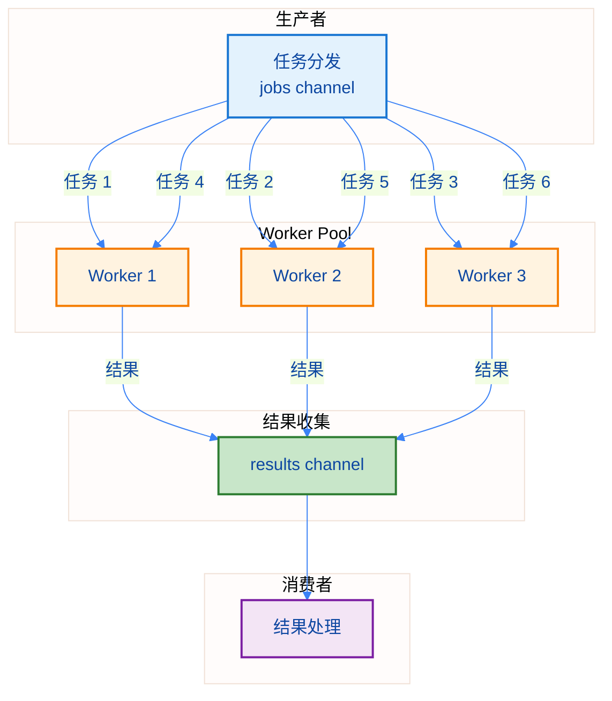
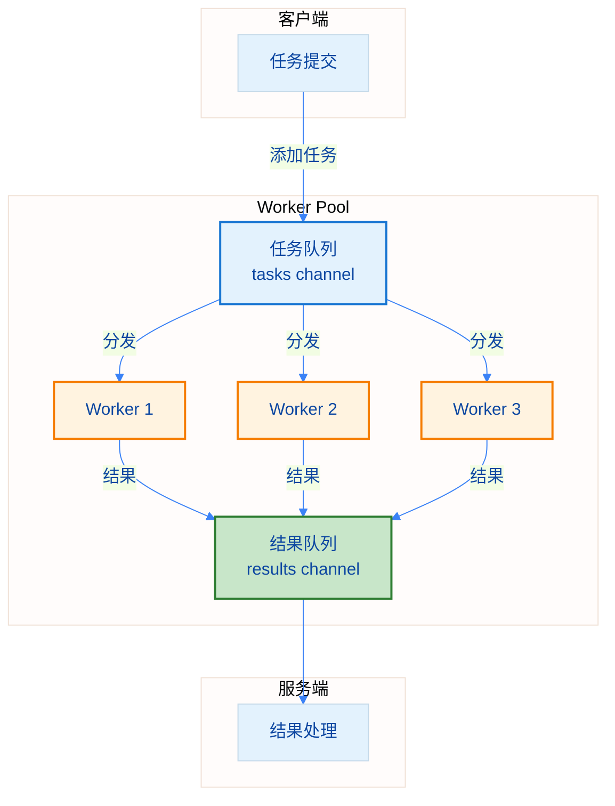
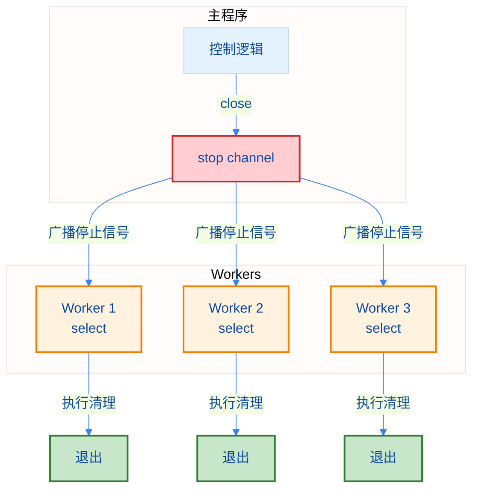
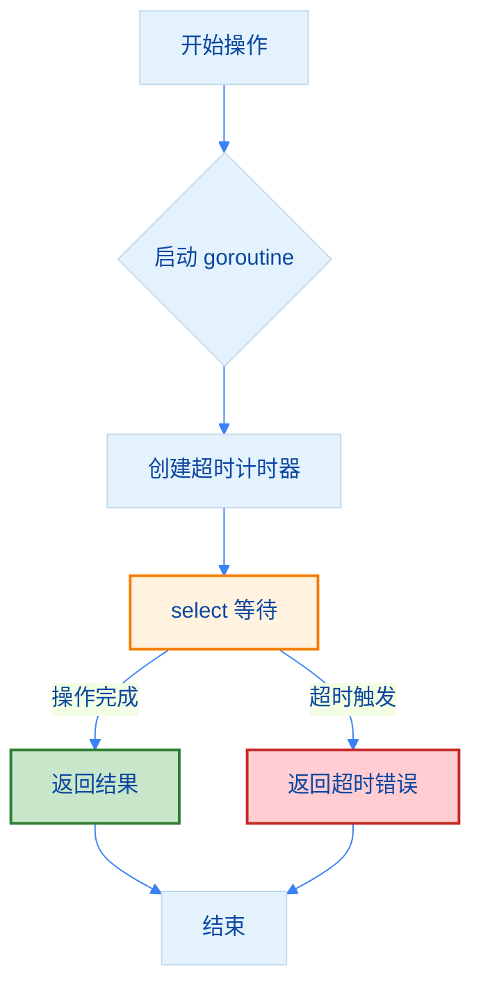
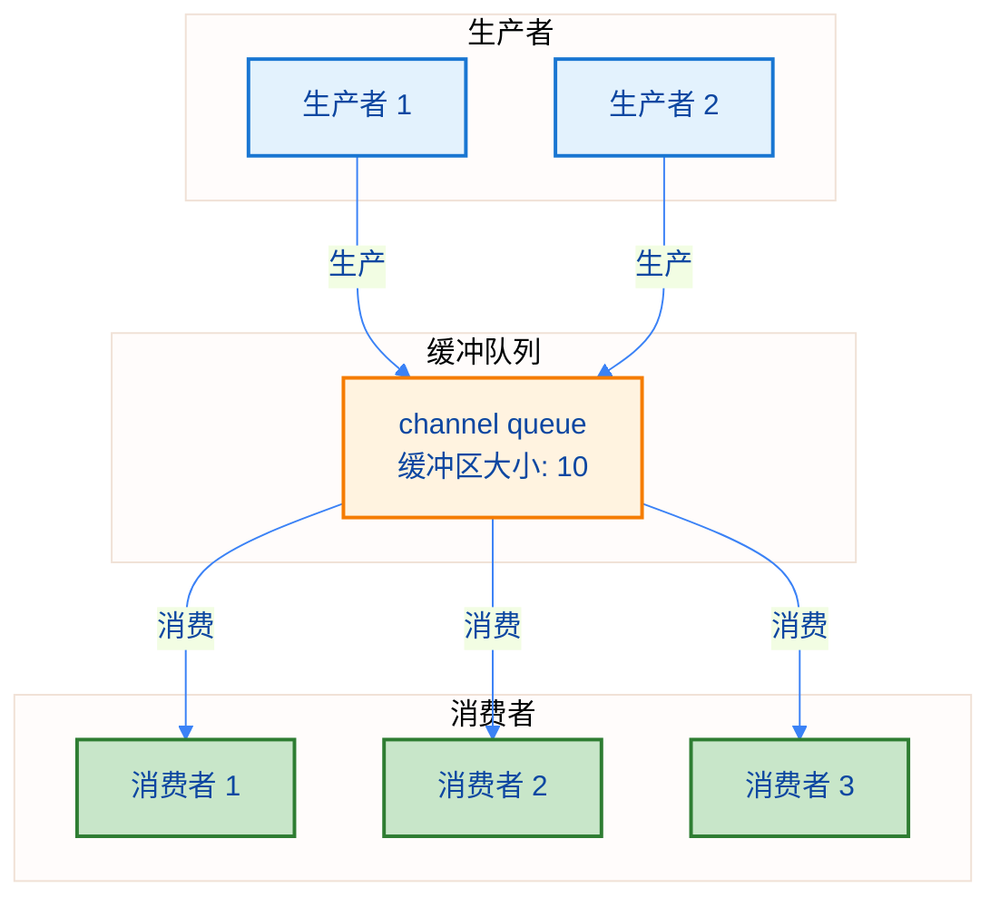

import { Badge } from "@rspress/core/theme";
import { Callout } from "@rspress/core/theme-original";

# Channel 模式 - Channel Patterns

[← 返回并发](.)

<Badge text="中级开发者" type="warning" />

在实际开发中，有一些经过验证的 channel 使用模式，这些模式能够帮助我们构建更可靠、更高效的并发程序。本文将详细介绍这些常见模式。

## 学习路径


## <Badge text="扇入模式 (Fan-in)" type="tip" />

### 问题场景

当有多个 goroutine 产生数据，需要将它们的数据合并到一个 channel 进行统一处理时，如何高效地收集数据？

### 解决方案

使用扇入模式将多个输入 channel 合并为一个输出 channel。

```go
package main

import (
    "fmt"
    "sync"
)

// producer: 生产数据到 channel
func producer(id int, out chan<- int, wg *sync.WaitGroup) {
    defer wg.Done()
    defer close(out)
    for i := 1; i <= 3; i++ {
        value := id*100 + i
        out <- value
        fmt.Printf("生产者 %d: 生产 %d\n", id, value)
    }
}

// fanIn: 合并多个 channel 到一个 channel
func fanIn(inputs ...<-chan int) <-chan int {
    output := make(chan int)

    var wg sync.WaitGroup
    for _, ch := range inputs {
        wg.Add(1)
        go func(c <-chan int) {
            defer wg.Done()
            for value := range c {
                output <- value
            }
        }(ch)
    }

    // 等待所有输入处理完成后关闭输出
    go func() {
        wg.Wait()
        close(output)
    }()

    return output
}

func main() {
    ch1 := make(chan int)
    ch2 := make(chan int)
    ch3 := make(chan int)

    var wg sync.WaitGroup
    wg.Add(3)

    go producer(1, ch1, &wg)
    go producer(2, ch2, &wg)
    go producer(3, ch3, &wg)

    // 合并三个 channel
    merged := fanIn(ch1, ch2, ch3)

    // 消费合并后的数据
    for value := range merged {
        fmt.Printf("合并后的值: %d\n", value)
    }

    fmt.Println("处理完成")
}
```

### 模式图示



### 使用注意事项

<Callout type="warning" title="重要提示">
  <strong>扇入模式注意事项</strong>：
  - 确保所有输入 channel 最终都会被关闭
  - 使用 sync.WaitGroup 等待所有输入处理完成
  - 只有在所有输入处理完成后才关闭输出 channel
  - 考虑使用缓冲 channel 提高性能
</Callout>

## <Badge text="扇出模式 (Fan-out)" type="info" />

### 问题场景

当单个 goroutine 无法及时处理大量数据时，如何将任务分发到多个 worker 并行处理？

### 解决方案

使用扇出模式将单个 channel 的数据分发到多个 worker 并行处理。

```go
package main

import (
    "fmt"
    "sync"
    "time"
)

// worker: 处理任务的 worker
func worker(id int, jobs <-chan int, results chan<- int, wg *sync.WaitGroup) {
    defer wg.Done()
    for job := range jobs {
        fmt.Printf("Worker %d: 开始处理任务 %d\n", id, job)
        // 模拟处理时间
        time.Sleep(100 * time.Millisecond)
        result := job * 2
        results <- result
        fmt.Printf("Worker %d: 完成任务 %d, 结果 %d\n", id, job, result)
    }
    fmt.Printf("Worker %d: 退出\n", id)
}

func main() {
    // 创建任务 channel 和结果 channel
    jobs := make(chan int, 100)
    results := make(chan int, 100)

    // 启动 3 个 worker
    var wg sync.WaitGroup
    numWorkers := 3
    for w := 1; w <= numWorkers; w++ {
        wg.Add(1)
        go worker(w, jobs, results, &wg)
    }

    // 发送 9 个任务
    numJobs := 9
    for j := 1; j <= numJobs; j++ {
        jobs <- j
    }
    close(jobs) // 关闭 jobs channel，通知 worker 没有更多任务

    // 启动一个 goroutine 等待所有 worker 完成
    go func() {
        wg.Wait()
        close(results) // 所有 worker 完成后关闭 results
    }()

    // 收集结果
    fmt.Println("\n开始收集结果:")
    for result := range results {
        fmt.Printf("收到结果: %d\n", result)
    }

    fmt.Println("所有任务完成")
}
```

### 模式图示



### 使用注意事项

<Callout type="tip" title="最佳实践">
  <strong>扇出模式注意事项</strong>：
  - Worker 数量通常设置为 CPU 核心数的 1-2 倍
  - 关闭 jobs channel 后，worker 会自动退出
  - 使用 sync.WaitGroup 确保所有 worker 完成
  - 考虑使用 context 实现 worker 的优雅退出
</Callout>

## <Badge text="工作池模式 (Worker Pool)" type="warning" />

### 问题场景

如何创建一个固定数量的 worker 池，处理大量并发任务，同时避免创建过多 goroutine？

### 解决方案

使用工作池模式维护固定数量的 worker，通过 channel 接收和处理任务。

```go
package main

import (
    "fmt"
    "sync"
    "time"
)

// Task: 任务结构
type Task struct {
    ID   int
    Data string
}

// Result: 结果结构
type Result struct {
    TaskID  int
    Success bool
    Message string
}

// WorkerPool: 工作池结构
type WorkerPool struct {
    tasks    chan Task
    results  chan Result
    wg       sync.WaitGroup
    quit     chan struct{}
    workers  int
}

// NewWorkerPool: 创建新的工作池
func NewWorkerPool(workers int, taskQueueSize int) *WorkerPool {
    return &WorkerPool{
        tasks:   make(chan Task, taskQueueSize),
        results: make(chan Result, taskQueueSize),
        quit:    make(chan struct{}),
        workers: workers,
    }
}

// Start: 启动工作池
func (wp *WorkerPool) Start() {
    for i := 1; i <= wp.workers; i++ {
        wp.wg.Add(1)
        go wp.worker(i)
    }
}

// worker: 工作函数
func (wp *WorkerPool) worker(id int) {
    defer wp.wg.Done()
    fmt.Printf("Worker %d: 启动\n", id)

    for {
        select {
        case task, ok := <-wp.tasks:
            if !ok {
                fmt.Printf("Worker %d: 任务 channel 关闭, 退出\n", id)
                return
            }
            // 处理任务
            result := wp.processTask(task, id)
            wp.results <- result
        case <-wp.quit:
            fmt.Printf("Worker %d: 收到退出信号\n", id)
            return
        }
    }
}

// processTask: 处理单个任务
func (wp *WorkerPool) processTask(task Task, workerID int) Result {
    fmt.Printf("Worker %d: 处理任务 %d\n", workerID, task.ID)

    // 模拟处理时间
    time.Sleep(100 * time.Millisecond)

    return Result{
        TaskID:  task.ID,
        Success: true,
        Message: fmt.Sprintf("Worker %d 完成任务 %d", workerID, task.ID),
    }
}

// AddTask: 添加任务
func (wp *WorkerPool) AddTask(task Task) {
    wp.tasks <- task
}

// GetResult: 获取结果
func (wp *WorkerPool) GetResult() Result {
    return <-wp.results
}

// Stop: 停止工作池
func (wp *WorkerPool) Stop() {
    close(wp.tasks)  // 关闭任务 channel
    close(wp.quit)   // 发送退出信号
    wp.wg.Wait()     // 等待所有 worker 完成
    close(wp.results) // 关闭结果 channel
}

func main() {
    // 创建工作池: 3 个 worker, 任务队列大小 100
    pool := NewWorkerPool(3, 100)

    // 启动工作池
    pool.Start()
    fmt.Println("工作池已启动")

    // 添加任务
    for i := 1; i <= 10; i++ {
        task := Task{
            ID:   i,
            Data: fmt.Sprintf("任务数据 %d", i),
        }
        pool.AddTask(task)
    }

    // 等待所有任务完成并收集结果
    go func() {
        pool.wg.Wait()
        close(pool.results)
    }()

    fmt.Println("\n开始收集结果:")
    count := 0
    for result := range pool.results {
        count++
        fmt.Printf("任务 %d: %s\n", result.TaskID, result.Message)
    }

    fmt.Printf("\n总共完成 %d 个任务\n", count)
}
```

### 模式图示



### 使用注意事项

<Callout type="info" title="设计考虑">
  <strong>工作池模式注意事项</strong>：
  - Worker 数量根据任务类型和 CPU 核心数确定
  - 任务队列大小需要根据生产消费速度平衡
  - 实现优雅关闭机制，避免任务丢失
  - 考虑任务超时和重试机制
  - 监控 worker 状态，便于排查问题
</Callout>

## <Badge text="停止信号模式 (Quit Channel)" type="danger" />

### 问题场景

如何优雅地停止正在运行的 goroutine，而不是让它直接崩溃或泄漏？

### 解决方案

使用 quit channel 发送停止信号，让 goroutine 能够优雅地退出。

```go
package main

import (
    "fmt"
    "time"
)

// worker: 支持 stop 的 worker
func worker(id int, jobs <-chan int, stop <-chan struct{}) {
    for {
        select {
        case job, ok := <-jobs:
            if !ok {
                fmt.Printf("Worker %d: 任务 channel 关闭, 退出\n", id)
                return
            }
            fmt.Printf("Worker %d: 处理任务 %d\n", id, job)
            time.Sleep(500 * time.Millisecond)
        case <-stop:
            fmt.Printf("Worker %d: 收到停止信号, 正在退出...\n", id)
            // 执行清理工作
            time.Sleep(100 * time.Millisecond)
            fmt.Printf("Worker %d: 已退出\n", id)
            return
        }
    }
}

func main() {
    jobs := make(chan int, 10)
    stop := make(chan struct{})

    // 启动 3 个 worker
    for i := 1; i <= 3; i++ {
        go worker(i, jobs, stop)
    }

    // 发送一些任务
    for i := 1; i <= 5; i++ {
        jobs <- i
        fmt.Printf("发送任务 %d\n", i)
    }

    time.Sleep(time.Second)
    fmt.Println("\n发送停止信号...")
    close(stop) // 关闭 stop channel, 所有 worker 都会收到信号

    // 等待 worker 退出
    time.Sleep(500 * time.Millisecond)
    fmt.Println("主程序退出")
}
```

### 模式图示



### 使用注意事项

<Callout type="warning" title="优雅关闭">
  <strong>停止信号模式注意事项</strong>：
  - 使用 `chan struct{}` 作为停止信号，不占用内存
  - 关闭 channel 会广播给所有接收者
  - 在 goroutine 中使用 select 监听停止信号
  - 收到信号后执行必要的清理工作
  - 避免重复关闭 channel
</Callout>

## <Badge text="超时模式 (Timeout)" type="info" />

### 问题场景

如何防止某个操作永久阻塞，设置合理的超时时间？

### 解决方案

使用 select + time.After 或 context.WithTimeout 实现超时控制。

```go
package main

import (
    "context"
    "fmt"
    "time"
)

// operationWithTimeout: 带超时的操作
func operationWithTimeout(timeout time.Duration) error {
    ctx, cancel := context.WithTimeout(context.Background(), timeout)
    defer cancel()

    result := make(chan string, 1)

    // 启动操作
    go func() {
        // 模拟耗时操作
        time.Sleep(2 * time.Second)
        result <- "操作完成"
    }()

    // 等待结果或超时
    select {
    case <-ctx.Done():
        return fmt.Errorf("操作超时: %v", timeout)
    case res := <-result:
        fmt.Println("结果:", res)
        return nil
    }
}

// operationWithTimeoutV2: 使用 time.After 的版本
func operationWithTimeoutV2(timeout time.Duration) error {
    result := make(chan string, 1)

    go func() {
        time.Sleep(2 * time.Second)
        result <- "操作完成"
    }()

    select {
    case <-time.After(timeout):
        return fmt.Errorf("操作超时: %v", timeout)
    case res := <-result:
        fmt.Println("结果:", res)
        return nil
    }
}

func main() {
    fmt.Println("=== 测试超时控制 ===")

    // 测试 1: 使用 context (会超时)
    fmt.Println("\n测试 1: context 超时 1 秒")
    err := operationWithTimeout(1 * time.Second)
    if err != nil {
        fmt.Println("错误:", err)
    }

    // 测试 2: 使用 time.After (会超时)
    fmt.Println("\n测试 2: time.After 超时 1 秒")
    err = operationWithTimeoutV2(1 * time.Second)
    if err != nil {
        fmt.Println("错误:", err)
    }

    // 测试 3: 足够长的时间 (不会超时)
    fmt.Println("\n测试 3: 3 秒超时, 操作 2 秒")
    err = operationWithTimeout(3 * time.Second)
    if err != nil {
        fmt.Println("错误:", err)
    }
}
```

### 模式图示



### 使用注意事项

<Callout type="tip" title="超时建议">
  <strong>超时模式注意事项</strong>：
  - 推荐使用 context.WithTimeout，更灵活
  - time.After 每次调用都会创建新的 timer
  - 高频场景使用 time.NewTimer 并重用
  - 超时后要取消正在进行的操作
  - 合理设置超时时间，避免过短或过长
</Callout>

## <Badge text="生产者-消费者模式" type="success" />

### 问题场景

如何解耦数据的生产和消费，让它们能够以不同的速度独立运行？

### 解决方案

使用 channel 作为缓冲队列，生产者负责生成数据，消费者负责处理数据。

```go
package main

import (
    "fmt"
    "sync"
    "time"
)

// producer: 生产者函数
func producer(id int, out chan<- int, wg *sync.WaitGroup) {
    defer wg.Done()
    defer close(out)

    for i := 1; i <= 5; i++ {
        value := id*100 + i
        out <- value
        fmt.Printf("生产者 %d: 生产 %d\n", id, value)
        time.Sleep(100 * time.Millisecond) // 模拟生产时间
    }
    fmt.Printf("生产者 %d: 完成, 关闭 channel\n", id)
}

// consumer: 消费者函数
func consumer(id int, in <-chan int, wg *sync.WaitGroup) {
    defer wg.Done()

    for value := range in {
        fmt.Printf("消费者 %d: 消费 %d\n", id, value)
        time.Sleep(150 * time.Millisecond) // 模拟消费时间（比生产慢）
    }
    fmt.Printf("消费者 %d: 退出\n", id)
}

func main() {
    // 创建带缓冲的 channel 作为队列
    queue := make(chan int, 10)

    var wg sync.WaitGroup

    // 启动 2 个生产者
    producers := 2
    for i := 1; i <= producers; i++ {
        wg.Add(1)
        ch := make(chan int, 5)
        go producer(i, ch, &wg)

        // 将生产者的 channel 合并到主队列
        wg.Add(1)
        go func(in <-chan int) {
            defer wg.Done()
            for value := range in {
                queue <- value
            }
        }(ch)
    }

    // 启动 3 个消费者
    consumers := 3
    for i := 1; i <= consumers; i++ {
        wg.Add(1)
        go consumer(i, queue, &wg)
    }

    // 启动一个 goroutine 等待所有生产者完成后关闭队列
    go func() {
        wg.Wait() // 这里会等待所有相关的 goroutine 完成
        // 注意：这里会导致死锁，因为 wg.Wait() 会等待 consumer 完成
        // 而 consumer 在等待 queue 关闭
        // 正确的做法是分别管理生产者和消费者的 WaitGroup
    }()

    // 更好的实现：使用两个 WaitGroup
    fmt.Println("\n=== 更好的实现 ===")
    betterImplementation()
}

func betterImplementation() {
    queue := make(chan int, 10)

    var prodWG sync.WaitGroup
    var consWG sync.WaitGroup

    // 启动生产者
    prodWG.Add(2)
    go func(id int) {
        defer prodWG.Done()
        for i := 1; i <= 3; i++ {
            value := id*100 + i
            queue <- value
            fmt.Printf("生产者 %d: 生产 %d\n", id, value)
            time.Sleep(50 * time.Millisecond)
        }
    }(1)

    go func(id int) {
        defer prodWG.Done()
        for i := 1; i <= 3; i++ {
            value := id*100 + i
            queue <- value
            fmt.Printf("生产者 %d: 生产 %d\n", id, value)
            time.Sleep(50 * time.Millisecond)
        }
    }(2)

    // 等待生产者完成
    go func() {
        prodWG.Wait()
        close(queue) // 生产者完成后关闭队列
        fmt.Println("所有生产者完成, 队列已关闭")
    }()

    // 启动消费者
    consWG.Add(2)
    go func(id int) {
        defer consWG.Done()
        for value := range queue {
            fmt.Printf("消费者 %d: 消费 %d\n", id, value)
            time.Sleep(100 * time.Millisecond)
        }
        fmt.Printf("消费者 %d: 退出\n", id)
    }(1)

    go func(id int) {
        defer consWG.Done()
        for value := range queue {
            fmt.Printf("消费者 %d: 消费 %d\n", id, value)
            time.Sleep(100 * time.Millisecond)
        }
        fmt.Printf("消费者 %d: 退出\n", id)
    }(2)

    // 等待消费者完成
    consWG.Wait()
    fmt.Println("所有消费者完成")
}
```

### 模式图示



### 使用注意事项

<Callout type="info" title="解耦原则">
  <strong>生产者-消费者模式注意事项</strong>：
  - 合理设置缓冲区大小，平衡生产和消费速度
  - 只由生产者负责关闭 channel
  - 使用 separate WaitGroup 管理生产者和消费者
  - 消费者使用 range 遍历 channel，自动检测关闭
  - 考虑添加错误处理和重试机制
</Callout>

## 模式对比

| 模式 | 适用场景 | 优点 | 缺点 |
|-----|---------|------|------|
| 扇入 (Fan-in) | 多数据源合并 | 统一处理，代码简洁 | 需要等待所有输入 |
| 扇出 (Fan-out) | 提高处理能力 | 并行处理，提高吞吐量 | 结果顺序不保证 |
| 工作池 (Worker Pool) | 限制并发数 | 资源可控，避免过载 | 实现相对复杂 |
| 停止信号 (Quit Channel) | 优雅退出 | 可控停止，清理资源 | 需要手动管理 |
| 超时 (Timeout) | 防止阻塞 | 避免死锁，提高可靠性 | 超时时间需要合理设置 |
| 生产者-消费者 | 解耦系统 | 松耦合，独立扩展 | 缓冲区大小需要调优 |

## 练习

<Badge text="初级" type="tip" />

1. **实现扇入模式**：编写一个函数，将 3 个 channel 的数据合并到一个 channel

<details>
<summary>查看答案</summary>

```go
package main

import (
    "fmt"
    "sync"
)

func producer(id int, out chan<- int, wg *sync.WaitGroup) {
    defer wg.Done()
    defer close(out)
    for i := 1; i <= 3; i++ {
        out <- id*10 + i
    }
}

func fanIn(ch1, ch2, ch3 <-chan int) <-chan int {
    out := make(chan int)

    var wg sync.WaitGroup
    wg.Add(3)

    go func() {
        defer wg.Done()
        for v := range ch1 {
            out <- v
        }
    }()

    go func() {
        defer wg.Done()
        for v := range ch2 {
            out <- v
        }
    }()

    go func() {
        defer wg.Done()
        for v := range ch3 {
            out <- v
        }
    }()

    go func() {
        wg.Wait()
        close(out)
    }()

    return out
}

func main() {
    ch1, ch2, ch3 := make(chan int), make(chan int), make(chan int)

    var wg sync.WaitGroup
    wg.Add(3)

    go producer(1, ch1, &wg)
    go producer(2, ch2, &wg)
    go producer(3, ch3, &wg)

    merged := fanIn(ch1, ch2, ch3)

    for v := range merged {
        fmt.Println(v)
    }
}
```

**解释**：为每个输入 channel 启动一个 goroutine，使用 WaitGroup 等待所有输入处理完成后关闭输出 channel。

</details>

2. **实现工作池**：创建一个包含 5 个 worker 的工作池，处理 20 个任务

<details>
<summary>查看答案</summary>

```go
package main

import (
    "fmt"
    "sync"
    "time"
)

func worker(id int, jobs <-chan int, results chan<- int, wg *sync.WaitGroup) {
    defer wg.Done()
    for job := range jobs {
        fmt.Printf("Worker %d: 任务 %d\n", id, job)
        time.Sleep(100 * time.Millisecond)
        results <- job * 2
    }
}

func main() {
    jobs := make(chan int, 100)
    results := make(chan int, 100)

    var wg sync.WaitGroup

    // 启动 5 个 worker
    for w := 1; w <= 5; w++ {
        wg.Add(1)
        go worker(w, jobs, results, &wg)
    }

    // 发送 20 个任务
    for j := 1; j <= 20; j++ {
        jobs <- j
    }
    close(jobs)

    // 等待所有 worker 完成
    go func() {
        wg.Wait()
        close(results)
    }()

    // 收集结果
    for result := range results {
        fmt.Println("结果:", result)
    }
}
```

**解释**：创建固定数量的 worker，通过 channel 分发任务，WaitGroup 确保所有 worker 完成。

</details>

<Badge text="中级" type="info" />

3. **实现优雅退出**：修改工作池，支持通过 stop channel 优雅退出

<details>
<summary>查看答案</summary>

```go
package main

import (
    "fmt"
    "sync"
    "time"
)

func worker(id int, jobs <-chan int, stop <-chan struct{}, wg *sync.WaitGroup) {
    defer wg.Done()
    for {
        select {
        case job, ok := <-jobs:
            if !ok {
                fmt.Printf("Worker %d: 任务 channel 关闭, 退出\n", id)
                return
            }
            fmt.Printf("Worker %d: 处理任务 %d\n", id, job)
            time.Sleep(100 * time.Millisecond)
        case <-stop:
            fmt.Printf("Worker %d: 收到停止信号\n", id)
            return
        }
    }
}

func main() {
    jobs := make(chan int, 100)
    stop := make(chan struct{})

    var wg sync.WaitGroup

    // 启动 worker
    for w := 1; w <= 3; w++ {
        wg.Add(1)
        go worker(w, jobs, stop, &wg)
    }

    // 发送部分任务
    for j := 1; j <= 5; j++ {
        jobs <- j
    }

    time.Sleep(500 * time.Millisecond)
    fmt.Println("发送停止信号...")
    close(stop)

    wg.Wait()
    fmt.Println("所有 worker 已退出")
}
```

**解释**：在 worker 中使用 select 监听 jobs 和 stop channel，收到停止信号后退出。

</details>

4. **实现超时控制**：为工作池的每个任务添加超时机制

<details>
<summary>查看答案</summary>

```go
package main

import (
    "fmt"
    "time"
)

func processTaskWithTimeout(id int, timeout time.Duration) {
    done := make(chan struct{})

    go func() {
        // 模拟任务处理
        time.Sleep(time.Duration(id%3) * 100 * time.Millisecond)
        close(done)
    }()

    select {
    case <-done:
        fmt.Printf("任务 %d 完成\n", id)
    case <-time.After(timeout):
        fmt.Printf("任务 %d 超时\n", id)
    }
}

func main() {
    for i := 1; i <= 5; i++ {
        processTaskWithTimeout(i, 150*time.Millisecond)
    }
}
```

**解释**：使用 select + time.After 实现超时控制，任务完成和超时先发生的先执行。

</details>

<Badge text="高级" type="warning" />

5. **实现动态工作池**：根据任务队列长度动态调整 worker 数量

<details>
<summary>查看答案</summary>

```go
package main

import (
    "fmt"
    "sync"
    "time"
)

type DynamicPool struct {
    tasks      chan int
    workerQuit chan struct{}
    poolQuit   chan struct{}
    wg         sync.WaitGroup
    minWorkers int
    maxWorkers int
}

func NewDynamicPool(min, max int) *DynamicPool {
    return &DynamicPool{
        tasks:      make(chan int, 100),
        workerQuit: make(chan struct{}),
        poolQuit:   make(chan struct{}),
        minWorkers: min,
        maxWorkers: max,
    }
}

func (p *DynamicPool) Start() {
    // 启动最小数量的 worker
    for i := 0; i < p.minWorkers; i++ {
        p.wg.Add(1)
        go p.worker(i + 1)
    }

    // 监控器：动态调整 worker 数量
    go p.monitor()
}

func (p *DynamicPool) worker(id int) {
    defer p.wg.Done()
    for {
        select {
        case task, ok := <-p.tasks:
            if !ok {
                return
            }
            fmt.Printf("Worker %d: 任务 %d\n", id, task)
            time.Sleep(200 * time.Millisecond)
        case <-p.workerQuit:
            return
        case <-p.poolQuit:
            return
        }
    }
}

func (p *DynamicPool) monitor() {
    ticker := time.NewTicker(time.Second)
    defer ticker.Stop()

    activeWorkers := p.minWorkers

    for {
        select {
        case <-ticker.C:
            queueLen := len(p.tasks)
            fmt.Printf("队列长度: %d, 活跃 worker: %d\n", queueLen, activeWorkers)

            // 队列太长，增加 worker
            if queueLen > 10 && activeWorkers < p.maxWorkers {
                p.wg.Add(1)
                go p.worker(activeWorkers + 1)
                activeWorkers++
                fmt.Printf("增加 worker, 当前: %d\n", activeWorkers)
            }

            // 队列太短，减少 worker
            if queueLen < 3 && activeWorkers > p.minWorkers {
                p.workerQuit <- struct{}{}
                activeWorkers--
                fmt.Printf("减少 worker, 当前: %d\n", activeWorkers)
            }

        case <-p.poolQuit:
            return
        }
    }
}

func (p *DynamicPool) AddTask(task int) {
    p.tasks <- task
}

func (p *DynamicPool) Stop() {
    close(p.tasks)
    close(p.poolQuit)
    p.wg.Wait()
}

func main() {
    pool := NewDynamicPool(2, 10)
    pool.Start()

    // 模拟任务流量变化
    for i := 1; i <= 30; i++ {
        pool.AddTask(i)
        if i%5 == 0 {
            time.Sleep(time.Second)
        }
    }

    time.Sleep(3 * time.Second)
    pool.Stop()
    fmt.Println("工作池已停止")
}
```

**解释**：通过监控队列长度动态调整 worker 数量，在任务多时扩容，任务少时缩容。

</details>

6. **实现 pipeline 模式**：将多个处理阶段连接起来，每个阶段由不同的 goroutine 处理

<details>
<summary>查看答案</summary>

```go
package main

import "fmt"

// generator: 生成数据
func generator(nums ...int) <-chan int {
    out := make(chan int)
    go func() {
        defer close(out)
        for _, n := range nums {
            out <- n
        }
    }()
    return out
}

// square: 计算平方
func square(in <-chan int) <-chan int {
    out := make(chan int)
    go func() {
        defer close(out)
        for n := range in {
            out <- n * n
        }
    }()
    return out
}

// addOne: 加一
func addOne(in <-chan int) <-chan int {
    out := make(chan int)
    go func() {
        defer close(out)
        for n := range in {
            out <- n + 1
        }
    }()
    return out
}

// merge: 合并多个 channel
func merge(chs ...<-chan int) <-chan int {
    out := make(chan int)
    go func() {
        defer close(out)
        for _, ch := range chs {
            for n := range ch {
                out <- n
            }
        }
    }()
    return out
}

func main() {
    // 构建 pipeline: generator -> square -> addOne
    nums := generator(1, 2, 3, 4, 5)
    squared := square(nums)
    result := addOne(squared)

    // 消费结果
    for n := range result {
        fmt.Println(n) // 输出: 2, 5, 10, 17, 26
    }

    // 扇出-扇入 pipeline
    fmt.Println("\n=== 扇出-扇入 Pipeline ===")
    in := generator(1, 2, 3)

    // 扇出：两个 square 处理器
    ch1 := square(in)
    ch2 := square(in)

    // 扇入：合并结果
    for n := range merge(ch1, ch2) {
        fmt.Println(n)
    }
}
```

**解释**：Pipeline 模式将处理过程分为多个阶段，每个阶段独立处理，数据像流水线一样流动。

</details>

## 总结

### 核心要点

<Badge text="核心概念" type="tip" />

1. **扇入模式**：合并多个输入 channel 到一个输出 channel
2. **扇出模式**：分发单个 channel 的数据到多个 worker
3. **工作池模式**：维护固定数量的 worker 处理任务
4. **停止信号模式**：使用 quit channel 实现优雅退出
5. **超时模式**：使用 select + time.After 或 context 实现超时控制
6. **生产者-消费者模式**：解耦数据生产和消费

### 模式选择指南

| 需求 | 推荐模式 | 组合建议 |
|-----|---------|---------|
| 多数据源收集 | 扇入 | + 工作池 |
| 提高处理能力 | 扇出 | + 工作池 |
| 限制资源使用 | 工作池 | + 停止信号 |
| 优雅关闭 | 停止信号 | + 任意模式 |
| 防止阻塞 | 超时 | + 工作池 |
| 解耦系统 | 生产者-消费者 | + 工作池 |

### 最佳实践清单

- [ ] 根据场景选择合适的模式
- [ ] 合理设置 channel 缓冲区大小
- [ ] 使用方向性 channel 提高类型安全
- [ ] 确保正确关闭 channel
- [ ] 使用 sync.WaitGroup 协调 goroutine
- [ ] 实现优雅退出机制
- [ ] 添加必要的超时控制
- [ ] 考虑使用 context 管理生命周期
- [ ] 监控 goroutine 和 channel 状态
- [ ] 编写测试验证并发安全性

[← Channel](./channel.mdx) | [继续：Sync 包 →](./sync.mdx)
