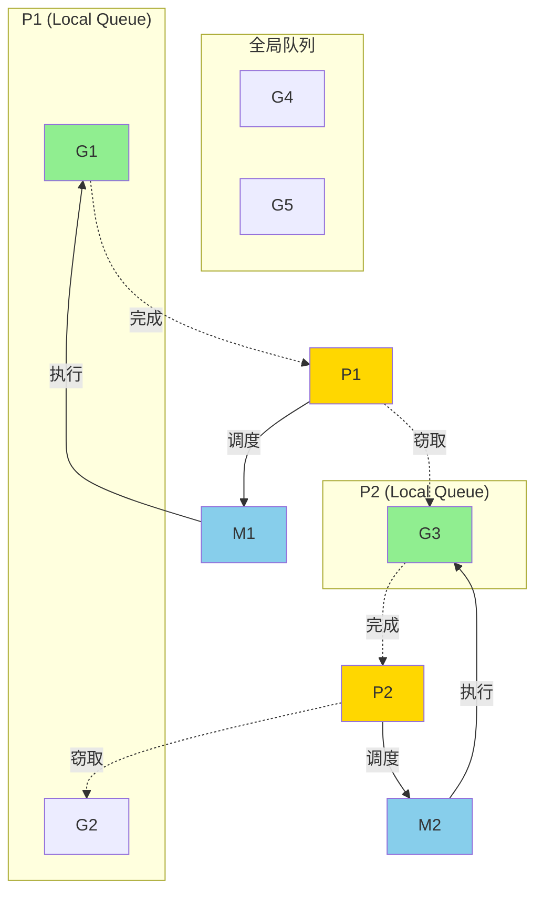
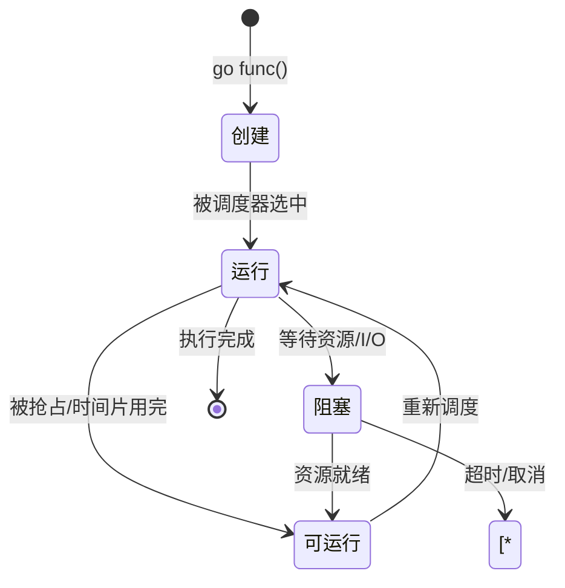

import Badge from '@theme/Badge';
import Callout from '@theme/Callout';

[← 返回并发](./)

# Goroutine

<Badge variant="warning" text="Go 1.0+" />

Goroutine 是 Go 实现并发的核心组件，它是一种轻量级的用户态线程，由 Go 运行时管理。

## Goroutine 基础

### 什么是 Goroutine

Goroutine 是 Go 实现的轻量级线程，具有以下特点：

- **轻量级**：初始栈大小仅 2KB（动态扩展）
- **高效调度**：由 Go 运行时调度，而非操作系统
- **低成本**：创建和销毁的开销极小
- **数量巨大**：单个程序可创建数百万个 goroutine

<Callout type="info">
  相比操作系统线程（通常 1-2MB 栈空间），goroutine 更加轻量和高效。
</Callout>

### 创建 Goroutine

使用 `go` 关键字启动一个 goroutine：

```go
package main

import (
    "fmt"
    "time"
)

func sayHello(name string) {
    fmt.Printf("Hello, %s!\n", name)
}

func main() {
    // 普通函数调用
    sayHello("Alice")

    // 启动 goroutine
    go sayHello("Bob")

    // 等待 goroutine 完成
    time.Sleep(time.Millisecond)
}
```

**输出示例：**
```
Hello, Alice!
Hello, Bob!
```

### 匿名 Goroutine

可以直接启动匿名函数作为 goroutine：

```go
package main

import (
    "fmt"
    "time"
)

func main() {
    // 无参数匿名函数
    go func() {
        fmt.Println("Anonymous goroutine")
    }()

    // 带参数匿名函数
    go func(msg string) {
        fmt.Println(msg)
    }("Hello from anonymous")

    time.Sleep(time.Millisecond)
}
```

### Goroutine 函数传参

goroutine 的参数在创建时求值：

```go
package main

import (
    "fmt"
    "time"
)

func main() {
    // 错误示例：循环变量捕获问题
    for i := 0; i < 3; i++ {
        go func() {
            fmt.Printf("Wrong: %d\n", i)
        }()
    }

    time.Sleep(time.Millisecond)
    fmt.Println("---")

    // 正确示例：传递参数
    for i := 0; i < 3; i++ {
        go func(n int) {
            fmt.Printf("Correct: %d\n", n)
        }(i)
    }

    time.Sleep(time.Millisecond)
}
```

**输出示例：**
```
Wrong: 3
Wrong: 3
Wrong: 3
---
Correct: 0
Correct: 1
Correct: 2
```

<Callout type="warning">
  在循环中启动 goroutine 时，务必注意循环变量捕获问题。推荐通过参数传递来避免。
</Callout>

## G-M-P 调度模型

Go 使用 G-M-P 模型进行 goroutine 调度：

### 组件说明

- **G (Goroutine)**: 用户态线程，包含执行的函数、栈、状态等信息
- **M (Machine)**: 系统线程，与内核线程一对一映射，负责执行 G
- **P (Processor)**: 调度器，维护本地运行队列，通常数量等于 CPU 核心数



### 调度流程

1. **创建**: 新创建的 G 优先放入本地队列
2. **执行**: M 从 P 的本地队列获取 G 执行
3. **调度**:
   - 本地队列为空时，从全局队列获取
   - 全局队列为空时，从其他 P 窃取任务
4. **阻塞**: G 阻塞时，M 释放 P，执行其他 G

<Callout type="tip">
  使用 `runtime.GOMAXPROCS()` 设置 P 的数量，默认等于 CPU 核心数。
</Callout>

## Goroutine 生命周期

Goroutine 有以下几种状态：

### 1. 创建状态

```go
go func() {
    // 刚创建，尚未运行
}()
```

### 2. 运行状态

```go
go func() {
    // 正在执行
    fmt.Println("Running...")
}()
```

### 3. 阻塞状态

```go
ch := make(chan int)

go func() {
    // 阻塞在 channel 操作
    <-ch
}()
```

### 4. 结束状态

```go
go func() {
    // 执行完成，自然结束
    fmt.Println("Done")
}()
```



## 常见问题

### Goroutine 泄漏

<Callout type="danger">
  Goroutine 泄漏是常见的资源泄漏问题，会导致内存持续增长。
</Callout>

**问题示例：**

```go
func leak() {
    ch := make(chan int)

    // goroutine 永远阻塞，无法退出
    go func() {
        <-ch // 没有人发送数据
    }()

    // ch 超出作用域，goroutine 永远无法接收数据
}
```

**解决方案：**

```go
func fixed() {
    ch := make(chan int)

    done := make(chan struct{})

    go func() {
        select {
        case <-ch:
            // 处理数据
        case <-time.After(time.Second):
            // 超时退出
        }
        close(done)
    }()

    // 确保资源释放
    <-done
}
```

### 主 Goroutine 退出

主 goroutine 退出时，所有其他 goroutine 都会被终止：

```go
package main

import (
    "fmt"
    "time"
)

func worker(id int) {
    for i := 0; ; i++ {
        fmt.Printf("Worker %d: %d\n", id, i)
        time.Sleep(time.Millisecond * 500)
    }
}

func main() {
    go worker(1)
    go worker(2)

    // 主 goroutine 只等待 1 秒
    time.Sleep(time.Second)
    fmt.Println("Main goroutine exiting")
}
```

**解决方案：使用 sync.WaitGroup**

```go
package main

import (
    "fmt"
    "sync"
    "time"
)

func worker(id int, wg *sync.WaitGroup) {
    defer wg.Done()

    for i := 0; i < 3; i++ {
        fmt.Printf("Worker %d: %d\n", id, i)
        time.Sleep(time.Millisecond * 100)
    }
}

func main() {
    var wg sync.WaitGroup

    wg.Add(2)
    go worker(1, &wg)
    go worker(2, &wg)

    wg.Wait()
    fmt.Println("All workers completed")
}
```

### Panic 传播

<Callout type="warning">
  Goroutine 中的 panic 不会传播到其他 goroutine，但会导致当前 goroutine 崩溃。
</Callout>

```go
package main

import (
    "fmt"
    "time"
)

func panicGoroutine() {
    defer func() {
        if r := recover(); r != nil {
            fmt.Printf("Recovered in goroutine: %v\n", r)
        }
    }()

    panic("Something went wrong!")
}

func main() {
    go panicGoroutine()

    // 主 goroutine 不受影响
    time.Sleep(time.Millisecond)
    fmt.Println("Main goroutine continues")
}
```

### 栈空间

Goroutine 栈从 2KB 开始，动态增长（最大 1GB on 64-bit）：

```go
package main

import (
    "fmt"
)

func recursive(depth int) {
    fmt.Printf("Depth: %d\n", depth)
    if depth > 0 {
        recursive(depth - 1)
    }
}

func main() {
    go recursive(1000)
    time.Sleep(time.Second) // 等待完成
}
```

<Callout type="info">
  与操作系统线程固定的栈大小不同，goroutine 栈按需增长，更加高效。
</Callout>

## 最佳实践

1. **控制并发数**: 使用 worker pool 模式限制 goroutine 数量
2. **优雅退出**: 使用 context 或 channel 实现 goroutine 的可控退出
3. **错误处理**: 在 goroutine 内部 recover panic
4. **避免泄漏**: 确保 goroutine 能够正常退出
5. **资源清理**: 使用 defer 确保资源释放

## 练习

<details>
<summary>练习 1: 打印数字</summary>

创建一个程序，启动 5 个 goroutine，每个 goroutine 打印自己的 ID（0-4），确保所有 goroutine 完成后主程序才退出。

<details>
<summary>查看答案</summary>

```go
package main

import (
    "fmt"
    "sync"
)

func printID(id int, wg *sync.WaitGroup) {
    defer wg.Done()
    fmt.Printf("Goroutine ID: %d\n", id)
}

func main() {
    var wg sync.WaitGroup

    for i := 0; i < 5; i++ {
        wg.Add(1)
        go printID(i, &wg)
    }

    wg.Wait()
    fmt.Println("All goroutines completed")
}
```

</details>
</details>

<details>
<summary>练习 2: 并发计算</summary>

使用 goroutine 并发计算 1 到 100 的和，将结果分为两部分（1-50 和 51-100），最后汇总。

<details>
<summary>查看答案</summary>

```go
package main

import (
    "fmt"
    "sync"
)

func sumRange(start, end int, wg *sync.WaitGroup, result *int) {
    defer wg.Done()

    sum := 0
    for i := start; i <= end; i++ {
        sum += i
    }
    *result = sum
}

func main() {
    var wg sync.WaitGroup
    var sum1, sum2 int

    wg.Add(2)

    go sumRange(1, 50, &wg, &sum1)
    go sumRange(51, 100, &wg, &sum2)

    wg.Wait()

    total := sum1 + sum2
    fmt.Printf("Sum 1-50: %d\n", sum1)
    fmt.Printf("Sum 51-100: %d\n", sum2)
    fmt.Printf("Total: %d\n", total)
}
```

</details>
</details>

<details>
<summary>练习 3: 超时控制</summary>

创建一个 goroutine，模拟耗时操作（3 秒），在主函数中设置 1 秒超时，超时后输出 "Timeout"。

<details>
<summary>查看答案</summary>

```go
package main

import (
    "fmt"
    "time"
)

func longOperation(done chan struct{}) {
    // 模拟耗时操作
    time.Sleep(3 * time.Second)
    close(done)
}

func main() {
    done := make(chan struct{})

    go longOperation(done)

    select {
    case <-done:
        fmt.Println("Operation completed")
    case <-time.After(time.Second):
        fmt.Println("Timeout")
    }
}
```

</details>
</details>

## 总结

Goroutine 是 Go 并发编程的基础：

- 使用 `go` 关键字创建 goroutine
- G-M-P 模型实现高效的 goroutine 调度
- 注意 goroutine 泄漏、panic 传播等常见问题
- 使用 `sync.WaitGroup` 等工具协调 goroutine
- 遵循最佳实践，编写安全的并发代码

---

[← 返回并发](./) | [继续：Channel →](./channel.mdx)
