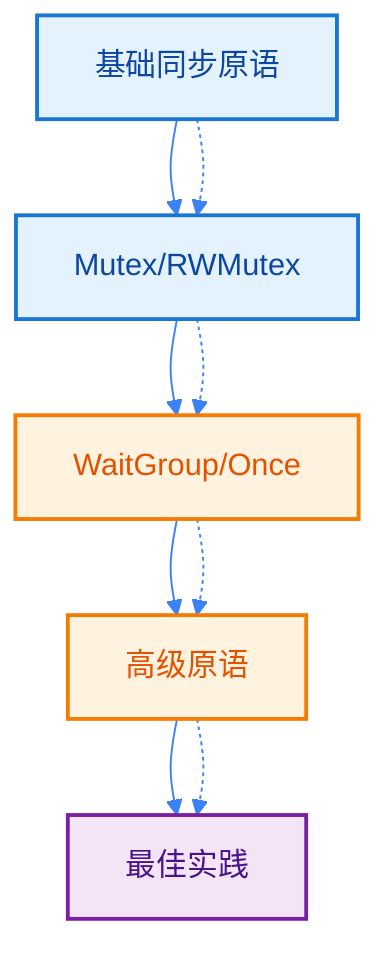
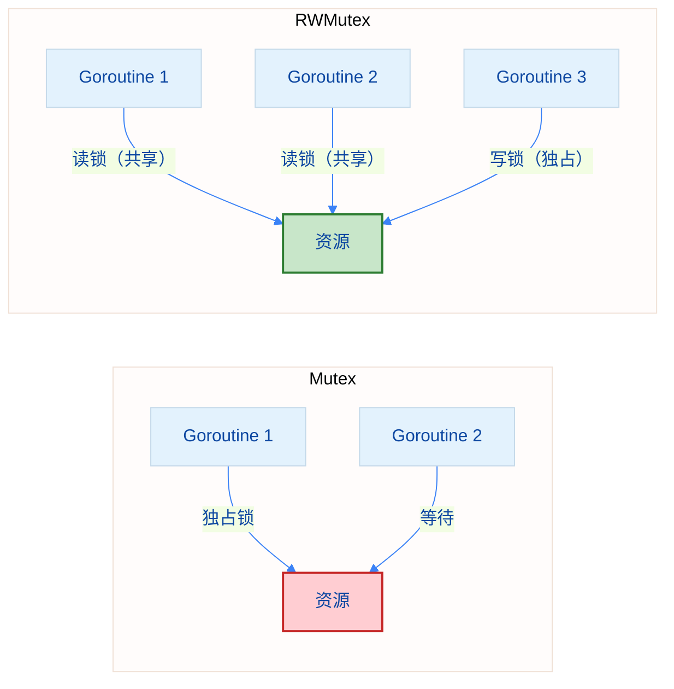
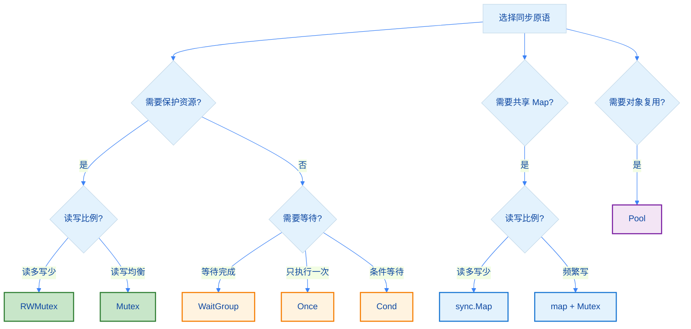

import { Badge } from "@rspress/core/theme";
import { Callout } from "@rspress/core/theme-original";

# Sync - 同步原语

[← 返回并发](.)

<Badge text="中级开发者" type="warning" />

`sync` 包提供了 Go 语言中用于并发同步的核心原语。与 channel 不同，sync 包更适用于传统的锁机制和资源协调场景。

## 学习路径



## sync.Mutex - 互斥锁

Mutex 是最基本的互斥锁，提供对共享资源的独占访问。

### 定义

```go
type Mutex struct {
    // 包含非导出字段
}
```

### 主要方法

```go
func (m *Mutex) Lock()   // 获取锁，如果已被占用则阻塞
func (m *Mutex) Unlock() // 释放锁
func (m *Mutex) TryLock() bool // 尝试获取锁，非阻塞（Go 1.18+）
```

### 使用场景

- 保护临界区
- 保护共享状态
- 确保同一时间只有一个 goroutine 访问资源

### 基础示例

```go
package main

import (
    "fmt"
    "sync"
    "time"
)

type SafeCounter struct {
    mu    sync.Mutex
    count int
}

func (c *SafeCounter) Increment() {
    c.mu.Lock()
    defer c.mu.Unlock()
    c.count++
}

func (c *SafeCounter) Value() int {
    c.mu.Lock()
    defer c.mu.Unlock()
    return c.count
}

func main() {
    counter := &SafeCounter{}

    // 启动 100 个 goroutine 并发增加计数器
    for i := 0; i < 100; i++ {
        go counter.Increment()
    }

    time.Sleep(time.Millisecond) // 等待所有 goroutine 完成
    fmt.Println("Final count:", counter.Value())
    // 输出：Final count: 100
}
```

<Callout type="tip" title="最佳实践">
  <strong>使用 defer 确保锁释放</strong>：
  - 在 Lock() 后立即使用 `defer m.Unlock()`
  - 确保即使发生 panic 也能释放锁
  - 避免死锁和资源泄漏
</Callout>

### TryLock 示例（Go 1.18+）

```go
package main

import (
    "fmt"
    "sync"
    "time"
)

func main() {
    var mu sync.Mutex

    // 尝试获取锁
    if mu.TryLock() {
        fmt.Println("成功获取锁")
        defer mu.Unlock()
    } else {
        fmt.Println("锁已被占用")
    }

    // 再次尝试（已被占用）
    go func() {
        if mu.TryLock() {
            fmt.Println("在 goroutine 中获取锁成功")
            mu.Unlock()
        } else {
            fmt.Println("在 goroutine 中获取锁失败")
        }
    }()

    time.Sleep(100 * time.Millisecond)
}
```

### 常见陷阱

<Callout type="danger" title={<Badge text="重要" type="danger" />}>
  <strong>Mutex 使用注意事项</strong>：
  - <strong>不可复制</strong>：Mutex 使用后不能复制，可能导致死锁
  - <strong>未加锁解锁</strong>：对未锁定的 Mutex 调用 Unlock 会 panic
  - <strong>重复加锁</strong>：同一个 goroutine 对同一个 Mutex 多次 Lock 会死锁
  - <strong>锁粒度</strong>：锁的范围尽可能小，减少等待时间
</Callout>

```go
// 错误示例：Mutex 复制导致问题
type Data struct {
    mu sync.Mutex
    val int
}

func badExample() {
    d := Data{val: 42}
    d2 := d  // 复制了 Mutex，错误！
    d2.mu.Lock()  // 可能导致死锁
}

// 正确示例：使用指针
func goodExample() {
    d := &Data{val: 42}
    d2 := d  // 复制指针，共享同一个 Mutex
    d2.mu.Lock()  // 正确
    d2.mu.Unlock()
}
```

## sync.RWMutex - 读写锁

RWMutex 是读写分离的锁，允许多个读操作同时进行，写操作独占。

### 定义

```go
type RWMutex struct {
    // 包含非导出字段
}
```

### 主要方法

```go
// 写锁（独占）
func (rw *RWMutex) Lock()      // 获取写锁
func (rw *RWMutex) Unlock()    // 释放写锁

// 读锁（共享）
func (rw *RWMutex) RLock()     // 获取读锁
func (rw *RWMutex) RUnlock()   // 释放读锁

// 尝试获取锁（Go 1.18+）
func (rw *RWMutex) TryLock() bool
func (rw *RWMutex) TryRLock() bool
```

### 使用场景

- 读多写少的场景
- 缓存系统
- 配置中心
- 数据库连接池

### 基础示例

```go
package main

import (
    "fmt"
    "sync"
    "time"
)

type Cache struct {
    mu   sync.RWMutex
    data map[string]string
}

func NewCache() *Cache {
    return &Cache{
        data: make(map[string]string),
    }
}

func (c *Cache) Get(key string) (string, bool) {
    c.mu.RLock()         // 读锁
    defer c.mu.RUnlock()
    value, ok := c.data[key]
    return value, ok
}

func (c *Cache) Set(key, value string) {
    c.mu.Lock()          // 写锁
    defer c.mu.Unlock()
    c.data[key] = value
}

func main() {
    cache := NewCache()

    // 写入数据
    cache.Set("name", "Alice")
    cache.Set("age", "30")

    var wg sync.WaitGroup

    // 启动多个读操作
    for i := 0; i < 5; i++ {
        wg.Add(1)
        go func(id int) {
            defer wg.Done()
            if val, ok := cache.Get("name"); ok {
                fmt.Printf("Reader %d: name = %s\n", id, val)
            }
        }(i)
    }

    // 启动写操作
    wg.Add(1)
    go func() {
        defer wg.Done()
        cache.Set("name", "Bob")
        fmt.Println("Writer: Updated name to Bob")
    }()

    wg.Wait()
}
```

### RWMutex vs Mutex 对比



<Callout type="info" title="选择建议">
  <strong>Mutex vs RWMutex</strong>：
  - <strong>Mutex</strong>：适合写操作频繁或读写均衡的场景
  - <strong>RWMutex</strong>：适合读多写少的场景
  - RWMutex 在读多写少时性能更好，但内存占用更高
  - 如果不确定，优先使用 Mutex
</Callout>

## sync.WaitGroup - 等待组

WaitGroup 用于等待一组 goroutine 完成。

### 定义

```go
type WaitGroup struct {
    // 包含非导出字段
}
```

### 主要方法

```go
func (wg *WaitGroup) Add(delta int)   // 增加计数器
func (wg *WaitGroup) Done()           // 计数器减 1
func (wg *WaitGroup) Wait()           // 阻塞直到计数器为 0
```

### 使用场景

- 等待多个 goroutine 完成
- 批量任务处理
- 并发任务协调

### 基础示例

```go
package main

import (
    "fmt"
    "sync"
    "time"
)

func worker(id int, wg *sync.WaitGroup) {
    defer wg.Done()  // 等同于 wg.Add(-1)

    fmt.Printf("Worker %d: 开始工作\n", id)
    time.Sleep(100 * time.Millisecond)
    fmt.Printf("Worker %d: 完成工作\n", id)
}

func main() {
    var wg sync.WaitGroup

    // 启动 3 个 worker
    for i := 1; i <= 3; i++ {
        wg.Add(1)  // 增加计数器
        go worker(i, &wg)
    }

    // 等待所有 worker 完成
    wg.Wait()
    fmt.Println("所有 worker 已完成")
}
```

### 常见模式

```go
package main

import (
    "fmt"
    "sync"
)

// 模式 1：在启动 goroutine 前调用 Add
func pattern1() {
    var wg sync.WaitGroup
    for i := 0; i < 3; i++ {
        wg.Add(1)
        go func(n int) {
            defer wg.Done()
            fmt.Println(n)
        }(i)
    }
    wg.Wait()
}

// 模式 2：批量 Add
func pattern2() {
    var wg sync.WaitGroup
    wg.Add(3)
    for i := 0; i < 3; i++ {
        go func(n int) {
            defer wg.Done()
            fmt.Println(n)
        }(i)
    }
    wg.Wait()
}

// 模式 3：在函数内部 Add
func process(tasks []int, wg *sync.WaitGroup) {
    for _, task := range tasks {
        wg.Add(1)
        go func(t int) {
            defer wg.Done()
            fmt.Printf("处理任务 %d\n", t)
        }(task)
    }
}

func main() {
    pattern1()
    fmt.Println("---")
    pattern2()
    fmt.Println("---")

    var wg sync.WaitGroup
    process([]int{1, 2, 3}, &wg)
    wg.Wait()
}
```

<Callout type="danger" title="注意事项">
  <strong>WaitGroup 使用规则</strong>：
  - Add 必须在 goroutine 启动前调用
  - Done 必须在 goroutine 内部调用
  - Add 和 Done 的调用次数必须匹配
  - 不要复制使用过的 WaitGroup
</Callout>

## sync.Once - 只执行一次

Once 确保某个操作只执行一次，常用于初始化场景。

### 定义

```go
type Once struct {
    // 包含非导出字段
}
```

### 主要方法

```go
func (o *Once) Do(f func())  // 执行函数 f，保证只执行一次
```

### 使用场景

- 单例模式
- 延迟初始化
- 配置加载
- 资源初始化

### 基础示例

```go
package main

import (
    "fmt"
    "sync"
)

type Database struct {
    connection string
}

var (
    instance *Database
    once     sync.Once
)

func GetDatabase() *Database {
    once.Do(func() {
        fmt.Println("初始化数据库连接")
        instance = &Database{connection: "localhost:5432"}
    })
    return instance
}

func main() {
    var wg sync.WaitGroup

    // 多个 goroutine 同时调用 GetDatabase
    for i := 0; i < 5; i++ {
        wg.Add(1)
        go func(id int) {
            defer wg.Done()
            db := GetDatabase()
            fmt.Printf("Goroutine %d: %v\n", id, db)
        }(i)
    }

    wg.Wait()
    // 输出：只打印一次 "初始化数据库连接"
}
```

### 单例模式实现

```go
package main

import (
    "fmt"
    "sync"
)

type Singleton struct {
    value int
}

var (
    singleton *Singleton
    once      sync.Once
)

func GetSingleton() *Singleton {
    once.Do(func() {
        singleton = &Singleton{value: 42}
    })
    return singleton
}

func main() {
    s1 := GetSingleton()
    s2 := GetSingleton()

    fmt.Printf("s1 == s2: %v\n", s1 == s2)  // true
    fmt.Printf("s1.value: %d\n", s1.value)  // 42
    fmt.Printf("s2.value: %d\n", s2.value)  // 42
}
```

### 与 Mutex 的对比

```go
// 使用 Mutex 实现（代码更复杂）
var mu sync.Mutex
var initialized bool
var value int

func getValue() int {
    mu.Lock()
    if !initialized {
        value = initialize()
        initialized = true
    }
    mu.Unlock()
    return value
}

// 使用 Once 实现（简洁清晰）
var once sync.Once
var value int

func getValue() int {
    once.Do(func() {
        value = initialize()
    })
    return value
}
```

## sync.Cond - 条件变量

Cond 用于等待或通知条件变化的场景，通常与 Mutex 配合使用。

### 定义

```go
type Cond struct {
    // 包含非导出字段
}
```

### 主要方法

```go
func NewCond(l Locker) *Cond           // 创建条件变量
func (c *Cond) Wait()                  // 等待通知（自动释放锁）
func (c *Cond) Signal()                // 唤醒一个等待的 goroutine
func (c *Cond) Broadcast()             // 唤醒所有等待的 goroutine
```

### 使用场景

- 生产者-消费者模式
- 任务队列
- 事件通知系统

### 基础示例

```go
package main

import (
    "fmt"
    "sync"
    "time"
)

type Queue struct {
    items []int
    cond  *sync.Cond
}

func NewQueue() *Queue {
    q := &Queue{
        items: make([]int, 0),
    }
    q.cond = sync.NewCond(&sync.Mutex{})
    return q
}

func (q *Queue) Push(item int) {
    q.cond.L.Lock()
    defer q.cond.L.Unlock()

    q.items = append(q.items, item)
    q.cond.Signal()  // 通知一个等待的消费者
}

func (q *Queue) Pop() int {
    q.cond.L.Lock()
    defer q.cond.L.Unlock()

    for len(q.items) == 0 {
        q.cond.Wait()  // 等待数据
    }

    item := q.items[0]
    q.items = q.items[1:]
    return item
}

func main() {
    q := NewQueue()

    // 消费者
    go func() {
        for i := 0; i < 5; i++ {
            item := q.Pop()
            fmt.Printf("消费: %d\n", item)
        }
    }()

    // 生产者
    for i := 1; i <= 5; i++ {
        q.Push(i)
        fmt.Printf("生产: %d\n", i)
        time.Sleep(100 * time.Millisecond)
    }

    time.Sleep(time.Second)
}
```

### Broadcast 示例

```go
package main

import (
    "fmt"
    "sync"
    "time"
)

func main() {
    var mu sync.Mutex
    cond := sync.NewCond(&mu)
    ready := false

    // 启动 3 个等待者
    for i := 1; i <= 3; i++ {
        go func(id int) {
            mu.Lock()
            for !ready {
                cond.Wait()  // 等待就绪信号
            }
            mu.Unlock()
            fmt.Printf("Goroutine %d: 开始执行\n", id)
        }(i)
    }

    time.Sleep(time.Second)

    // 唤醒所有等待者
    mu.Lock()
    ready = true
    cond.Broadcast()  // 唤醒所有
    mu.Unlock()

    time.Sleep(time.Second)
}
```

<Callout type="warning" title="重要">
  <strong>Cond 使用注意事项</strong>：
  - Wait() 必须在持有锁时调用
  - Wait() 会自动释放锁并阻塞，被唤醒后重新获取锁
  - Wait() 应该在循环中调用（防止虚假唤醒）
  - Signal() 只唤醒一个 goroutine，Broadcast() 唤醒所有
</Callout>

## sync.Map - 并发安全 Map

sync.Map 是专门为并发场景设计的 Map，内置了并发安全机制。

### 定义

```go
type Map struct {
    // 包含非导出字段
}
```

### 主要方法

```go
func (m *Map) Load(key any) (value any, ok bool)
func (m *Map) Store(key, value any)
func (m *Map) LoadOrStore(key, value any) (actual any, loaded bool)
func (m *Map) LoadAndDelete(key any) (value any, loaded bool)
func (m *Map) Delete(key any)
func (m *Map) Range(f func(key, value any) bool)
```

### 使用场景

- 读多写少的缓存
- 注册表场景
- key 生命周期分离的场景
- 多个 goroutine 并发访问 Map

### 基础示例

```go
package main

import (
    "fmt"
    "sync"
)

func main() {
    var m sync.Map

    // 存储
    m.Store("name", "Alice")
    m.Store("age", 30)
    m.Store(1, "one")

    // 读取
    if value, ok := m.Load("name"); ok {
        fmt.Println("name:", value)  // name: Alice
    }

    // LoadOrStore：不存在则存储
    actual, loaded := m.LoadOrStore("city", "Beijing")
    fmt.Printf("city: %v, existed: %v\n", actual, loaded)

    actual, loaded = m.LoadOrStore("name", "Bob")
    fmt.Printf("name: %v, existed: %v\n", actual, loaded)

    // Range 遍历
    fmt.Println("\n所有键值对:")
    m.Range(func(key, value any) bool {
        fmt.Printf("  %v: %v\n", key, value)
        return true  // 返回 false 停止遍历
    })

    // 删除
    m.Delete("age")
    fmt.Println("\n删除 age 后:")
    m.Range(func(key, value any) bool {
        fmt.Printf("  %v: %v\n", key, value)
        return true
    })
}
```

### 与普通 Map + Mutex 的对比

```go
// 使用 sync.Map
func useSyncMap() {
    var m sync.Map
    m.Store("key", "value")
    val, _ := m.Load("key")
    fmt.Println(val)
}

// 使用普通 Map + Mutex
func useMapWithMutex() {
    var (
        mu   sync.Mutex
        data = make(map[string]string)
    )

    mu.Lock()
    data["key"] = "value"
    mu.Unlock()

    mu.Lock()
    val := data["key"]
    mu.Unlock()

    fmt.Println(val)
}
```

<Callout type="info" title="选择建议">
  <strong>sync.Map vs map + Mutex/RWMutex</strong>：

  **使用 sync.Map**：
  - 读多写少的场景
  - key 集合稳定，主要是更新值
  - 分散的、不协调的访问

  **使用 map + Mutex/RWMutex**：
  - 写操作频繁
  - 需要复杂的原子操作
  - 性能是关键考虑
</Callout>

### 缓存示例

```go
package main

import (
    "fmt"
    "sync"
    "time"
)

type Cache struct {
    data sync.Map
}

func (c *Cache) Get(key string) (string, bool) {
    val, ok := c.data.Load(key)
    if !ok {
        return "", false
    }
    return val.(string), true
}

func (c *Cache) Set(key, value string) {
    c.data.Store(key, value)
}

func (c *Cache) GetOrCreate(key string, create func() string) string {
    // 原子操作：存在则返回，不存在则创建并存储
    actual, _ := c.data.LoadOrStore(key, create())
    return actual.(string)
}

func main() {
    cache := &Cache{}

    // 设置值
    cache.Set("user:1", "Alice")

    // 获取值
    if val, ok := cache.Get("user:1"); ok {
        fmt.Println("Found:", val)
    }

    // 原子获取或创建
    val := cache.GetOrCreate("user:2", func() string {
        fmt.Println("Creating user:2")
        return "Bob"
    })
    fmt.Println("Value:", val)

    // 再次获取（不会创建）
    val = cache.GetOrCreate("user:2", func() string {
        fmt.Println("This won't print")
        return "Charlie"
    })
    fmt.Println("Value:", val)
}
```

## sync.Pool - 对象池

Pool 是临时对象池，用于重用对象以减少 GC 压力。

### 定义

```go
type Pool struct {
    // 包含非导出字段
    noCopy any
}

type Pool struct {
    New func() any  // 创建对象的函数
}
```

### 主要方法

```go
func (p *Pool) Get() any    // 从池中获取对象
func (p *Pool) Put(x any)   // 将对象放回池中
```

### 使用场景

- 频繁创建/销毁的对象
- 临时缓冲区
- 连接对象
- 减少内存分配

### 基础示例

```go
package main

import (
    "bytes"
    "fmt"
    "sync"
)

func main() {
    // 创建字节缓冲区池
    bufferPool := sync.Pool{
        New: func() any {
            fmt.Println("创建新的缓冲区")
            return new(bytes.Buffer)
        },
    }

    // 获取缓冲区
    buf1 := bufferPool.Get().(*bytes.Buffer)
    buf1.WriteString("Hello")
    fmt.Println("buf1:", buf1.String())

    // 放回池中
    bufferPool.Put(buf1)

    // 再次获取（可能复用）
    buf2 := bufferPool.Get().(*bytes.Buffer)
    buf2.Reset()  // 重置缓冲区
    buf2.WriteString("World")
    fmt.Println("buf2:", buf2.String())
}
```

### 性能对比

```go
package main

import (
    "bytes"
    "fmt"
    "sync"
    "time"
)

func withoutPool() {
    start := time.Now()
    for i := 0; i < 10000; i++ {
        buf := new(bytes.Buffer)
        buf.WriteString("test")
        _ = buf.String()
    }
    fmt.Printf("不使用池: %v\n", time.Since(start))
}

func withPool() {
    pool := sync.Pool{
        New: func() any {
            return new(bytes.Buffer)
        },
    }

    start := time.Now()
    for i := 0; i < 10000; i++ {
        buf := pool.Get().(*bytes.Buffer)
        buf.WriteString("test")
        _ = buf.String()
        pool.Put(buf)
    }
    fmt.Printf("使用池: %v\n", time.Since(start))
}

func main() {
    withoutPool()
    withPool()
}
```

### JSON 编码池

```go
package main

import (
    "bytes"
    "encoding/json"
    "fmt"
    "sync"
)

var jsonPool = sync.Pool{
    New: func() any {
        return new(bytes.Buffer)
    },
}

func toJSON(v any) (string, error) {
    buf := jsonPool.Get().(*bytes.Buffer)
    defer func() {
        buf.Reset()
        jsonPool.Put(buf)
    }()

    if err := json.NewEncoder(buf).Encode(v); err != nil {
        return "", err
    }

    return buf.String(), nil
}

func main() {
    data := map[string]any{
        "name": "Alice",
        "age":  30,
    }

    jsonStr, err := toJSON(data)
    if err != nil {
        fmt.Println("Error:", err)
        return
    }

    fmt.Println(jsonStr)
}
```

<Callout type="warning" title="注意事项">
  <strong>Pool 使用规则</strong>：
  - Pool 中的对象可能随时被 GC 回收
  - Get() 返回的对象可能是 nil
  - Put() 前必须重置对象状态
  - 不要在 Pool 中存储连接等需要显式关闭的资源
  - Pool 适合存储无状态或可重置的对象
</Callout>

## 原语对比与选择

### 使用场景对比



### 性能特点对比

| 原语 | 适用场景 | 性能特点 | 内存开销 |
|-----|---------|---------|---------|
| Mutex | 通用锁保护 | 低开销 | 低 |
| RWMutex | 读多写少 | 读并发，写独占 | 中 |
| WaitGroup | 任务等待 | 低开销 | 低 |
| Once | 单次执行 | 低开销 | 低 |
| Cond | 条件等待 | 中等开销 | 中 |
| sync.Map | 并发 Map | 读优化，适合缓存 | 高 |
| Pool | 对象复用 | 减少 GC 压力 | 中 |

## 最佳实践

### 1. 避免锁复制

```go
// 错误：复制了 Mutex
type Data struct {
    mu sync.Mutex
}

func (d Data) BadMethod() {
    d.mu.Lock()  // 错误！复制了锁
    defer d.mu.Unlock()
}

// 正确：使用指针
func (d *Data) GoodMethod() {
    d.mu.Lock()
    defer d.mu.Unlock()
}
```

### 2. 合理的锁粒度

```go
// 粗粒度锁：简单但效率低
type Counter struct {
    mu    sync.Mutex
    count int
    other string
}

func (c *Counter) Increment() {
    c.mu.Lock()
    c.count++
    c.mu.Unlock()
}

// 细粒度锁：复杂但效率高
type Counters struct {
    counts [10]struct {
        mu    sync.Mutex
        value int
    }
}

func (c *Counters) Increment(id int) {
    c.counts[id%10].mu.Lock()
    c.counts[id%10].value++
    c.counts[id%10].mu.Unlock()
}
```

### 3. 避免死锁

```go
// 错误：可能导致死锁
func bad() {
    var mu1, mu2 sync.Mutex

    mu1.Lock()
    mu2.Lock()
    // ...
    mu1.Unlock()
    mu2.Unlock()
}

// 正确：按固定顺序获取锁
func good() {
    var mu1, mu2 sync.Mutex

    mu1.Lock()
    mu2.Lock()
    // ...
    mu2.Unlock()
    mu1.Unlock()
}
```

### 4. defer 释放锁

```go
func (c *Counter) Increment() {
    c.mu.Lock()
    defer c.mu.Unlock()

    c.count++
    // 即使这里 panic，锁也会被释放
}
```

## 练习

<Badge text="初级" type="tip" />

1. **实现线程安全的计数器**：使用 Mutex 保护计数器，支持增加和获取操作

<details>
<summary>查看答案</summary>

```go
package main

import (
    "fmt"
    "sync"
)

type SafeCounter struct {
    mu    sync.Mutex
    count int
}

func (c *SafeCounter) Increment() {
    c.mu.Lock()
    defer c.mu.Unlock()
    c.count++
}

func (c *SafeCounter) Value() int {
    c.mu.Lock()
    defer c.mu.Unlock()
    return c.count
}

func (c *SafeCounter) Reset() {
    c.mu.Lock()
    defer c.mu.Unlock()
    c.count = 0
}

func main() {
    counter := &SafeCounter{}
    var wg sync.WaitGroup

    // 启动 1000 个 goroutine
    for i := 0; i < 1000; i++ {
        wg.Add(1)
        go func() {
            defer wg.Done()
            counter.Increment()
        }()
    }

    wg.Wait()
    fmt.Println("Final count:", counter.Value())
}
```

**解释**：使用 Mutex 保护计数器的并发访问，确保原子性操作。

</details>

2. **实现配置管理器**：使用 RWMutex 实现读写分离的配置缓存

<details>
<summary>查看答案</summary>

```go
package main

import (
    "fmt"
    "sync"
    "time"
)

type Config struct {
    mu   sync.RWMutex
    data map[string]string
}

func NewConfig() *Config {
    return &Config{
        data: make(map[string]string),
    }
}

func (c *Config) Get(key string) (string, bool) {
    c.mu.RLock()
    defer c.mu.RUnlock()
    val, ok := c.data[key]
    return val, ok
}

func (c *Config) Set(key, value string) {
    c.mu.Lock()
    defer c.mu.Unlock()
    c.data[key] = value
}

func (c *Config) GetAll() map[string]string {
    c.mu.RLock()
    defer c.mu.RUnlock()

    result := make(map[string]string, len(c.data))
    for k, v := range c.data {
        result[k] = v
    }
    return result
}

func main() {
    config := NewConfig()

    // 写入配置
    config.Set("host", "localhost")
    config.Set("port", "8080")

    var wg sync.WaitGroup

    // 启动多个读操作
    for i := 0; i < 5; i++ {
        wg.Add(1)
        go func(id int) {
            defer wg.Done()
            if host, ok := config.Get("host"); ok {
                fmt.Printf("Reader %d: host = %s\n", id, host)
            }
        }(i)
    }

    // 启动写操作
    wg.Add(1)
    go func() {
        defer wg.Done()
        time.Sleep(50 * time.Millisecond)
        config.Set("host", "example.com")
        fmt.Println("Writer: Updated host")
    }()

    wg.Wait()

    // 打印所有配置
    fmt.Println("\n所有配置:")
    for k, v := range config.GetAll() {
        fmt.Printf("  %s = %s\n", k, v)
    }
}
```

**解释**：使用 RWMutex 实现读写分离，多个读操作可以并发执行，写操作独占访问。

</details>

<Badge text="中级" type="info" />

3. **实现带超时的任务队列**：使用 Cond 实现生产者-消费者模式，支持超时

<details>
<summary>查看答案</summary>

```go
package main

import (
    "fmt"
    "sync"
    "time"
)

type Task struct {
    ID   int
    Data string
}

type TaskQueue struct {
    mu     sync.Mutex
    cond   *sync.Cond
    tasks  []Task
    closed bool
}

func NewTaskQueue() *TaskQueue {
    q := &TaskQueue{
        tasks: make([]Task, 0),
    }
    q.cond = sync.NewCond(&q.mu)
    return q
}

func (q *TaskQueue) Push(task Task) error {
    q.mu.Lock()
    defer q.mu.Unlock()

    if q.closed {
        return fmt.Errorf("queue is closed")
    }

    q.tasks = append(q.tasks, task)
    q.cond.Signal()  // 通知一个等待的消费者
    return nil
}

func (q *TaskQueue) Pop(timeout time.Duration) (Task, bool) {
    q.mu.Lock()
    defer q.mu.Unlock()

    if len(q.tasks) == 0 && !q.closed {
        // 使用 channel 实现超时
        done := make(chan struct{})
        go func() {
            q.cond.Wait()
            close(done)
        }()

        select {
        case <-done:
            // 被唤醒
        case <-time.After(timeout):
            // 超时，取消等待
            q.cond.Broadcast()
            return Task{}, false
        }
    }

    if q.closed {
        return Task{}, false
    }

    if len(q.tasks) == 0 {
        return Task{}, false
    }

    task := q.tasks[0]
    q.tasks = q.tasks[1:]
    return task, true
}

func (q *TaskQueue) Close() {
    q.mu.Lock()
    defer q.mu.Unlock()

    q.closed = true
    q.cond.Broadcast()  // 唤醒所有等待者
}

func main() {
    queue := NewTaskQueue()
    var wg sync.WaitGroup

    // 消费者
    wg.Add(1)
    go func() {
        defer wg.Done()
        for i := 0; i < 3; i++ {
            task, ok := queue.Pop(2 * time.Second)
            if !ok {
                fmt.Printf("消费者: 获取任务超时或队列已关闭\n")
                break
            }
            fmt.Printf("消费者: 处理任务 %d\n", task.ID)
        }
    }()

    // 生产者
    for i := 1; i <= 3; i++ {
        time.Sleep(500 * time.Millisecond)
        queue.Push(Task{ID: i, Data: fmt.Sprintf("Task %d", i)})
        fmt.Printf("生产者: 添加任务 %d\n", i)
    }

    wg.Wait()
    queue.Close()
    fmt.Println("队列已关闭")
}
```

**解释**：使用 Cond 实现任务队列，当队列为空时消费者等待，生产者添加任务后唤醒消费者。支持超时机制。

</details>

4. **实现多级缓存**：使用 sync.Map 实现本地缓存 + 缓存淘汰

<details>
<summary>查看答案</summary>

```go
package main

import (
    "fmt"
    "sync"
    "time"
)

type CacheItem struct {
    Value      string
    Expiration time.Time
}

func (item *CacheItem) IsExpired() bool {
    return time.Now().After(item.Expiration)
}

type Cache struct {
    data sync.Map
}

func NewCache() *Cache {
    cache := &Cache{}
    go cache.cleanupExpired()
    return cache
}

func (c *Cache) Set(key, value string, ttl time.Duration) {
    item := &CacheItem{
        Value:      value,
        Expiration: time.Now().Add(ttl),
    }
    c.data.Store(key, item)
}

func (c *Cache) Get(key string) (string, bool) {
    val, ok := c.data.Load(key)
    if !ok {
        return "", false
    }

    item := val.(*CacheItem)
    if item.IsExpired() {
        c.data.Delete(key)
        return "", false
    }

    return item.Value, true
}

func (c *Cache) Delete(key string) {
    c.data.Delete(key)
}

func (c *Cache) cleanupExpired() {
    ticker := time.NewTicker(time.Minute)
    defer ticker.Stop()

    for range ticker.C {
        c.data.Range(func(key, value any) bool {
            item := value.(*CacheItem)
            if item.IsExpired() {
                c.data.Delete(key)
                fmt.Printf("清理过期键: %v\n", key)
            }
            return true
        })
    }
}

func main() {
    cache := NewCache()

    // 设置缓存（1秒过期）
    cache.Set("user:1", "Alice", time.Second)
    cache.Set("user:2", "Bob", 2*time.Second)

    // 获取缓存
    if val, ok := cache.Get("user:1"); ok {
        fmt.Println("user:1 =", val)
    }

    // 等待过期
    time.Sleep(time.Second + 100*time.Millisecond)

    // 已过期
    if _, ok := cache.Get("user:1"); !ok {
        fmt.Println("user:1 已过期")
    }

    // user:2 还在
    if val, ok := cache.Get("user:2"); ok {
        fmt.Println("user:2 =", val)
    }
}
```

**解释**：使用 sync.Map 实现并发安全的缓存，支持 TTL 过期机制和后台清理。

</details>

<Badge text="高级" type="warning" />

5. **实现数据库连接池**：使用 Pool 实现可复用的数据库连接池

<details>
<summary>查看答案</summary>

```go
package main

import (
    "fmt"
    "sync"
    "time"
)

// 模拟数据库连接
type DBConnection struct {
    id       int
    inUse    bool
    lastUsed time.Time
}

func (db *DBConnection) Query(query string) string {
    return fmt.Sprintf("结果来自连接 %d: %s", db.id, query)
}

func (db *DBConnection) Close() error {
    fmt.Printf("连接 %d 已关闭\n", db.id)
    return nil
}

type ConnectionPool struct {
    pool    sync.Pool
    maxConn int
    connID  int
    mu      sync.Mutex
}

func NewConnectionPool(maxConn int) *ConnectionPool {
    p := &ConnectionPool{
        maxConn: maxConn,
    }

    p.pool = sync.Pool{
        New: func() any {
            p.mu.Lock()
            p.connID++
            id := p.connID
            p.mu.Unlock()

            fmt.Printf("创建新连接 %d\n", id)
            return &DBConnection{
                id:       id,
                lastUsed: time.Now(),
            }
        },
    }

    return p
}

func (p *ConnectionPool) Get() *DBConnection {
    conn := p.pool.Get().(*DBConnection)
    conn.inUse = true
    conn.lastUsed = time.Now()
    return conn
}

func (p *ConnectionPool) Put(conn *DBConnection) {
    conn.inUse = false
    conn.lastUsed = time.Now()
    p.pool.Put(conn)
}

func (p *ConnectionPool) Execute(query string) string {
    conn := p.Get()
    defer p.Put(conn)

    // 模拟查询延迟
    time.Sleep(50 * time.Millisecond)
    return conn.Query(query)
}

func main() {
    pool := NewConnectionPool(5)

    var wg sync.WaitGroup

    // 模拟并发查询
    for i := 0; i < 10; i++ {
        wg.Add(1)
        go func(id int) {
            defer wg.Done()

            result := pool.Execute(fmt.Sprintf("SELECT * FROM users WHERE id = %d", id))
            fmt.Printf("Goroutine %d: %s\n", id, result)
        }(i)
    }

    wg.Wait()
    fmt.Println("\n所有查询完成")
}
```

**解释**：使用 sync.Pool 实现数据库连接池，连接可以被复用，减少创建连接的开销。

</details>

6. **实现分布式锁协调器**：结合多种 sync 原语实现复杂的并发控制

<details>
<summary>查看答案</summary>

```go
package main

import (
    "fmt"
    "sync"
    "time"
)

// LockManager 管理多个资源的锁
type LockManager struct {
    mu     sync.Mutex
    locks  map[string]*sync.Mutex
    once   sync.Once
    cond   *sync.Cond
    active int
}

func NewLockManager() *LockManager {
    lm := &LockManager{
        locks: make(map[string]*sync.Mutex),
    }
    lm.cond = sync.NewCond(&lm.mu)
    return lm
}

func (lm *LockManager) getLock(resource string) *sync.Mutex {
    lm.mu.Lock()
    defer lm.mu.Unlock()

    if _, ok := lm.locks[resource]; !ok {
        lm.locks[resource] = &sync.Mutex{}
    }
    return lm.locks[resource]
}

func (lm *LockManager) Acquire(resource string, timeout time.Duration) bool {
    lock := lm.getLock(resource)

    done := make(chan struct{})
    go func() {
        lock.Lock()
        close(done)
    }()

    select {
    case <-done:
        lm.mu.Lock()
        lm.active++
        lm.mu.Unlock()
        return true
    case <-time.After(timeout):
        return false
    }
}

func (lm *LockManager) Release(resource string) {
    lock := lm.getLock(resource)
    lock.Unlock()

    lm.mu.Lock()
    lm.active--
    if lm.active == 0 {
        lm.cond.Broadcast()
    }
    lm.mu.Unlock()
}

func (lm *LockManager) WaitAll() {
    lm.mu.Lock()
    defer lm.mu.Unlock()

    for lm.active > 0 {
        lm.cond.Wait()
    }
}

// Worker 使用锁管理器
type Worker struct {
    id      int
    manager *LockManager
}

func (w *Worker) Process(resources []string) {
    fmt.Printf("Worker %d: 尝试获取资源 %v\n", w.id, resources)

    // 获取所有资源锁
    acquired := make([]string, 0)
    for _, res := range resources {
        if w.manager.Acquire(res, 100*time.Millisecond) {
            acquired = append(acquired, res)
        } else {
            break
        }
    }

    // 如果获取失败，释放已获取的锁
    if len(acquired) != len(resources) {
        fmt.Printf("Worker %d: 获取资源失败，释放已获取的锁\n", w.id)
        for _, res := range acquired {
            w.manager.Release(res)
        }
        return
    }

    // 处理任务
    fmt.Printf("Worker %d: 成功获取资源 %v，开始处理\n", w.id, resources)
    time.Sleep(100 * time.Millisecond)

    // 释放所有锁
    for _, res := range resources {
        w.manager.Release(res)
    }
    fmt.Printf("Worker %d: 完成处理，释放资源\n", w.id)
}

func main() {
    manager := NewLockManager()
    var wg sync.WaitGroup

    tasks := [][]string{
        {"A", "B"},
        {"B", "C"},
        {"C", "D"},
        {"A", "D"},
    }

    for i, resources := range tasks {
        wg.Add(1)
        go func(id int, res []string) {
            defer wg.Done()
            worker := &Worker{id: id, manager: manager}
            worker.Process(res)
        }(i, resources)
    }

    wg.Wait()
    manager.WaitAll()
    fmt.Println("\n所有 worker 已完成")
}
```

**解释**：结合 Mutex、Cond、WaitGroup 等多种同步原语，实现了复杂的资源锁管理器，支持多资源锁获取和超时控制。

</details>

## 总结

### 核心要点

<Badge text="核心概念" type="tip" />

1. **Mutex/RWMutex**：保护共享资源，RWMutex 适合读多写少场景
2. **WaitGroup**：等待一组 goroutine 完成
3. **Once**：确保操作只执行一次，适合单例模式
4. **Cond**：条件变量，适合等待/通知模式
5. **sync.Map**：并发安全的 Map，适合读多写少场景
6. **Pool**：对象池，减少 GC 压力

### 使用场景

| 场景 | 推荐使用 | 注意事项 |
|-----|---------|---------|
| 保护临界区 | ✅ Mutex | 使用 defer 释放锁 |
| 读多写少 | ✅ RWMutex | 读操作用 RLock/RUnlock |
| 等待完成 | ✅ WaitGroup | Add/Done 要匹配 |
| 单次初始化 | ✅ Once | Do 中的函数会阻塞 |
| 条件等待 | ✅ Cond | Wait 应在循环中调用 |
| 并发缓存 | ✅ sync.Map | 适合读多写少 |
| 对象复用 | ✅ Pool | Put 前重置状态 |

### 最佳实践清单

- [ ] 使用 defer 确保锁释放
- [ ] 避免锁复制，使用指针传递
- [ ] WaitGroup 的 Add/Done 要匹配
- [ ] RWMutex 适合读多写少，否则用 Mutex
- [ ] Cond.Wait 应在循环中调用
- [ ] sync.Map 适合读多写少的缓存
- [ ] Pool 获取的对象可能是 nil
- [ ] 避免在 Pool 中存储需要显式关闭的资源
- [ ] 选择合适的锁粒度平衡性能和简单性
- [ ] 优先使用 channel 而非共享内存

[← Channel 模式](./channel-patterns.mdx) | [继续：Atomic →](./atomic.mdx)
