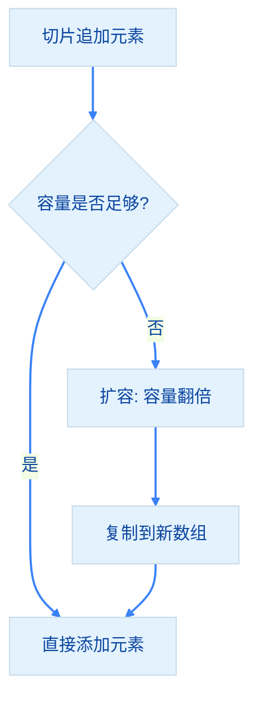

import { Badge } from "@rspress/core/theme";
import { Callout } from "@rspress/core/theme-original";

# 数据类型 - Go 数据类型参考手册

[← 返回 Golang 模块](..)

本文档提供 Go 语言各种数据类型的详细参考，包括使用场景、最佳实践和常见陷阱。


## <Badge text="数据类型概览" type="tip" />

### 值类型 vs 引用类型

| 类型 | 说明 | 示例 |
|------|------|------|
| **值类型** | 赋值时拷贝整个值 | int, float, bool, string, array, struct |
| **引用类型** | 赋值时只拷贝引用 | slice, map, pointer, channel, interface, func |

<Badge text="核心区别" type="info" /> **值类型**在赋值时拷贝整个值，**引用类型**只拷贝引用（指针）。


## <Badge text="数值类型" type="tip" />

### 整型

```go
// 平台相关
var i int = 42
var u uint = 42

// 有符号整型
var i8 int8 = 127
var i16 int16 = 32767
var i32 int32 = 2147483647
var i64 int64 = 9000000000

// 无符号整型
var u8 uint8 = 255       // byte 别名
var u16 uint16 = 65535
var u32 uint32 = 4294967295
var u64 uint64 = 18446744073709551615
```

### 整型选择指南

| 场景 | 推荐类型 | 说明 |
|-----|----------|------|
| 一般计数、索引 | `int` | 性能最优，跨平台兼容 |
| ID、数据库主键 | `int64` | 保证不溢出，跨平台一致 |
| 字节处理 | `byte` | 明确语义 |
| 文件大小 | `int64` | 文件可能超过 4GB |

### 浮点型

```go
var f32 float32 = 3.14        // IEEE-754 32位
var f64 float64 = 3.141592653589793  // IEEE-754 64位
```

<Badge text="建议" type="tip" /> 除非有特殊内存限制，否则<strong>始终使用 `float64`</strong>。


## <Badge text="字符串类型" type="tip" />

### 字符串基础

```go
var s1 string = "hello"
s2 := "世界"

// 多行字符串
s3 := `第一行
第二行`

// 字符串拼接
s4 := s1 + " " + s2
```

### 字符串与字节切片

```go
s := "hello"

// string → []byte
bytes := []byte(s)

// []byte → string
str := string([]byte{104, 101, 108, 108, 111})

// string → []rune
runes := []rune("你好")
```


## <Badge text="数组类型" type="info" />

### 数组基础

```go
var arr1 [5]int
arr2 := [3]int{1, 2, 3}
arr3 := [...]int{1, 2, 3, 4}

// 访问
arr2[0] = 10
```

<Badge text="重要" type="warning" /> **数组长度是类型的一部分**，`[3]int` 和 `[4]int` 是不同类型！


## <Badge text="切片类型" type="info" />

### 切片基础

```go
// 创建切片
s1 := []int{1, 2, 3}
s2 := make([]int, 3)
s3 := make([]int, 3, 5)

// 切片操作
fmt.Println(s1[1:3])

// 追加
s2 = append(s2, 4)
```

<Callout type="warning" title={<Badge text="重要" type="warning" />}>
  切片的长度<strong>不能通过 `nil` 判断</strong>，必须使用 `len(s)` 来判断切片是否为空。

  ```go
  // ✅ 正确：使用 len() 判断
  if len(s) == 0 {
      // 切片为空
  }
  ```
</Callout>

### 切片扩容机制



```go
s := make([]int, 0, 3)
s = append(s, 1, 2, 3)
fmt.Println(len(s), cap(s))  // 3 3

s = append(s, 4)  // 触发扩容
fmt.Println(len(s), cap(s))  // 4 6
```


## <Badge text="映射类型" type="info" />

### Map 基础

```go
// 创建 map
m := make(map[string]int)

// 添加/修改
m["key"] = 1

// 读取（带检查）
v, ok := m["key"]
if ok {
    fmt.Println(v)
}

// 删除
delete(m, "key")
```

<Callout type="danger" title={<Badge text="必须初始化" type="danger" />}>
  <strong>map 必须初始化才能使用</strong>

  ```go
  // ❌ 错误：仅定义
  var m map[string]int
  m["key"] = 1  // panic

  // ✅ 正确：使用 make 初始化
  m := make(map[string]int)
  m["key"] = 1
  ```
</Callout>


## <Badge text="结构体类型" type="info" />

### 结构体基础

```go
type User struct {
    ID   int
    Name string
}

u := User{1, "Alice"}
```


## <Badge text="指针类型" type="warning" />

### 指针基础

```go
x := 42
p := &x  // 获取地址

fmt.Println(*p)  // 42 解引用
*p = 100
fmt.Println(x)    // 100
```

<Callout type="warning" title={<Badge text="最佳实践" type="warning" />}>
  <strong>优先使用值类型，仅在必要时使用指针</strong>
</Callout>


## <Badge text="接口类型" type="warning" />

### 接口基础

```go
type Speaker interface {
    Speak() string
}

type Dog struct{}

func (d Dog) Speak() string {
    return "汪汪"
}

var s Speaker = Dog{}
```

<Callout type="warning" title={<Badge text="最佳实践" type="warning" />}>
  <strong>接口实现必须使用 `var _` 编译时检查</strong>

  ```go
  var _ Speaker = (*Dog)(nil)
  ```
</Callout>


## 数据类型速查表

| 类型 | 值/引用 | 零值 | 使用场景 |
|------|---------|------|----------|
| `bool` | 值 | `false` | 布尔值 |
| `int` | 值 | `0` | 默认整型 |
| `int64` | 值 | `0` | 大数值、ID |
| `float64` | 值 | `0` | 默认浮点型 |
| `string` | 值 | `""` | 文本 |
| `[N]T` | 值 | 元素零值 | 固定大小数组 |
| `[]T` | 引用 | `nil` | 动态数组 |
| `map[K]V` | 引用 | `nil` | 键值对 |
| `struct` | 值 | 字段零值 | 聚合数据 |
| `*T` | 引用 | `nil` | 指针 |
| `interface` | 引用 | `nil` | 多态 |


## 练习

1. **编写函数**，接收切片并返回其平均值
2. **创建 map** 统计字符串中每个字符出现的次数
3. **定义结构体**包含嵌入的切片
4. **实现接口**，让多个类型都实现 Stringer 接口


[← 返回 Golang 模块](..) | [核心基础](../fundamentals/overview/)
