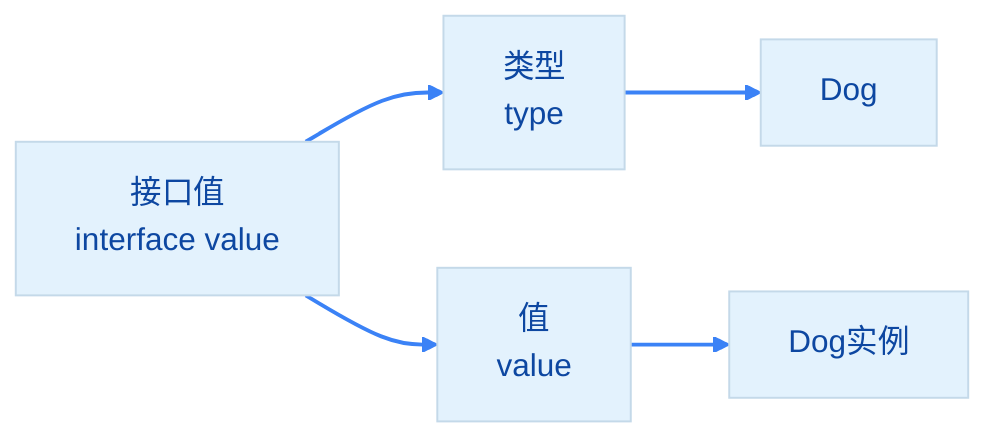
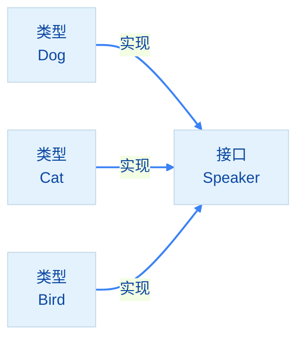

import { Badge } from "@rspress/core/theme";
import { Callout } from "@rspress/core/theme-original";

# 接口类型 - Interface Types

[← 返回数据类型](../)

接口定义<strong>行为契约</strong>，是 Go 实现多态的核心。

## <Badge text="接口基础" type="tip" />

### 定义接口

```go
// 定义接口
type Speaker interface {
    Speak() string
}

// 实现接口（隐式，无需显式声明）
type Dog struct {
    Name string
}

func (d Dog) Speak() string {
    return "汪汪"
}

type Cat struct {
    Name string
}

func (c Cat) Speak() string {
    return "喵喵"
}
```

### 使用接口

```go
// 接口变量可以持有任何实现该接口的类型
var s Speaker

s = Dog{Name: "Buddy"}
fmt.Println(s.Speak())  // 汪汪

s = Cat{Name: "Whiskers"}
fmt.Println(s.Speak())  // 喵喵
```

## <Badge text="接口实现检查" type="warning" />

<Callout type="warning" title={<Badge text="最佳实践" type="warning" />}>
  <strong>接口实现必须使用 `var _` 编译时检查</strong>

  ```go
  // 编译时验证接口实现（使用指针形式）
  var _ Speaker = (*Dog)(nil)
  var _ Speaker = (*Cat)(nil)

  // 如果接口未实现，编译时会报错：
  // cannot use (*Dog)(nil) (type *Dog) as type Speaker in assignment
  ```
</Callout>

## <Badge text="接口值" type="info" />

### 接口内部结构

```go
type Speaker interface {
    Speak() string
}

type Dog struct{}

func (d Dog) Speak() string {
    return "汪汪"
}

// 接口值包含两部分：
// 1. 类型信息（具体类型）
// 2. 值信息（具体值或指针）
var s Speaker = Dog{}
```



### nil 接口值

```go
var s Speaker
fmt.Println(s == nil)  // true

// s.Speak()  // panic: nil pointer dereference
```

### 包含 nil 指针的接口

```go
var d *Dog
var s Speaker = d  // s != nil，但内部值是 nil 指针

fmt.Println(s == nil)  // false - 接口本身不是 nil
// s.Speak()  // panic: nil pointer dereference
```

<Badge text="重要" type="danger" /> 包含 nil 指针的接口<strong>不是 nil</strong>！

## <Badge text="空接口" type="info" />

### interface{} 与 any

```go
// 空接口没有任何方法，所有类型都实现它
var i interface{}

i = 42
fmt.Println(i)  // 42

i = "hello"
fmt.Println(i)  // hello

i = []int{1, 2, 3}
fmt.Println(i)  // [1 2 3]

// Go 1.18+ 推荐使用 any
var j any = "world"
fmt.Println(j)  // world
```

### 类型断言

```go
var i interface{} = "hello"

// 方式1：安全断言
s, ok := i.(string)
if ok {
    fmt.Println("字符串:", s)
} else {
    fmt.Println("不是字符串")
}

// 方式2：直接断言（失败会 panic）
// s := i.(string)
```

### 类型 switch

```go
func describe(i interface{}) {
    switch v := i.(type) {
    case int:
        fmt.Println("整数:", v)
    case string:
        fmt.Println("字符串:", v)
    case bool:
        fmt.Println("布尔:", v)
    case []int:
        fmt.Println("整数切片:", v)
    default:
        fmt.Println("未知类型")
    }
}

describe(42)       // 整数: 42
describe("hello")  // 字符串: hello
describe(true)     // 布尔: true
```

## <Badge text="接口组合" type="info" />

### 嵌入接口

```go
type Reader interface {
    Read(p []byte) (n int, err error)
}

type Writer interface {
    Write(p []byte) (n int, err error)
}

type ReadWriter interface {
    Reader  // 嵌入 Reader
    Writer  // 嵌入 Writer
}

// ReadWriter 包含 Read 和 Write 两个方法
```

### 组合多个接口

```go
type LockableReader interface {
    Reader
    Lock()
    Unlock()
}
```

## <Badge text="接口最佳实践" type="warning" />

### 接口设计原则

```go
// ❌ 不好：接口过大
type BadInterface interface {
    Method1()
    Method2()
    Method3()
    // ... 很多方法
}

// ✅ 好：接口小而专注
type Writer interface {
    Write(p []byte) (n int, err error)
}
```

<Badge text="建议" type="tip" /> <strong>接口应该由使用者定义</strong>，而非实现者：

```go
// 定义在调用方
func SaveData(w Writer, data []byte) error {
    _, err := w.Write(data)
    return err
}

// 实现者只需要实现 Writer 接口
```

### 接口命名

| 接口方法数 | 命名约定 | 示例 |
|-----------|---------|------|
| 单个方法 | 方法名 + er | `Reader`, `Writer` |
| 多个方法 | 描述功能 | `ReadWriteCloser` |

## <Badge text="常用标准接口" type="info" />

```go
// io.Reader - 读取接口
type Reader interface {
    Read(p []byte) (n int, err error)
}

// io.Writer - 写入接口
type Writer interface {
    Write(p []byte) (n int, err error)
}

// fmt.Stringer - 字符串化接口
type Stringer interface {
    String() string
}

// error - 错误接口
type error interface {
    Error() string
}
```

### 实现 Stringer

```go
type Person struct {
    Name string
    Age  int
}

func (p Person) String() string {
    return fmt.Sprintf("%s (%d岁)", p.Name, p.Age)
}

p := Person{Name: "Alice", Age: 25}
fmt.Println(p)  // Alice (25岁)
```

## <Badge text="接口 vs 继承" type="info" />

```go
// Go 的接口是隐式的
type Dog struct{}

func (d Dog) Speak() string {
    return "汪汪"
}

// Dog 自动实现了 Speaker 接口
var s Speaker = Dog{}
```



<Badge text="优势" type="tip" />
- 解耦：类型无需声明实现接口
- 灵活：可以随时添加新接口
- 简洁：没有复杂的继承层次

## 练习

1. 定义 Shape 接口，包含 Area() 方法
2. 实现 Circle 和 Rectangle 结构体
3. 编写函数计算多个形状的总面积


[← 指针](./pointer.mdx)
