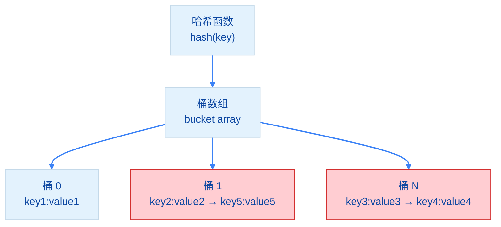

import { Badge } from "@rspress/core/theme";
import { Callout } from "@rspress/core/theme-original";

# 映射类型 - Map Types

[← 返回数据类型](../)

Map 是 Go 语言的<strong>哈希表</strong>，提供键值对存储。

## <Badge text="Map 基础" type="tip" />

### 创建 Map

```go
// 使用 make 创建
m1 := make(map[string]int)

// 使用字面量创建
m2 := map[string]int{
    "apple":  5,
    "banana": 3,
}
fmt.Println(m2)  // map[apple:5 banana:3]
```

<Callout type="danger" title={<Badge text="必须初始化" type="danger" />}>
  <strong>map 必须初始化才能使用</strong>

  ```go
  // ❌ 错误：仅定义
  var m map[string]int
  m["key"] = 1  // panic: assignment to entry in nil map

  // ✅ 正确：使用 make 初始化
  m := make(map[string]int)
  m["key"] = 1
  ```
</Callout>

### Map 操作

```go
m := make(map[string]int)

// 添加/修改元素
m["key1"] = 10
m["key2"] = 20

// 读取元素
v := m["key1"]
fmt.Println(v)  // 10

// 读取带检查（推荐）
v, ok := m["key1"]
if ok {
    fmt.Println("存在:", v)
} else {
    fmt.Println("不存在")
}

// 删除元素
delete(m, "key1")

// 获取长度
fmt.Println(len(m))  // 1
```

## <Badge text="Map 遍历" type="info" />

```go
m := map[string]int{
    "apple":  5,
    "banana": 3,
    "cherry": 7,
}

// 遍历 map（顺序不确定）
for key, value := range m {
    fmt.Printf("%s: %d\n", key, value)
}

// 只遍历键
for key := range m {
    fmt.Println(key)
}

// 只遍历值
for _, value := range m {
    fmt.Println(value)
}
```

<Badge text="注意" type="warning" /> Map 的遍历顺序是<strong>随机的</strong>，每次运行可能不同。

## <Badge text="Map 特性" type="info" />

### 键类型要求

```go
// 可比较的类型都能作为键
m1 := map[int]string{1: "one"}
m2 := map[string]int{"one": 1}
m3 := map[bool]string{true: "yes"}

// ❌ 不能使用 slice、map、func 作为键
// m4 := map[[]int]string{}  // 编译错误

// ✅ 可以使用数组作为键（长度固定）
m5 := map[[3]int]string{[3]int{1, 2, 3}: "array key"}
```

### 零值和删除

```go
m := make(map[string]int)

// 读取不存在的键返回零值
v := m["notexist"]
fmt.Println(v)  // 0

// 删除不存在的键不会报错
delete(m, "notexist")  // 什么都不会发生

// 检查键是否存在
if v, ok := m["key"]; ok {
    fmt.Println("存在:", v)
}
```

## <Badge text="Map 实现原理" type="warning" />

### 哈希冲突

Go 使用<strong>链地址法</strong>解决哈希冲突：



### 扩容机制

- 负载因子 > 6.5 时触发扩容
- 扩容时桶数量翻倍
- 渐进式 rehash，避免一次性迁移

## <Badge text="并发安全" type="danger" />

```go
// ❌ 并发写入会 panic
m := make(map[int]int)
go func() {
    for i := 0; i < 1000; i++ {
        m[i] = i
    }
}()
go func() {
    for i := 0; i < 1000; i++ {
        m[i] = i * 2
    }
}()
// panic: concurrent map writes
```

<Badge text="解决方案" type="tip" /> 使用 `sync.Mutex` 或 `sync.RWMutex` 保护 map：

```go
import "sync"

type SafeMap struct {
    mu   sync.RWMutex
    data map[string]int
}

func (sm *SafeMap) Get(key string) (int, bool) {
    sm.mu.RLock()
    defer sm.mu.RUnlock()
    v, ok := sm.data[key]
    return v, ok
}

func (sm *SafeMap) Set(key string, value int) {
    sm.mu.Lock()
    defer sm.mu.Unlock()
    sm.data[key] = value
}
```

或使用 Go 1.9+ 的 `sync.Map`：

```go
var m sync.Map

m.Store("key", "value")
if v, ok := m.Load("key"); ok {
    fmt.Println(v)
}
m.Delete("key")
```

## <Badge text="Map 使用技巧" type="info" />

### 统计频率

```go
s := "hello world"

// 统计字符出现次数
freq := make(map[rune]int)
for _, c := range s {
    freq[c]++
}

fmt.Println(freq)  // map[ :1 h:1 e:1 l:3 o:2 w:1 r:1 d:1]
```

### 分组

```go
type Person struct {
    Name string
    Age  int
}

people := []Person{
    {"Alice", 25},
    {"Bob", 30},
    {"Charlie", 25},
}

// 按年龄分组
groups := make(map[int][]Person)
for _, p := range people {
    groups[p.Age] = append(groups[p.Age], p)
}

fmt.Println(groups)
// map[25:[{Alice 25} {Charlie 25}] 30:[{Bob 30}]]
```

## <Badge text="Map vs Slice" type="info" />

| 特性 | Map | Slice |
|-----|-----|-------|
| 索引 | 任意键（可比较类型） | 整数索引 |
| 查找 | O(1) 平均 | O(n) 线性 |
| 有序性 | 无序 | 有序 |
| 使用场景 | 键值对、快速查找 | 有序集合、序列 |

## 练习

1. 使用 map 统计文本中每个单词出现的次数
2. 实现两个 map 的合并功能
3. 创建 map 存储 slice，实现多值映射


[← 切片](./slice.mdx) | [结构体 →](./struct.mdx)
