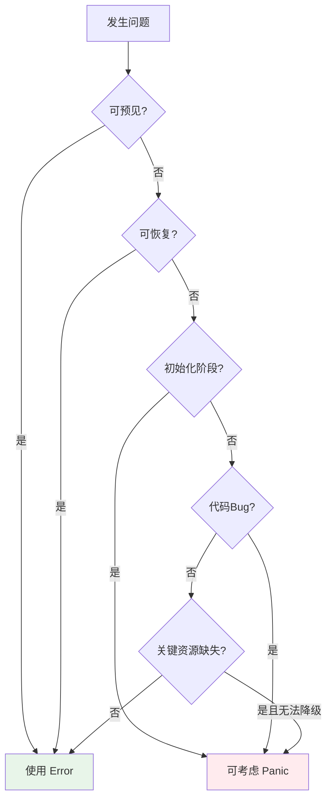

import { Badge } from "@rspress/core/theme";
import { Callout } from "@rspress/core/theme-original";

# Panic vs Error - 何时使用哪个？

<Badge text="核心概念" type="danger" />
<Badge text="重要决策" type="warning" />

Go 提供了两种错误处理机制：`error` 和 `panic`。理解它们的区别并正确使用，是写出健壮 Go 程序的关键。

## 核心区别

<Badge text="无技术背景读者" type="info" />

| 特性 | Error | Panic |
|------|-------|-------|
| **性质** | 预期的失败 | 意外的灾难 |
| **类比** | 车辆没油了 | 发动机爆炸 |
| **处理** | 返回给调用者处理 | 程序可能终止 |
| **恢复** | 调用者决定如何处理 | 只能通过 `recover` |
| **使用频率** | 99% 的场景 | <1% 的场景 |

<Callout type="danger">
**黄金法则**：**默认使用 error**，只有在极少数情况下才使用 panic。
</Callout>

## 使用场景决策树



## Error 使用场景

<Badge text="初级开发者" type="tip" />

### 1. 网络操作

```go
// ✅ 使用 error
func FetchData(url string) ([]byte, error) {
    resp, err := http.Get(url)
    if err != nil {
        return nil, fmt.Errorf("HTTP request failed: %w", err)
    }
    defer resp.Body.Close()

    if resp.StatusCode != http.StatusOK {
        return nil, fmt.Errorf("unexpected status: %d", resp.StatusCode)
    }

    return io.ReadAll(resp.Body)
}
```

### 2. 文件操作

```go
// ✅ 使用 error
func ReadConfig(path string) ([]byte, error) {
    data, err := os.ReadFile(path)
    if err != nil {
        return nil, fmt.Errorf("read config: %w", err)
    }
    return data, nil
}
```

### 3. 用户输入验证

```go
// ✅ 使用 error
func CreateUser(email, password string) error {
    if email == "" {
        return errors.New("email cannot be empty")
    }
    if len(password) < 8 {
        return errors.New("password too short")
    }
    return nil
}
```

### 4. 数据库操作

```go
// ✅ 使用 error
func GetUser(id int) (*User, error) {
    var user User
    err := db.First(&user, id).Error
    if err != nil {
        if errors.Is(err, gorm.ErrRecordNotFound) {
            return nil, ErrUserNotFound
        }
        return nil, fmt.Errorf("database error: %w", err)
    }
    return &user, nil
}
```

## Panic 使用场景

<Badge text="高级开发者" type="danger" />

### 场景 1: 程序初始化失败

```go
// ✅ 可接受的 panic：关键配置加载失败
func init() {
    config, err := loadConfig()
    if err != nil {
        panic(fmt.Sprintf("cannot load config: %v", err))
        // 理由：没有配置，程序无法正常运行
    }
}

// ✅ 可接受的 panic：必需的依赖不可用
func MustConnectDB(dsn string) *sql.DB {
    db, err := sql.Open("mysql", dsn)
    if err != nil {
        panic(fmt.Sprintf("database is required: %v", err))
    }
    if err := db.Ping(); err != nil {
        panic(fmt.Sprintf("database ping failed: %v", err))
    }
    return db
}
```

<Callout type="warning">
**注意**：在库代码中，应该返回 error 而非 panic，让调用者决定如何处理。
</Callout>

### 场景 2: 不可恢复的逻辑错误

```go
// ✅ 可接受的 panic：表示代码 bug
func process(data []byte) {
    if len(data) < 4 {
        panic("invalid data: programming error - should have been validated")
    }
    // 这是代码逻辑错误，不应该在生产环境发生
}

// ✅ 可接受的 panic：不可达代码
func switchExample(value int) string {
    switch value {
    case 1:
        return "one"
    case 2:
        return "two"
    default:
        panic(fmt.Sprintf("unexpected value: %d", value))
    }
}
```

### 场景 3: 关键资源不可用且无法降级

```go
// ✅ 谨慎使用：关键支付系统
func ProcessPayment(amount float64) error {
    client, err := payment.NewClient()
    if err != nil {
        // 支付服务不可用，无法处理交易
        panic(fmt.Sprintf("payment service unavailable: %v", err))
    }
    defer client.Close()

    return client.Charge(amount)
}
```

<Callout type="danger">
**更好的做法**：返回 error 并让上层决定是否终止程序。
</Callout>

## Defer + Recover

<Badge text="中级开发者" type="warning" />

### Recover 基础

```go
// ❌ 错误：recover 在非 defer 函数中调用
func wrongRecover() {
    if r := recover(); r != nil {
        fmt.Println("不会捕获 panic")
    }
    panic("test")
}

// ✅ 正确：recover 必须在 defer 中调用
func correctRecover() {
    defer func() {
        if r := recover(); r != nil {
            fmt.Println("捕获到 panic:", r)
        }
    }()
    panic("test")
}
```

### Recover 的限制

```go
// ❌ recover 无法捕获其他 goroutine 的 panic
func parent() {
    defer func() {
        if r := recover(); r != nil {
            fmt.Println("捕获不到子 goroutine 的 panic")
        }
    }()

    go func() {
        panic("子 goroutine panic")
    }()

    time.Sleep(time.Second)
}

// ✅ 在子 goroutine 内部 recover
func parent() {
    go func() {
        defer func() {
            if r := recover(); r != nil {
                fmt.Println("捕获到:", r)
            }
        }()
        panic("子 goroutine panic")
    }()
}
```

### 生产级 Recover 模式

```go
// 模式 1: HTTP 服务器恢复中间件
func RecoveryMiddleware(next http.Handler) http.Handler {
    return http.HandlerFunc(func(w http.ResponseWriter, r *http.Request) {
        defer func() {
            if err := recover(); err != nil {
                // 记录堆栈
                stack := debug.Stack()
                log.Printf("panic recovered: %v\n%s", err, stack)

                // 返回 500
                http.Error(w, "Internal Server Error", 500)
            }
        }()
        next.ServeHTTP(w, r)
    })
}

// 模式 2: 带上下文的恢复
func SafeOperation(ctx context.Context) (err error) {
    defer func() {
        if r := recover(); r != nil {
            err = fmt.Errorf("panic in %s: %v", ctx.Value("operation"), r)
            // 可以添加 metrics
            metrics.PanicCounter.Inc()
        }
    }()

    // 业务逻辑
    return nil
}

// 模式 3: 转换 panic 为 error
func ToError(f func()) (err error) {
    defer func() {
        if r := recover(); r != nil {
            err = fmt.Errorf("panic: %v", r)
        }
    }()
    f()
    return nil
}
```

## Defer 高级技巧

<Badge text="高级开发者" type="danger" />

### 技巧 1: 修改命名返回值

```go
func WithNamedReturn() (result int) {
    defer func() {
        result++  // 修改返回值
    }()
    result = 10
    return result  // 实际返回 11
}
```

### 技巧 2: 追踪执行时间

```go
func TimeTrack(name string) {
    start := time.Now()
    defer func() {
        fmt.Printf("%s took %v\n", name, time.Since(start))
    }()
    // 业务逻辑
}
```

### 技巧 3: 检查 defer 错误

```go
func DeferWithErrorCheck() error {
    resp, err := http.Get(url)
    if err != nil {
        return err
    }

    // 检查 Close 的错误
    defer func() {
        if closeErr := resp.Body.Close(); closeErr != nil {
            log.Printf("close error: %v", closeErr)
        }
    }()

    return processResponse(resp)
}
```

### 技巧 4: 限制 defer 作用域

```go
// ❌ 性能问题：循环中 defer
func ProcessFiles(files []string) error {
    for _, file := range files {
        f, err := os.Open(file)
        if err != nil {
            return err
        }
        defer f.Close()  // 等到函数结束才关闭
    }
    return nil
}

// ✅ 正确：使用匿名函数
func ProcessFiles(files []string) error {
    for _, file := range files {
        if err := func() error {
            f, err := os.Open(file)
            if err != nil {
                return err
            }
            defer f.Close()  // 每次迭代都关闭

            return processFile(f)
        }(); err != nil {
            return err
        }
    }
    return nil
}
```

## 常见陷阱

<Badge text="中级开发者" type="warning" />

### 陷阱 1: 过度使用 panic

```go
// ❌ 不应该：用 panic 处理可恢复错误
func GetUser(id int) *User {
    user, err := db.QueryUser(id)
    if err != nil {
        panic(err)  // 不应该！
    }
    return user
}

// ✅ 正确：返回 error
func GetUser(id int) (*User, error) {
    user, err := db.QueryUser(id)
    if err != nil {
        return nil, err
    }
    return user, nil
}
```

### 陷阱 2: 在库中使用 panic

```go
// ❌ 库代码不应该 panic 终止程序
func ReadConfig(path string) {
    data, err := os.ReadFile(path)
    if err != nil {
        log.Fatal(err)  // 终止调用者的程序！
    }
    // ...
}

// ✅ 返回 error
func ReadConfig(path string) ([]byte, error) {
    data, err := os.ReadFile(path)
    if err != nil {
        return nil, err
    }
    return data, nil
}
```

### 陷阱 3: Defer 中使用未初始化的值

```go
// ❌ 可能 panic
resp, err := http.Get(url)
defer resp.Body.Close()  // 如果 resp 为 nil
if err != nil {
    return err
}

// ✅ 先检查
resp, err := http.Get(url)
if err != nil {
    return err
}
defer resp.Body.Close()
```

## 性能考虑

<Badge text="高级开发者" type="danger" />

### 性能对比

| 操作 | 时间开销 | 说明 |
|------|---------|------|
| 返回 error | ~1-2 ns | 几乎无开销 |
| 单次 defer | ~10-50 ns | 纳秒级 |
| panic + recover | ~1000+ ns | 栈展开开销大 |

### 优化建议

```go
// 优化 1: 避免热路径中的 defer
// ❌ 高频调用
func fastProcess(data []byte) {
    defer cleanup()  // 每次 10-50ns
    // 处理
}

// ✅ 直接调用
func fastProcess(data []byte) {
    // 处理
    cleanup()
}

// 优化 2: 减少错误创建
// ❌ 每次创建新错误
if err != nil {
    return fmt.Errorf("operation %d failed", id)
}

// ✅ 使用预定义错误
var ErrOperationFailed = errors.New("operation failed")
if err != nil {
    return ErrOperationFailed
}
```

## 实战案例

<Badge text="高级开发者" type="danger" />

### 完整的 HTTP 服务错误处理

```go
package main

import (
    "fmt"
    "log"
    "net/http"
    "runtime/debug"
)

// 自定义错误类型
type AppError struct {
    Code    int
    Message string
    Err     error
}

func (e *AppError) Error() string {
    return fmt.Sprintf("[%d] %s: %v", e.Code, e.Message, e.Err)
}

func (e *AppError) Unwrap() error {
    return e.Err
}

// 预定义错误
var (
    ErrNotFound     = &AppError{Code: 404, Message: "Not Found"}
    ErrInvalidInput = &AppError{Code: 400, Message: "Invalid Input"}
)

// 处理器
func handleUser(w http.ResponseWriter, r *http.Request) {
    // 使用 defer + recover 保护处理器
    defer func() {
        if err := recover(); err != nil {
            // 记录完整堆栈
            log.Printf("panic recovered: %v\n%s", err, debug.Stack())
            http.Error(w, "Internal Server Error", 500)
        }
    }()

    id := r.URL.Query().Get("id")
    if id == "" {
        writeError(w, ErrInvalidInput)
        return
    }

    user, err := getUser(id)
    if err != nil {
        writeError(w, err)
        return
    }

    writeJSON(w, user)
}

func getUser(id string) (*User, error) {
    // 返回 error，而非 panic
    if id == "0" {
        return nil, fmt.Errorf("%w: user %s not found", ErrNotFound, id)
    }
    return &User{ID: id}, nil
}

func writeError(w http.ResponseWriter, err error) {
    if appErr, ok := err.(*AppError); ok {
        http.Error(w, appErr.Message, appErr.Code)
    } else {
        http.Error(w, "Internal Error", 500)
    }
}

func main() {
    // 全局恢复中间件
    mux := http.NewServeMux()
    mux.HandleFunc("/user", handleUser)

    wrapped := RecoveryMiddleware(mux)

    log.Println("Server started on :8080")
    log.Fatal(http.ListenAndServe(":8080", wrapped))
}
```

## 练习

<Badge text="实战练习" type="success" />

### 练习 1: 实现安全的队列处理器

创建一个队列处理器，能优雅地处理 panic 并继续处理：

```go
// TODO: 实现此函数
func ProcessQueue(items []Item) {
    // 遍历处理每个 item
    // 如果处理过程 panic，记录日志但继续处理下一个
}
```

<details>
<summary>查看答案</summary>

```go
func ProcessQueue(items []Item) {
    for i, item := range items {
        func() {
            defer func() {
                if r := recover(); r != nil {
                    log.Printf("Item %d panic recovered: %v\n%s", i, r, debug.Stack())
                }
            }()

            // 处理 item，可能 panic
            ProcessItem(item)
        }()
    }
}
```

</details>

---

## 总结

### 关键要点

| 读者水平 | 核心要点 |
|---------|---------|
| <Badge text="无技术背景" type="info" /> | Error 是预期问题，Panic 是灾难。99% 用 error。 |
| <Badge text="初级开发者" type="tip" /> | 默认总是返回 error。只在初始化失败时考虑 panic。 |
| <Badge text="中级开发者" type="warning" /> | 使用 defer + recover 捕获 panic。recover 只在当前 goroutine 有效。 |
| <Badge text="高级开发者" type="danger" /> | panic 性能开销大。在生产代码中谨慎使用，优先返回 error。 |

### 决策树总结

```
可预见错误？ → Yes → Error
     ↓ No
可恢复？     → Yes → Error
     ↓ No
初始化阶段？ → Yes → 可考虑 Panic
     ↓ No
代码 Bug？   → Yes → 可考虑 Panic
     ↓ No
默认         →      Error
```

### 下一步

- [← 错误包装](./error-wrapping.mdx)
- [自定义错误类型 →](./custom-errors.mdx)
- [错误处理最佳实践 →](./best-practices.mdx)
