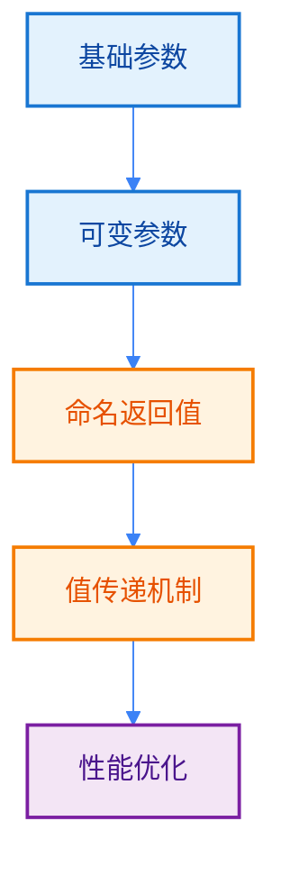
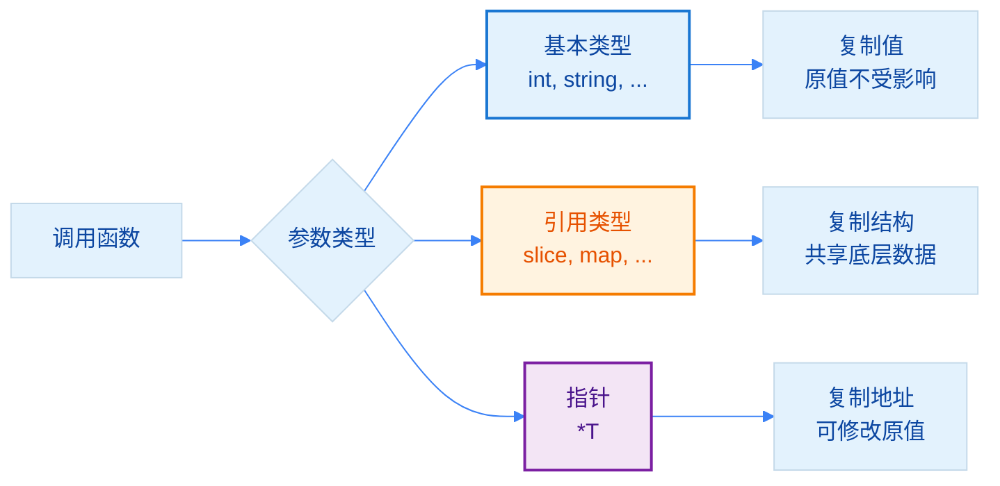

import { Badge } from "@rspress/core/theme";
import { Callout } from "@rspress/core/theme-original";

# 高级参数 - Advanced Parameters

[← 返回函数与方法](./)

<Badge text="中级" type="warning" /> 深入理解 Go 语言的参数机制，掌握可变参数、命名返回值等高级特性。

## 学习路径



## <Badge text="可变参数函数" type="info" />

### 基本语法

<Badge text="初级开发者" type="tip" /> 可变参数让你创建灵活的函数，接收任意数量的参数。

```go
package main

import "fmt"

// 可变参数：...int 表示可以接收任意数量的 int 参数
func sum(numbers ...int) int {
    total := 0
    for _, num := range numbers {
        total += num
    }
    return total
}

// 混合参数：可变参数必须是最后一个
func greet(prefix string, names ...string) {
    for _, name := range names {
        fmt.Printf("%s, %s!\n", prefix, name)
    }
}

// 实际应用：日志函数
func log(level string, messages ...string) {
    fmt.Printf("[%s] ", level)
    for _, msg := range messages {
        fmt.Printf("%s ", msg)
    }
    fmt.Println()
}

func main() {
    // 基本使用
    fmt.Println(sum(1, 2, 3))        // 6
    fmt.Println(sum(1, 2, 3, 4, 5))  // 15
    fmt.Println(sum())                // 0 (无参数)

    // 混合参数
    greet("Hello", "Alice", "Bob", "Charlie")

    // 实际应用
    log("INFO", "用户登录", "ID:12345", "IP:192.168.1.1")
    log("ERROR", "数据库连接失败")
}
```

### 可变参数工作原理

```mermaid
%%{init: {'theme':'base', 'themeVariables': { 'lineColor':'#3b82f6', 'primaryColor':'#e3f2fd', 'primaryTextColor':'#0d47a1'}}}%%
flowchart LR
    A[调用 sum<br/>sum(1, 2, 3)] --> B[参数打包成<br/>slice int{1, 2, 3}]
    B --> C[函数内部<br/>遍历 slice]

    D[调用 sum<br/>nums...] --> E[展开 slice<br/>传递参数]
    E --> F[同单参数调用]

    style B fill:#e1f5fe,stroke:#0277bd,stroke-width:2px,color:#01579b
    style E fill:#fff3e0,stroke:#e65100,stroke-width:2px,color:#e65100
```

### 传递切片给可变参数

```go
package main

import "fmt"

func sum(numbers ...int) int {
    total := 0
    for _, num := range numbers {
        total += num
    }
    return total
}

func main() {
    // 已有切片
    nums := []int{1, 2, 3, 4, 5}

    // 使用 ... 展开切片
    fmt.Println(sum(nums...))  // 15

    // 部分展开
    fmt.Println(sum(nums[:3]...))  // 6 (只传前3个)

    // 组合参数
    first := 10
    rest := []int{20, 30}
    fmt.Println(sum(first, rest...))  // 60
}
```

<Callout type="info" title={<Badge text="切片引用" type="info" />}>
  可变参数在函数内部实际上是 <code>[]T</code> 类型的切片。详细了解切片请参考[<strong>Slice 类型</strong>](../data-types/slice.mdx)。
</Callout>

### 可变参数的实际应用

```go
package main

import (
    "errors"
    "fmt"
    "strings"
)

// 1. 字符串拼接
func join(separator string, parts ...string) string {
    return strings.Join(parts, separator)
}

// 2. 错误收集
func validateAll(value int, validators ...func(int) error) error {
    var errs []string
    for i, v := range validators {
        if err := v(value); err != nil {
            errs = append(errs, fmt.Sprintf("验证器%d: %v", i, err))
        }
    }
    if len(errs) > 0 {
        return errors.New(strings.Join(errs, "; "))
    }
    return nil
}

// 3. 配置选项模式
type Server struct {
    host     string
    port     int
    maxConn  int
}

type Option func(*Server)

func WithHost(host string) Option {
    return func(s *Server) { s.host = host }
}

func WithPort(port int) Option {
    return func(s *Server) { s.port = port }
}

func WithMaxConn(max int) Option {
    return func(s *Server) { s.maxConn = max }
}

func NewServer(opts ...Option) *Server {
    s := &Server{
        host:    "localhost",
        port:    8080,
        maxConn: 100,
    }
    for _, opt := range opts {
        opt(s)
    }
    return s
}

func main() {
    // 字符串拼接
    fmt.Println(join(", ", "Go", "Python", "JavaScript"))

    // 错误收集
    err := validateAll(150,
        func(n int) error {
            if n < 0 { return errors.New("不能为负数") }
            return nil
        },
        func(n int) error {
            if n > 100 { return errors.New("不能超过100") }
            return nil
        },
    )
    fmt.Println("验证结果:", err)

    // 配置选项模式
    server := NewServer(
        WithHost("example.com"),
        WithPort(443),
        WithMaxConn(1000),
    )
    fmt.Printf("服务器: %+v\n", server)
}
```

<Callout type="warning" title={<Badge text="性能注意" type="warning" />}>
  每次调用可变参数函数都会创建一个新的切片。如果性能关键且频繁调用，考虑接受切片作为参数。
</Callout>

## <Badge text="命名返回值" type="warning" />

### 基本用法

<Badge text="中级开发者" type="warning" /> 命名返回值可以增强代码可读性，但需谨慎使用。

```go
package main

import "fmt"

// 命名返回值
func divideWithNamed(a, b int) (quotient int, remainder int) {
    quotient = a / b
    remainder = a % b
    return  // 隐式返回（返回所有命名返回值）
}

// 命名返回值支持类型简写
func divideWithNamedShort(a, b int) (quotient, remainder int) {
    quotient = a / b
    remainder = a % b
    return
}

// 也可以显式返回
func divideWithExplicit(a, b int) (quotient, remainder int) {
    if b == 0 {
        return 0, 0  // 显式返回
    }
    quotient = a / b
    remainder = a % b
    return quotient, remainder  // 显式返回
}

func main() {
    q, r := divideWithNamed(10, 3)
    fmt.Printf("10 / 3 = %d ... %d\n", q, r)

    q2, r2 := divideWithNamedShort(10, 3)
    fmt.Printf("10 / 3 = %d ... %d\n", q2, r2)

    q3, r3 := divideWithExplicit(10, 0)
    fmt.Printf("10 / 0 = %d ... %d\n", q3, r3)
}
```

### 命名返回值与 defer

```go
package main

import "fmt"

// 使用 defer 修改返回值
func calculateWithRetry() (result int) {
    defer func() {
        if result == 0 {
            result = -1  // 修改返回值表示失败
        }
    }()

    // 模拟计算
    result = 42
    return
}

// 资源清理模式
func processFile(filename string) (content string, err error) {
    defer func() {
        if r := recover(); r != nil {
            err = fmt.Errorf("panic: %v", r)
        }
    }()

    // 处理文件...
    content = "文件内容"
    return
}

func main() {
    result := calculateWithRetry()
    fmt.Println("结果:", result)

    content, err := processFile("test.txt")
    fmt.Printf("内容: %s, 错误: %v\n", content, err)
}
```

<Callout type="danger" title={<Badge text="不推荐" type="danger" />}>
  <strong>谨慎使用命名返回值</strong>。虽然命名返回值可以提高代码可读性，但也会带来以下问题：

  • <strong>遮蔽风险</strong>：函数内部使用同名变量时容易产生遮蔽
  • <strong>可读性下降</strong>：<code>return</code> 不带返回值时，不清楚返回了什么
  • <strong>调试困难</strong>：难以追踪返回值的来源

  除非有特殊需求（如 defer 修改返回值），否则应使用<strong>显式返回</strong>。
</Callout>

## <Badge text="多返回值模式" type="info" />

### 错误处理模式

<Badge text="初级开发者" type="tip" /> Go 的多返回值是其特色功能，常用于错误处理。

```go
package main

import (
    "errors"
    "fmt"
)

// Go 的惯用错误处理
func divideSafe(a, b int) (int, error) {
    if b == 0 {
        return 0, errors.New("division by zero")
    }
    return a / b, nil
}

// 返回更多信息
func divideWithDetails(a, b int) (quotient int, remainder int, err error) {
    if b == 0 {
        return 0, 0, errors.New("division by zero")
    }
    return a / b, a % b, nil
}

// 值+布尔模式
func getValue(m map[string]int, key string) (int, bool) {
    val, ok := m[key]
    return val, ok
}

func main() {
    // 错误处理
    result, err := divideSafe(10, 0)
    if err != nil {
        fmt.Println("错误:", err)
        return
    }
    fmt.Println("结果:", result)

    // 多返回值
    q, r, err := divideWithDetails(10, 3)
    if err != nil {
        fmt.Println("错误:", err)
        return
    }
    fmt.Printf("10 / 3 = %d ... %d\n", q, r)

    // 值+布尔
    m := map[string]int{"one": 1}
    if val, ok := getValue(m, "one"); ok {
        fmt.Println("找到:", val)
    }
}
```

### 忽略返回值

```go
package main

import "fmt"

func getValues() (int, string, bool) {
    return 42, "hello", true
}

func main() {
    // 使用 _ 忽略不需要的返回值
    num, _, _ := getValues()
    fmt.Println("数字:", num)

    // 只关心错误
    _, err := someOperation()
    if err != nil {
        fmt.Println("操作失败:", err)
    }
}

func someOperation() (string, error) {
    return "done", nil
}
```

### 多返回值设计原则

```go
package main

import (
    "errors"
    "fmt"
)

// ✅ 好的设计：返回值有明确的顺序
func getUser(id int) (*User, error) {
    // ...
    return nil, errors.New("not found")
}

// ✅ 好的设计：返回相关的多个值
func minMax(numbers []int) (min, max int) {
    if len(numbers) == 0 {
        return 0, 0
    }
    min, max = numbers[0], numbers[0]
    for _, n := range numbers {
        if n < min {
            min = n
        }
        if n > max {
            max = n
        }
    }
    return
}

// ❌ 不好的设计：返回值过多
func tooManyReturns() (int, string, bool, float64, error) {
    // 难以记忆和使用
    return 0, "", false, 0.0, nil
}

// ✅ 更好的设计：使用结构体
type Result struct {
    ID      int
    Name    string
    Valid   bool
    Score   float64
}

func getResult() (*Result, error) {
    return &Result{
        ID:    1,
        Name:  "test",
        Valid: true,
        Score: 95.5,
    }, nil
}

type User struct {
    Name string
}

func main() {
    min, max := minMax([]int{3, 1, 4, 1, 5, 9})
    fmt.Printf("最小: %d, 最大: %d\n", min, max)

    result, err := getResult()
    if err != nil {
        fmt.Println("错误:", err)
        return
    }
    fmt.Printf("结果: %+v\n", result)
}
```

## <Badge text="参数传递机制" type="warning" />

### 值传递详解

<Badge text="中级开发者" type="warning" /> Go 语言中<strong>所有参数都是值传递</strong>，包括指针、切片、映射等。

```go
package main

import "fmt"

// 基本类型：值传递
func modifyValue(x int) {
    x = 100  // 不会影响原始值
}

// 指针：值传递（传递的是地址的副本）
func modifyPointer(x *int) {
    *x = 100  // 会影响原始值（通过地址修改）
}

// 切片：值传递（传递的是切片结构的副本）
func modifySlice(s []int) {
    s[0] = 99  // 会影响原始切片（共享底层数组）
    s = append(s, 4)  // 不会影响原始切片（修改的是副本的len/cap）
}

// 映射：值传递（传递的是映射结构的副本）
func modifyMap(m map[string]int) {
    m["key"] = 100  // 会影响原始映射
}

func main() {
    // 基本类型
    a := 1
    modifyValue(a)
    fmt.Println("基本类型:", a)  // 1（未改变）

    // 指针
    b := 1
    modifyPointer(&b)
    fmt.Println("指针:", b)  // 100（已改变）

    // 切片
    s := []int{1, 2, 3}
    modifySlice(s)
    fmt.Println("切片:", s)  // [99 2 3]（第一个元素改变，但append未生效）

    // 映射
    m := map[string]int{"key": 1}
    modifyMap(m)
    fmt.Println("映射:", m)  // map[key:100]（已改变）
}
```

### 参数传递图解



<Callout type="info" title={<Badge text="关键理解" type="info" />}>
  Go 语言中<strong>所有参数都是值传递</strong>。引用类型（切片、映射、通道）看起来像引用传递，是因为它们的结构包含指向底层数据的指针。
</Callout>

### 大参数优化

```go
package main

import (
    "fmt"
    "time"
)

// 大结构体：使用指针避免复制
type LargeStruct struct {
    data [1024]int  // 8KB 数据
}

// ❌ 低效：复制整个结构体
func processByVal(ls LargeStruct) int {
    return ls.data[0]
}

// ✅ 高效：只复制指针（8字节）
func processByPtr(ls *LargeStruct) int {
    return ls.data[0]
}

func benchmark() {
    ls := LargeStruct{}

    // 值传递
    start := time.Now()
    for i := 0; i < 100000; i++ {
        processByVal(ls)
    }
    fmt.Printf("值传递: %v\n", time.Since(start))

    // 指针传递
    start = time.Now()
    for i := 0; i < 100000; i++ {
        processByPtr(&ls)
    }
    fmt.Printf("指针传递: %v\n", time.Since(start))
}

func main() {
    benchmark()
}
```

## <Badge text="性能考虑" type="danger" />

### 可变参数性能

<Badge text="高级开发者" type="danger" /> 理解可变参数的性能影响，做出正确选择。

```go
package main

import (
    "fmt"
    "time"
)

// 可变参数版本
func sumVarargs(numbers ...int) int {
    total := 0
    for _, n := range numbers {
        total += n
    }
    return total
}

// 切片参数版本
func sumSlice(numbers []int) int {
    total := 0
    for _, n := range numbers {
        total += n
    }
    return total
}

func benchmark() {
    nums := make([]int, 100)
    for i := range nums {
        nums[i] = i
    }

    // 可变参数
    start := time.Now()
    for i := 0; i < 1000000; i++ {
        sumVarargs(nums...)
    }
    fmt.Printf("可变参数: %v\n", time.Since(start))

    // 切片参数
    start = time.Now()
    for i := 0; i < 1000000; i++ {
        sumSlice(nums)
    }
    fmt.Printf("切片参数: %v\n", time.Since(start))
}

func main() {
    benchmark()
}
```

<Callout type="tip" title={<Badge text="性能建议" type="success" />}>
  • <strong>API 灵活性优先</strong>：对外API使用可变参数，提升易用性<br/>
  • <strong>内部性能优先</strong>：内部函数使用切片参数，避免分配<br/>
  • <strong>预分配优化</strong>：高频场景考虑预分配切片复用
</Callout>

### 返回值优化

```go
package main

import "fmt"

// ❌ 不必要的命名返回值
func add(a, b int) (sum int) {
    sum = a + b
    return
}

// ✅ 简洁的显式返回
func addBetter(a, b int) int {
    return a + b
}

// ✅ 合理使用命名返回值（defer场景）
func withDefer() (result int) {
    defer func() {
        result *= 2  // defer 中修改返回值
    }()
    result = 10
    return
}

func main() {
    fmt.Println(addBetter(1, 2))  // 3
    fmt.Println(withDefer())       // 20
}
```

## 最佳实践

### 参数设计原则

```go
// ✅ 参数数量适中（≤5个）
func createUser(name, email string, age int) (*User, error) {
    return &User{name, email, age}, nil
}

// ✅ 参数过多时使用配置结构体
type Config struct {
    Host     string
    Port     int
    Timeout  time.Duration
    TLS      bool
}

func NewServer(cfg Config) *Server {
    return &Server{cfg: cfg}
}

// ✅ 可变参数放在最后
func format(template string, args ...interface{}) string {
    return fmt.Sprintf(template, args...)
}

// ❌ 错误：可变参数不在最后
// func invalid(args ...int, fixed int) {}
```

### 返回值设计原则

```go
// ✅ 错误作为最后一个返回值
func getData() (Data, error) {
    return Data{}, nil
}

// ✅ 返回值有明确含义
func divide(a, b int) (int, error) {
    if b == 0 {
        return 0, fmt.Errorf("division by zero")
    }
    return a / b, nil
}

// ✅ 相关值一起返回
func minMax(numbers []int) (min, max int) {
    // ...
    return 0, 0
}

// ❌ 返回值过多时使用结构体
type Result struct {
    Sum     int
    Average float64
    Min     int
    Max     int
}

func calculate(numbers []int) Result {
    // ...
    return Result{}
}
```

## 练习

<Badge text="中级" type="info" />
1. **实现一个通用的过滤函数**，使用可变参数支持多个过滤条件
2. **编写一个配置解析器**，使用命名返回值和错误处理

<Badge text="高级" type="warning" />
3. **实现一个性能优化的字符串拼接函数**，对比可变参数和切片参数的性能差异
4. **设计一个链式调用构建器**，使用函数选项模式

[← 函数基础](./function-basics.mdx) | [方法 →](./methods.mdx)
