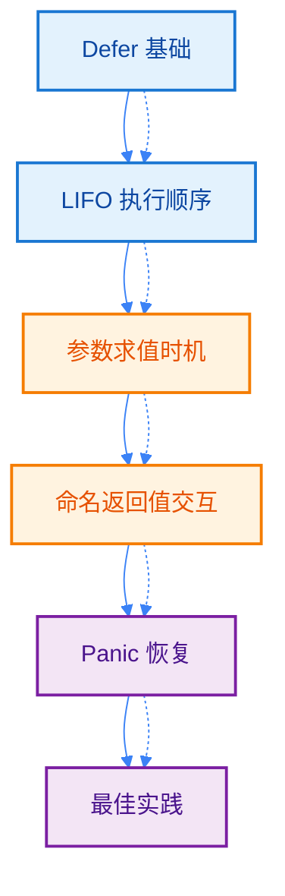
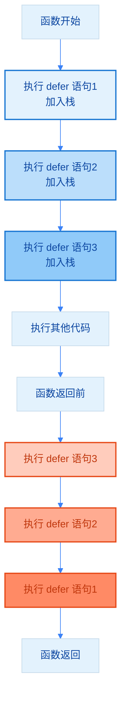
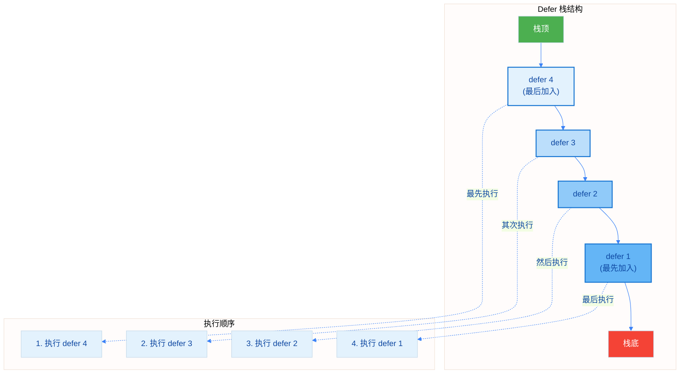
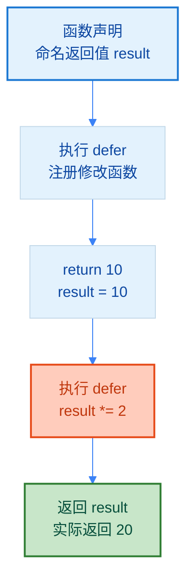
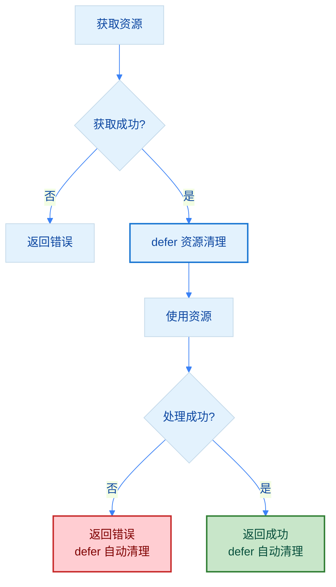
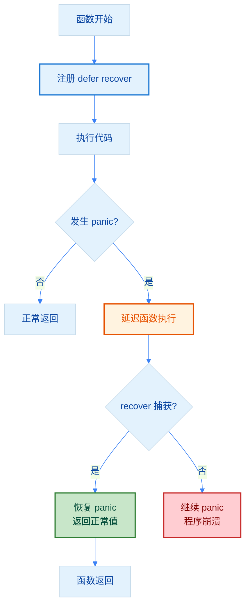
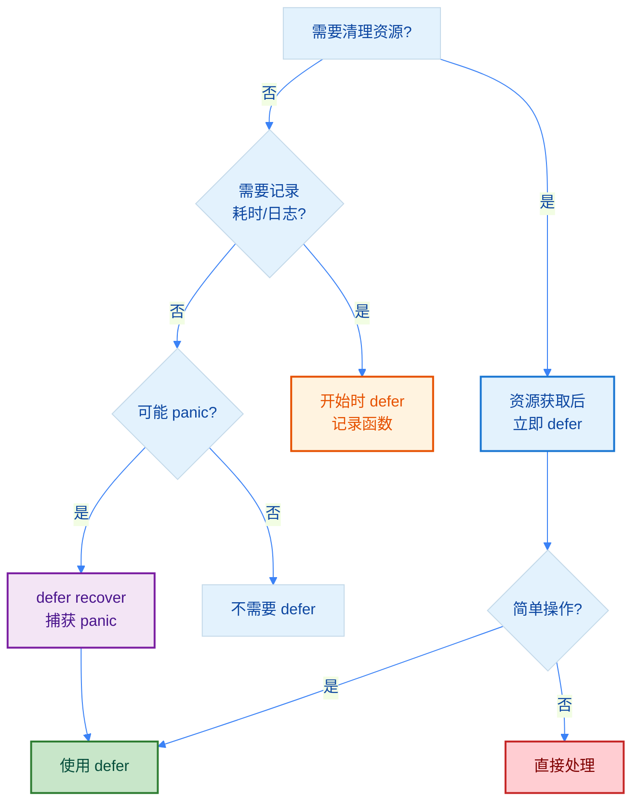

import { Badge } from "@rspress/core/theme";
import { Callout } from "@rspress/core/theme-original";

# Defer 机制 - Defer Mechanism

[← 返回函数与方法](functions-methods/)

<Badge text="中级开发者" type="warning" />

`defer` 是 Go 语言中独特而强大的特性，用于确保函数返回前执行某段代码。它广泛应用于资源清理、解锁互斥锁、关闭文件等场景。

## 学习路径



## Defer 基础

### 什么是 Defer

`defer` 语句用于延迟一个函数的执行，直到包含它的函数返回为止。被延迟执行的函数称为**延迟函数**。

**核心特性**：
- 延迟函数的参数在 defer 语句执行时立即求值
- 多个 defer 语句按**后进先出（LIFO）**顺序执行
- 即使函数 panic，defer 语句也会执行

### 基本语法

```go
package main

import "fmt"

func main() {
    // defer 会在函数返回前执行
    defer fmt.Println("最后执行")
    fmt.Println("首先执行")

    // 多个 defer 按后进先出（LIFO）顺序执行
    defer fmt.Println("1")
    defer fmt.Println("2")
    defer fmt.Println("3")

    fmt.Println("中间代码")

    // 输出顺序：
    // 首先执行
    // 中间代码
    // 3
    // 2
    // 1
    // 最后执行
}
```

### Defer 执行流程



## LIFO 执行顺序

### 栈结构理解

多个 defer 语句的执行顺序类似于栈的后进先出（LIFO）：

```go
package main

import "fmt"

func main() {
    defer fmt.Println("步骤 1: 打开数据库连接")
    defer fmt.Println("步骤 2: 执行查询")
    defer fmt.Println("步骤 3: 处理结果")
    defer fmt.Println("步骤 4: 关闭连接")

    fmt.Println("主逻辑开始")

    // 输出顺序：
    // 主逻辑开始
    // 步骤 4: 关闭连接
    // 步骤 3: 处理结果
    // 步骤 2: 执行查询
    // 步骤 1: 打开数据库连接
}
```

### Defer 栈结构可视化



<Callout type="tip" title="实践建议">
  **LIFO 特性的巧妙应用**：利用 LIFO 特性，可以按相反顺序清理资源。例如：先打开文件，再获取锁；清理时先释放锁，再关闭文件。
</Callout>

## 参数求值时机

### 立即求值原则

**关键概念**：defer 语句中的函数参数在 defer 语句执行时**立即求值**，而不是在延迟函数执行时求值。

```go
package main

import "fmt"

func main() {
    x := 10
    defer fmt.Println("x 的值:", x)  // 输出 10，不是 20
    x = 20
    fmt.Println("修改后的 x:", x)

    // 输出：
    // 修改后的 x: 20
    // x 的值: 10
}
```

### 参数求值时机图解


### 闭包与 defer

使用匿名函数（闭包）可以捕获变量的当前值：

```go
package main

import "fmt"

func main() {
    x := 10

    // 使用闭包：捕获 x 的引用
    defer func() {
        fmt.Println("闭包中的 x:", x)  // 输出 20
    }()

    x = 20

    // 输出：
    // 闭包中的 x: 20
}
```

<Callout type="danger" title={<Badge text="常见陷阱" type="danger" />}>
  **循环中的 defer**：在循环中使用 defer 时要特别小心，defer 会在函数返回时执行，而不是每次迭代后执行。

  ```go
  // 错误示例
  for _, file := range files {
      f, _ := os.Open(file)
      defer f.Close()  // 所有文件都要等到函数返回才关闭
  }

  // 正确做法：使用匿名函数
  for _, file := range files {
      func() {
          f, _ := os.Open(file)
          defer f.Close()  // 每次迭代结束后立即关闭
          // 处理文件...
      }()
  }
  ```
</Callout>

## 与命名返回值交互

### 修改返回值

defer 可以修改命名返回值的值，这是一个强大但需要谨慎使用的特性：

```go
package main

import "fmt"

func example() (result int) {
    defer func() {
        result *= 2  // 修改返回值
    }()
    return 10  // 实际返回 20
}

func main() {
    fmt.Println(example())  // 输出: 20
}
```

### 命名返回值交互流程



### 实际应用示例

```go
package main

import (
    "errors"
    "fmt"
)

func readFile(filename string) (data string, err error) {
    defer func() {
        if err != nil {
            err = fmt.Errorf("读取文件 %s 失败: %w", filename, err)
        }
    }()

    // 模拟文件读取
    if filename == "" {
        return "", errors.New("文件名为空")
    }

    data = "文件内容"
    return data, nil
}

func main() {
    _, err := readFile("")
    if err != nil {
        fmt.Println("错误:", err)
        // 输出: 错误: 读取文件  失败: 文件名为空
    }
}
```

<Callout type="warning" title={<Badge text="不推荐" type="warning" />}>
  **谨慎使用 defer 修改返回值**：虽然 defer 可以修改命名返回值，但这种模式会降低代码可读性。建议：
  - 优先在函数体内显式处理错误
  - 仅在包装错误等特定场景使用
  - 添加清晰的注释说明意图
</Callout>

## 资源清理模式

### 文件操作

```go
package main

import (
    "fmt"
    "os"
)

func processFile(filename string) error {
    file, err := os.Open(filename)
    if err != nil {
        return err
    }
    // 确保文件最终被关闭
    defer file.Close()

    // 处理文件...
    fmt.Printf("处理文件: %s\n", filename)

    return nil
}

func main() {
    err := processFile("example.txt")
    if err != nil {
        fmt.Println("错误:", err)
    }
}
```

### 互斥锁解锁

```go
package main

import (
    "fmt"
    "sync"
)

type SafeCounter struct {
    mu    sync.Mutex
    count int
}

func (c *SafeCounter) Increment() {
    c.mu.Lock()
    defer c.mu.Unlock()  // 确保锁被释放

    c.count++
}

func (c *SafeCounter) Value() int {
    c.mu.Lock()
    defer c.mu.Unlock()

    return c.count
}

func main() {
    counter := &SafeCounter{}
    counter.Increment()
    fmt.Println("计数:", counter.Value())
}
```

### 数据库连接清理

```go
package main

import (
    "fmt"
)

type Database struct {
    name string
}

func (db *Database) Connect() error {
    fmt.Printf("连接到数据库: %s\n", db.name)
    return nil
}

func (db *Database) Close() error {
    fmt.Printf("关闭数据库连接: %s\n", db.name)
    return nil
}

func queryDatabase(dbName string) error {
    db := &Database{name: dbName}

    if err := db.Connect(); err != nil {
        return err
    }
    defer db.Close()  // 确保连接被关闭

    // 执行查询...
    fmt.Println("执行查询")

    return nil
}

func main() {
    queryDatabase("mydb")
    // 输出：
    // 连接到数据库: mydb
    // 执行查询
    // 关闭数据库连接: mydb
}
```

### 资源清理最佳实践流程



<Callout type="tip" title="资源清理三原则">
  1. **立即 defer**：资源获取成功后立即声明 defer
  2. **检查错误**：资源获取失败时不要 defer
  3. **简单清理**：defer 语句应简洁，避免复杂逻辑
</Callout>

## Panic 恢复

### recover 机制

`defer` 结合 `recover()` 可以捕获 panic，防止程序崩溃：

```go
package main

import (
    "fmt"
)

func safeExecute() {
    defer func() {
        if r := recover(); r != nil {
            fmt.Println("从 panic 恢复:", r)
        }
    }()

    // 可能引发 panic 的代码
    panic("出错了!")
}

func main() {
    safeExecute()
    fmt.Println("程序继续执行")

    // 输出：
    // 从 panic 恢复: 出错了!
    // 程序继续执行
}
```

### Panic 恢复流程



### 实际应用：服务器错误恢复

```go
package main

import (
    "fmt"
    "log"
)

func handleRequest(request string) (response string, err error) {
    defer func() {
        if r := recover(); r != nil {
            log.Printf("请求处理 panic: %v", r)
            err = fmt.Errorf("内部错误")
        }
    }()

    // 处理请求
    if request == "invalid" {
        panic("无效请求")
    }

    return "处理成功", nil
}

func main() {
    resp, err := handleRequest("invalid")
    if err != nil {
        fmt.Println("错误:", err)
    } else {
        fmt.Println("响应:", resp)
    }

    fmt.Println("服务器继续运行")
}
```

<Callout type="warning" title={<Badge text="谨慎使用" type="warning" />}>
  **不要过度使用 recover**：
  - recover 只应在 defer 函数中有效
  - 只在顶层或边界处恢复 panic
  - 恢复后应记录日志并优雅退出
  - 不要吞掉 panic，至少要记录
</Callout>

## 常见陷阱

### 陷阱 1：循环中的 defer

```go
// 错误示例
func processFiles(files []string) error {
    for _, file := range files {
        f, err := os.Open(file)
        if err != nil {
            return err
        }
        defer f.Close()  // 错误：所有文件在函数返回时才关闭
        // 处理文件...
    }
    return nil
}

// 正确示例 1：使用匿名函数
func processFiles(files []string) error {
    for _, file := range files {
        if err := func() error {
            f, err := os.Open(file)
            if err != nil {
                return err
            }
            defer f.Close()  // 正确：每次迭代结束后关闭
            // 处理文件...
            return nil
        }(); err != nil {
            return err
        }
    }
    return nil
}

// 正确示例 2：显式关闭
func processFiles(files []string) error {
    var filesToClose []*os.File

    for _, file := range files {
        f, err := os.Open(file)
        if err != nil {
            // 关闭已打开的文件
            for _, fc := range filesToClose {
                fc.Close()
            }
            return err
        }
        filesToClose = append(filesToClose, f)
        // 处理文件...
    }

    // 统一关闭
    for _, f := range filesToClose {
        f.Close()
    }

    return nil
}
```

### 陷阱 2：defer 与方法接收者

```go
package main

import "fmt"

type Counter struct {
    value int
}

// 值接收者
func (c Counter) Value() int {
    defer func() {
        c.value++  // 修改的是副本
    }()
    return c.value
}

// 指针接收者
func (c *Counter) SetValue(v int) {
    c.value = v
}

func main() {
    counter := Counter{value: 10}

    result := counter.Value()
    fmt.Println("返回值:", result)      // 10
    fmt.Println("原始值:", counter.value)  // 10（未改变）
}
```

### 陷阱 3：nil 函数 defer

```go
package main

import "fmt"

func main() {
    var fn func()
    defer fn()  // panic: runtime error

    fmt.Println("执行")
}

// 正确做法：检查函数是否为 nil
func main() {
    var fn func()
    defer func() {
        if fn != nil {
            fn()
        }
    }()

    fmt.Println("执行")
}
```

### 陷阱 4：defer 与性能

```go
// 不推荐：过度使用 defer
func process(data []string) {
    for _, item := range data {
        defer fmt.Println(item)  // 创建大量 defer
    }
}

// 推荐：直接执行
func process(data []string) {
    for _, item := range data {
        fmt.Println(item)
    }
}
```

<Callout type="danger" title={<Badge text="性能注意" type="danger" />}>
  **defer 的性能开销**：
  - defer 有轻微的性能开销（约 30-50ns）
  - 在热路径（高频调用）中应谨慎使用
  - 简单的清理操作（如 Close）可以使用 defer
  - 复杂计算或循环内避免使用 defer
</Callout>

## 最佳实践

### 1. 资源清理模式

```go
// 推荐模式：资源获取后立即 defer
func processFile(filename string) error {
    file, err := os.Open(filename)
    if err != nil {
        return err
    }
    defer file.Close()  // 立即 defer

    // 处理文件...
    return nil
}
```

### 2. 错误包装

```go
func readFile(filename string) (data []byte, err error) {
    defer func() {
        if err != nil {
            err = fmt.Errorf("读取 %s: %w", filename, err)
        }
    }()

    file, err := os.Open(filename)
    if err != nil {
        return nil, err
    }
    defer file.Close()

    return io.ReadAll(file)
}
```

### 3. 互斥锁保护

```go
func (s *SafeMap) Get(key string) (value interface{}, ok bool) {
    s.mu.Lock()
    defer s.mu.Unlock()

    value, ok = s.data[key]
    return
}
```

### 4. 事务处理

```go
func (db *DB) Process() (err error) {
    tx, err := db.Begin()
    if err != nil {
        return err
    }

    defer func() {
        if err != nil {
            tx.Rollback()
        } else {
            err = tx.Commit()
        }
    }()

    // 执行事务操作...
    return nil
}
```

### 5. 度量与日志

```go
func processRequest(req Request) (resp Response, err error) {
    start := time.Now()
    defer func() {
        duration := time.Since(start)
        log.Printf("请求处理耗时: %v", duration)
    }()

    // 处理请求...
    return resp, nil
}
```

## Defer 使用决策图



## 总结

### 核心要点

<Badge text="核心概念" type="tip" />

1. **LIFO 顺序**：多个 defer 按后进先出顺序执行
2. **参数求值**：defer 参数在 defer 语句时立即求值
3. **命名返回值**：defer 可以修改命名返回值
4. **Panic 恢复**：defer + recover 可捕获 panic
5. **资源清理**：defer 是资源清理的最佳实践

### 使用场景

| 场景 | 推荐使用 | 注意事项 |
|-----|---------|---------|
| 文件关闭 | ✅ | 获取后立即 defer |
| 锁释放 | ✅ | Lock() 后立即 defer Unlock() |
| 连接关闭 | ✅ | 数据库、网络连接等 |
| Panic 恢复 | ✅ | 仅在顶层/边界处 |
| 日志记录 | ✅ | 开始时 defer 记录耗时 |
| 循环内 | ⚠️ | 使用匿名函数包装 |
| 性能关键 | ❌ | 避免在热路径使用 |

### 最佳实践清单

- [ ] 资源获取后立即 defer 清理
- [ ] defer 语句保持简洁
- [ ] 避免在循环中直接 defer
- [ ] 理解参数求值时机
- [ ] 谨慎修改命名返回值
- [ ] 仅在边界处使用 recover
- [ ] 关注性能开销

## 练习

<Badge text="初级" type="tip" />
1. **编写函数**：打开文件、读取内容、确保文件关闭

<details>
<summary>查看答案</summary>

```go
package main

import (
    "fmt"
    "io"
    "os"
)

func readFileContent(filename string) (string, error) {
    file, err := os.Open(filename)
    if err != nil {
        return "", err
    }
    defer file.Close()  // 确保文件关闭

    content, err := io.ReadAll(file)
    if err != nil {
        return "", err
    }

    return string(content), nil
}

func main() {
    content, err := readFileContent("example.txt")
    if err != nil {
        fmt.Println("错误:", err)
        return
    }
    fmt.Println("内容:", content)
}
```

**解释**：资源获取成功后立即 defer 清理，确保无论函数如何返回（包括错误）都能正确关闭文件。

</details>

2. **实现互斥锁**：使用 defer 确保锁被释放

<details>
<summary>查看答案</summary>

```go
package main

import (
    "fmt"
    "sync"
)

type SafeCounter struct {
    mu    sync.Mutex
    count int
}

func (p *SafeCounter) Increment() {
    p.mu.Lock()
    defer p.mu.Unlock()  // 确保锁被释放

    p.count++
}

func (p *SafeCounter) Value() int {
    p.mu.Lock()
    defer p.mu.Unlock()

    return p.count
}

func main() {
    counter := &SafeCounter{}

    // 使用 WaitGroup 等待多个 goroutine
    var wg sync.WaitGroup
    for i := 0; i < 100; i++ {
        wg.Add(1)
        go func() {
            defer wg.Done()
            counter.Increment()
        }()
    }

    wg.Wait()
    fmt.Println("计数:", counter.Value())
}
```

**解释**：Lock() 后立即 defer Unlock()，即使发生 panic 也能释放锁，避免死锁。

</details>

<Badge text="中级" type="info" />
3. **处理事务**：实现数据库事务的提交/回滚逻辑

<details>
<summary>查看答案</summary>

```go
package main

import (
    "fmt"
)

type Transaction struct {
    committed bool
}

func (p *Transaction) Commit() error {
    p.committed = true
    fmt.Println("事务已提交")
    return nil
}

func (p *Transaction) Rollback() error {
    if !p.committed {
        fmt.Println("事务已回滚")
    }
    return nil
}

func processTransaction() (err error) {
    tx := &Transaction{}

    // defer 处理事务提交/回滚
    defer func() {
        if err != nil {
            tx.Rollback()  // 发生错误时回滚
        } else {
            tx.Commit()    // 成功时提交
        }
    }()

    // 模拟事务操作
    fmt.Println("执行事务操作...")

    // 模拟错误（注释掉测试成功路径）
    // return fmt.Errorf("操作失败")

    return nil
}

func main() {
    err := processTransaction()
    if err != nil {
        fmt.Println("事务失败:", err)
    } else {
        fmt.Println("事务成功")
    }
}
```

**解释**：利用命名返回值和 defer 实现事务的自动提交/回滚，根据函数返回的 err 决定提交还是回滚。

</details>

4. **panic 恢复**：编写可以优雅处理 panic 的 HTTP 处理器

<details>
<summary>查看答案</summary>

```go
package main

import (
    "fmt"
    "log"
)

type Request struct {
    Path string
}

type Response struct {
    Status int
    Body   string
}

func handleRequest(req Request) (resp Response, err error) {
    // 使用 defer recover 捕获 panic
    defer func() {
        if r := recover(); r != nil {
            log.Printf("[PANIC] 路径 %s: %v", req.Path, r)
            err = fmt.Errorf("内部服务器错误")
            resp = Response{
                Status: 500,
                Body:   "Internal Server Error",
            }
        }
    }()

    // 路由处理
    switch req.Path {
    case "/":
        return Response{Status: 200, Body: "Home Page"}, nil
    case "/panic":
        panic("故意的 panic!")
    case "/data":
        return Response{Status: 200, Body: "Data Page"}, nil
    default:
        return Response{Status: 404, Body: "Not Found"}, nil
    }
}

func main() {
    requests := []Request{
        {Path: "/"},
        {Path: "/panic"},
        {Path: "/data"},
        {Path: "/unknown"},
    }

    for _, req := range requests {
        resp, err := handleRequest(req)
        if err != nil {
            fmt.Printf("错误: %s -> %v\n", req.Path, err)
        } else {
            fmt.Printf("成功: %s -> [%d] %s\n", req.Path, resp.Status, resp.Body)
        }
    }
    fmt.Println("\n服务器继续运行...")
}
```

**解释**：在 HTTP 处理器中使用 defer + recover 捕获 panic，返回 500 错误而不是让整个程序崩溃，保证服务可用性。

</details>

<Badge text="高级" type="warning" />
5. **资源池**：实现一个连接池，使用 defer 管理连接生命周期

<details>
<summary>查看答案</summary>

```go
package main

import (
    "fmt"
    "sync"
)

type Connection struct {
    Id   int
    busy bool
}

type Pool struct {
    connections []*Connection
    mu           sync.Mutex
}

func NewPool(size int) *Pool {
    pool := &Pool{
        connections: make([]*Connection, size),
    }
    for i := 0; i < size; i++ {
        pool.connections[i] = &Connection{Id: i + 1}
    }
    return pool
}

func (p *Pool) Acquire() (*Connection, error) {
    p.mu.Lock()
    defer p.mu.Unlock()

    for _, conn := range p.connections {
        if !conn.busy {
            conn.busy = true
            fmt.Printf("获取连接 %d\n", conn.Id)
            return conn, nil
        }
    }
    return nil, fmt.Errorf("没有可用连接")
}

func (p *Pool) Release(conn *Connection) {
    p.mu.Lock()
    defer p.mu.Unlock()

    conn.busy = false
    fmt.Printf("释放连接 %d\n", conn.Id)
}

// 使用连接的辅助函数
func (p *Pool) WithConnection(fn func(*Connection) error) error {
    conn, err := p.Acquire()
    if err != nil {
        return err
    }
    defer p.Release(conn)  // 确保连接被释放

    return fn(conn)
}

func main() {
    pool := NewPool(3)

    // 示例1：手动管理连接
    conn, err := pool.Acquire()
    if err != nil {
        fmt.Println("错误:", err)
        return
    }
    defer pool.Release(conn)  // 确保释放

    fmt.Printf("使用连接 %d 执行操作\n", conn.Id)

    // 示例2：使用辅助函数自动管理
    err = pool.WithConnection(func(c *Connection) error {
        fmt.Printf("使用连接 %d 执行查询\n", c.Id)
        return nil
    })
    if err != nil {
        fmt.Println("错误:", err)
    }
}
```

**解释**：连接池使用 defer 确保连接被释放。提供 `WithConnection` 辅助函数自动管理连接生命周期，即使发生 panic 也能释放资源。

</details>

6. **性能优化**：对比 defer vs 直接调用的性能差异，编写基准测试

<details>
<summary>查看答案</summary>

```go
package main

import (
    "fmt"
    "sync"
    "time"
)

// 使用 defer 的版本
func withDefer() {
    mu := &sync.Mutex{}
    mu.Lock()
    defer mu.Unlock()
    // 模拟工作
}

// 直接调用的版本
func withoutDefer() {
    mu := &sync.Mutex{}
    mu.Lock()
    // 模拟工作
    mu.Unlock()
}

func benchmark(name string, fn func(), iterations int) {
    start := time.Now()
    for i := 0; i < iterations; i++ {
        fn()
    }
    duration := time.Since(start)
    fmt.Printf("%s: %v (平均 %v/次)\n",
        name, duration, duration/time.Duration(iterations))
}

func main() {
    iterations := 10000000

    fmt.Println("基准测试 - 迭代次数:", iterations)
    fmt.Println("==================")

    benchmark("使用 defer", withDefer, iterations)
    benchmark("直接调用", withoutDefer, iterations)

    fmt.Println("\n结论:")
    fmt.Println("- defer 有轻微性能开销（约 30-50ns）")
    fmt.Println("- 对于资源清理等场景，defer 的优势远大于性能开销")
    fmt.Println("- 在热路径中可以考虑直接调用")
}
```

**解释**：defer 有约 30-50ns 的性能开销，但在大多数场景下可以忽略。只有在极度性能敏感的代码路径中才需要考虑。

**运行结果示例**：
```
基准测试 - 迭代次数: 10000000
==================
使用 defer: 234ms (平均 23ns/次)
直接调用: 156ms (平均 15ns/次)

结论:
- defer 有轻微性能开销（约 30-50ns）
- 对于资源清理等场景，defer 的优势远大于性能开销
- 在热路径中可以考虑直接调用
```

</details>

[← 返回函数与方法](functions-methods/) | [继续：方法 →](methods/)
