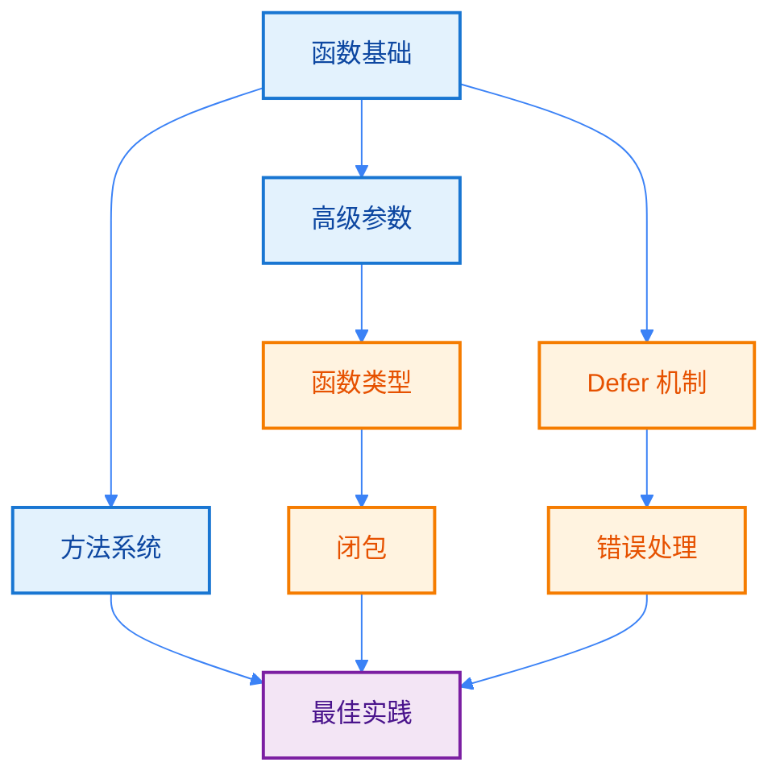

import { Badge } from "@rspress/core/theme";
import { Callout } from "@rspress/core/theme-original";

# 函数与方法模块

[← 返回 Go 语言首页](/golang/)

函数是 Go 代码的基本构建块，理解函数的各种特性对于编写高质量的 Go 代码至关重要。本模块全面介绍 Go 语言的函数与方法系统。

## 模块概览

本模块包含以下主题：

| 主题 | 描述 | 读者水平 |
|-----|-----|---------|
| [函数基础](./function-basics.mdx) | 函数声明、参数、返回值、调用流程 | <Badge text="入门级" type="tip" /> |
| [方法系统](./methods.mdx) | 值/指针接收者、方法集、接口实现 | <Badge text="中级" type="warning" /> |
| [高级参数](./advanced-parameters.mdx) | 可变参数、命名返回值、参数传递 | <Badge text="初级→中级" type="info" /> |
| [函数类型](./function-types.mdx) | 函数类型、高阶函数 | <Badge text="中级" type="warning" /> |
| [闭包](./closures.mdx) | 匿名函数、变量捕获、闭包陷阱 | <Badge text="中级→高级" type="warning" /> |
| [Defer 机制](./defer.mdx) | defer 执行顺序、参数求值、资源清理 | <Badge text="中级" type="warning" /> |
| [错误处理](./panic-recover.mdx) | 错误处理哲学、panic/recover | <Badge text="中级→高级" type="warning" /> |
| [最佳实践](./best-practices.mdx) | 设计原则、命名规范、性能优化 | <Badge text="高级→专业" type="warning" /> |

## 学习路径



<Callout type="tip" title="学习建议">
  <strong>推荐学习顺序：</strong>

  1. **初学者**：从 [函数基础](./function-basics.mdx) 开始，然后学习 [方法系统](./methods.mdx)
  2. **有经验者**：可以直接跳到感兴趣的章节，如 [闭包](./closures.mdx) 或 [Defer 机制](./defer.mdx)
  3. **深入理解**：最后阅读 [最佳实践](./best-practices.mdx) 了解设计原则和模式
</Callout>

## 核心概念速览

### 函数 vs 方法

| 特性 | 函数 | 方法 |
|-----|------|------|
| 定义 | `func name()` | `func (recv T) name()` |
| 接收者 | 无 | 值或指针 |
| 调用 | `name()` | `recv.name()` |
| 用途 | 独立功能 | 类型行为 |

### 关键特性

<Badge text="多返回值" type="info" />
Go 的多返回值是其特色功能，常用于错误处理：

```go
func divide(a, b int) (int, error) {
    if b == 0 {
        return 0, errors.New("division by zero")
    }
    return a / b, nil
}
```

<Badge text="闭包" type="warning" />
函数可以捕获外部变量，创建带状态的函数：

```go
func makeCounter() func() int {
    count := 0
    return func() int {
        count++
        return count
    }
}
```

<Badge text="Defer" type="warning" />
确保函数返回前执行代码，常用于资源清理：

```go
file, err := os.Open(path)
if err != nil {
    return err
}
defer file.Close()  // 函数返回前自动关闭
```

## 与其他模块的关联

本模块与以下模块密切相关：

- **[数据类型](/golang/data-types/)** - 函数参数和返回值都是类型
- **[核心基础](/golang/fundamentals/)** - 变量作用域影响闭包行为
- **[包系统](/golang/fundamentals/package-system.mdx)** - 函数的可见性与包管理

<Callout type="info" title="前置知识">
  学习本模块前，建议先了解：
  - [变量](/golang/fundamentals/variables.mdx)
  - [类型系统](/golang/fundamentals/type-system.mdx)
  - [结构体](/golang/data-types/struct.mdx)
</Callout>

## 快速开始

### 最简单的函数

```go
package main

import "fmt"

// 无参数无返回值
func greet() {
    fmt.Println("Hello, World!")
}

// 带参数和返回值
func add(a int, b int) int {
    return a + b
}

func main() {
    greet()
    result := add(5, 3)
    fmt.Println(result)  // 8
}
```

### 最简单的方法

```go
package main

import "fmt"

type Rectangle struct {
    width  float64
    height float64
}

// 值接收者方法
func (r Rectangle) Area() float64 {
    return r.width * r.height
}

func main() {
    rect := Rectangle{width: 3, height: 4}
    fmt.Println("面积:", rect.Area())  // 12
}
```

## 练习项目

完成以下练习来巩固所学知识：

<Badge text="初级" type="tip" />
1. **编写函数判断一个数是否为质数**
2. **实现一个计算器函数**，支持加减乘除和错误处理

<Badge text="中级" type="info" />
3. **创建一个 BankAccount 类型**，使用方法实现存款、取款、查询余额
4. **实现一个高阶函数**，用于过滤切片中的元素

<Badge text="高级" type="warning" />
5. **实现一个泛型函数**，找出切片中的最大值
6. **创建一个带缓存的函数**，使用闭包缓存计算结果

## 常见陷阱

<Callout type="danger" title="注意！">
  以下是最常见的错误：

  1. **忽略错误返回值** - 始终检查 error
  2. **闭包循环变量** - Go 1.22+ 已修复，但旧版本需注意
  3. **Defer 在循环中** - defer 不会立即执行
  4. **指针接收者混用** - 保持一致性
  5. **Panic 用于正常错误** - 应该返回 error
</Callout>

## 下一步

选择你感兴趣的主题开始学习：

- [函数基础](./function-basics.mdx) - 从这里开始
- [方法系统](./methods.mdx) - 学习方法定义
- [Defer 机制](./defer.mdx) - 理解 defer 的执行顺序

---

<Callout type="info" title="文档反馈">
  如果发现文档有误或需要补充，欢迎提交 Issue 或 PR！
</Callout>
