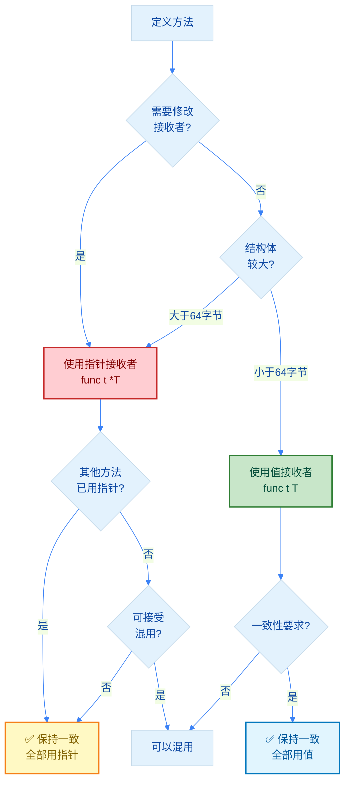

import { Badge } from "@rspress/core/theme";
import { Callout } from "@rspress/core/theme-original";

# 方法 - Methods

<Badge text="中级" type="warning" />

[← 返回函数与方法](./)

方法是带接收者的函数，用于为类型定义行为。与函数不同，方法通过接收者与特定类型关联，实现面向对象风格的编程。

## <Badge text="方法基础" type="tip" />

### 方法声明语法

<Badge text="语法" type="info" /> 方法声明与函数类似，但在 `func` 关键字和方法名之间增加了接收者：

```go
func (接收者) 方法名(参数列表) 返回类型 {
    // 方法体
}
```

```go
package main

import "fmt"

// 定义结构体
type Rectangle struct {
    width  float64
    height float64
}

// 值接收者方法：计算面积
func (r Rectangle) Area() float64 {
    return r.width * r.height
}

// 指针接收者方法：缩放尺寸
func (r *Rectangle) Scale(factor float64) {
    r.width *= factor
    r.height *= factor
}

func main() {
    rect := Rectangle{width: 3, height: 4}

    // 调用值接收者方法
    fmt.Println("面积:", rect.Area())  // 12

    // 调用指针接收者方法
    rect.Scale(2)
    fmt.Printf("缩放后: %.1f x %.1f\n", rect.width, rect.height)  // 6.0 x 8.0
}
```

### 方法结构图解

```mermaid
%%{init: {'theme':'base', 'themeVariables': { 'lineColor':'#3b82f6', 'primaryColor':'#e3f2fd', 'primaryTextColor':'#0d47a1'}}}%%
flowchart LR
    A[func] --> B[(接收者)]
    B --> C[方法名]
    C --> D[参数列表]
    D --> E[返回类型]
    E --> F[方法体]

    A1[func] --> B1[(r Rectangle)]
    B1 --> C1[Area]
    C1 --> D1[()]
    D1 --> E1[float64]
    E1 --> F1[return r.width * r.height]

    style A fill:#4caf50,color:#fff
    style A1 fill:#4caf50,color:#fff
    style B fill:#2196f3,color:#fff
    style B1 fill:#ff9800,color:#fff
    style C fill:#9c27b0,color:#fff
    style C1 fill:#9c27b0,color:#fff
```

## <Badge text="值接收者 vs 指针接收者" type="warning" />

### 对比表格

| 特性 | 值接收者 `func (t T)` | 指针接收者 `func (t *T)` |
|-----|---------------------|----------------------|
| **修改原值** | ❌ 不能修改 | ✅ 可以修改 |
| **内存拷贝** | ✅ 创建副本 | ❌ 无拷贝 |
| **nil 安全** | ✅ 安全 | ⚠️ 需检查 nil |
| **性能** | 小结构体快 | 大结构体更快 |
| **一致性** | - | 建议统一使用 |

### 详细对比示例

```go
package main

import "fmt"

type Counter struct {
    count int
}

// 值接收者：不会修改原始值
func (c Counter) IncrementValue() int {
    c.count++  // 修改的是副本
    return c.count
}

// 指针接收者：会修改原始值
func (c *Counter) IncrementPointer() int {
    c.count++  // 修改原始值
    return c.count
}

// 值接收者：只读操作
func (c Counter) GetCount() int {
    return c.count
}

func main() {
    c := Counter{count: 0}

    // 值接收者调用
    fmt.Println(c.IncrementValue())  // 1
    fmt.Println("原值:", c.count)     // 0（原值未变）

    // 指针接收者调用
    fmt.Println(c.IncrementPointer())  // 1
    fmt.Println("原值:", c.count)       // 1（原值已修改）

    // 值类型也可以调用指针接收者方法（Go 自动取地址）
    c.IncrementPointer()
    fmt.Println("再次:", c.count)  // 2
}
```

### 大结构体的性能影响

```go
package main

import "fmt"

// 大结构体（100字节）
type BigStruct struct {
    data [100]byte
}

// 值接收者：每次调用都会拷贝100字节
func (b BigStruct) ProcessValue() {
    // 处理逻辑
}

// 指针接收者：只拷贝8字节（指针大小）
func (b *BigStruct) ProcessPointer() {
    // 处理逻辑
}

func main() {
    bs := BigStruct{}

    // 值接收者：拷贝整个结构体
    bs.ProcessValue()

    // 指针接收者：只传递指针
    bs.ProcessPointer()
}
```

<Callout type="info" title={<Badge text="性能建议" type="info" />}>
  <strong>何时使用指针接收者：</strong>

  • 结构体大小 > 64 字节
  • 需要修改接收者的值
  • 为了保持一致性（避免混用）

  <strong>何时使用值接收者：</strong>

  • 结构体较小（< 64 字节）
  • 只读操作，不需要修改
  • 基本类型（int, string 等）
</Callout>

## <Badge text="接收者选择决策" type="warning" />

### 决策树



### 选择指南

<Badge text="决策表" type="tip" />

| 场景 | 推荐接收者 | 原因 |
|-----|----------|------|
| 需要修改接收者字段 | 指针接收者 `*T` | 必须用指针才能修改原值 |
| 结构体 > 64 字节 | 指针接收者 `*T` | 避免大内存拷贝，提升性能 |
| 只读操作，小结构体 | 值接收者 `T` | 简单清晰，避免 nil 检查 |
| 基本类型（int, bool） | 值接收者 `T` | 拷贝成本低，语义更清晰 |
| 已有方法用指针 | 指针接收者 `*T` | 保持一致性，避免混淆 |
| 实现 Stringer 接口 | 值接收者 `T` | 遵循标准库惯例 |

<Badge text="一致性原则" type="warning" /> **同一类型的所有方法应使用相同的接收者类型**，避免混用值和指针接收者。

## <Badge text="方法集" type="danger" />

### 方法集规则

<Badge text="重要" type="danger" /> 方法集决定了类型可以实现哪些接口，这是 Go 接口系统的核心。

```go
package main

import "fmt"

type T struct{}

// T 的方法集包含这些方法
func (t T) M1() {}
func (t *T) M2() {}

func main() {
    var t T
    var pt *T = &T{}

    // T 类型变量可以调用 M1 和 M2
    t.M1()  // 直接调用
    t.M2()  // Go 自动转换为 (&t).M2()

    // *T 类型变量可以调用 M1 和 M2
    pt.M1()  // Go 自动解引用 (*pt).M1()
    pt.M2()  // 直接调用
}
```

### 方法集与接口实现

```go
package main

import "fmt"

// 接口定义
type Interface1 interface {
    M1()
}

type Interface2 interface {
    M2()
}

type MyType struct{}

// 值接收者方法
func (m MyType) M1() {
    fmt.Println("M1 called")
}

// 指针接收者方法
func (m *MyType) M2() {
    fmt.Println("M2 called")
}

func main() {
    var mt MyType
    var pmt *MyType = &MyType{}

    // MyType 实现了 Interface1
    var i1 Interface1 = mt  // ✅ 值类型实现值接收者接口
    i1.M1()

    // *MyType 实现了 Interface1 和 Interface2
    var i2 Interface2 = pmt  // ✅ 指针类型实现指针接收者接口
    i2.M2()

    // ⚠️ 指针类型也可以实现值接收者方法
    var i1b Interface1 = pmt  // ✅ 指针类型包含值接收者方法
    i1b.M1()

    // ❌ 值类型不能实现指针接收者接口
    // var i2b Interface2 = mt  // 编译错误
}
```

### 方法集规则总结

<Badge text="规则" type="tip" />

| 类型 | 方法集包含 |
|-----|----------|
| `T`（值类型） | 所有接收者为 `T` 的方法 |
| `*T`（指针类型） | 所有接收者为 `T` 和 `*T` 的方法 |

<Callout type="danger" title={<Badge text="关键点" type="danger" />}>
  <strong>值类型不能实现指针接收者接口！</strong>

  ```go
  type MyInterface interface {
      M()  // 指针接收者方法
  }

  type MyType struct{}

  func (m *MyType) M() {}  // 指针接收者

  var mt MyType
  var i MyInterface = mt  // ❌ 编译错误

  var pmt *MyType = &MyType{}
  i = pmt  // ✅ 正确
  ```
</Callout>

## <Badge text="方法值与方法表达式" type="warning" />

### 方法值

<Badge text="常用" type="info" /> 方法值是将方法绑定到特定接收者后的函数引用：

```go
package main

import "fmt"

type Math struct {
    value int
}

func (m Math) Add(x int) int {
    return m.value + x
}

func (m *Math) Multiply(x int) {
    m.value *= x
}

func main() {
    m := Math{value: 10}

    // 方法值：将方法绑定到接收者
    addFunc := m.Add
    fmt.Println(addFunc(5))  // 15（m.value + 5）

    multiplyFunc := m.Multiply
    multiplyFunc(2)
    fmt.Println(m.value)  // 20
}
```

### 方法表达式

<Badge text="高级" type="warning" /> 方法表达式需要显式传递接收者：

```go
package main

import "fmt"

type Math struct {
    value int
}

func (m Math) Add(x int) int {
    return m.value + x
}

func (m *Math) Multiply(x int) {
    m.value *= x
}

func main() {
    m := Math{value: 10}

    // 方法表达式：需要显式传递接收者
    addExpr := Math.Add
    fmt.Println(addExpr(m, 5))  // 15

    multiplyExpr := (*Math).Multiply
    multiplyExpr(&m, 2)
    fmt.Println(m.value)  // 20
}
```

### 方法值 vs 方法表达式

| 特性 | 方法值 | 方法表达式 |
|-----|-------|----------|
| **语法** | `receiver.Method` | `Type.Method` |
| **接收者** | 已绑定 | 需显式传递 |
| **用途** | 回调、延迟执行 | 反射、动态调用 |
| **常用性** | ✅ 常用 | ⚠️ 特殊场景 |

### 实际应用：回调函数

```go
package main

import "fmt"

type Handler struct {
    name string
}

func (h Handler) Handle() {
    fmt.Printf("Handler %s processing...\n", h.name)
}

func process(h func()) {
    h()  // 调用回调
}

func main() {
    handler1 := Handler{name: "A"}
    handler2 := Handler{name: "B"}

    // 使用方法值作为回调
    process(handler1.Handle)  // Handler A processing...
    process(handler2.Handle)  // Handler B processing...
}
```

## <Badge text="高级话题" type="danger" />

### nil 接收者

<Badge text="危险" type="danger" /> nil 接收者调用方法会导致 panic：

```go
package main

import "fmt"

type MyType struct {
    value int
}

func (m *MyType) Method() {
    if m == nil {
        fmt.Println("接收者为 nil")
        return
    }
    fmt.Println("接收者非 nil:", m.value)
}

func main() {
    var mt *MyType  // nil 指针

    // 如果方法不检查 nil，会 panic
    mt.Method()  // 接收者为 nil
}
```

<Callout type="warning" title={<Badge text="最佳实践" type="warning" />}>
  <strong>指针接收者方法应该检查 nil</strong>

  ```go
  func (m *MyType) Method() {
      if m == nil {
          return  // 安全处理 nil 接收者
      }
      // 正常逻辑
  }
  ```
</Callout>

### 嵌入类型的方法

详见 [Struct 类型 - 嵌入](/docs/zh/golang/data-types/struct.mdx#匿名字段嵌入)

```go
type Base struct{}

func (b Base) Method() {
    fmt.Println("Base.Method")
}

type Derived struct {
    Base  // 嵌入
}

d := Derived{}
d.Method()  // 调用 Base.Method（提升方法）
```

### 类型别名的方法

```go
type MyInt int

func (m MyInt) Double() MyInt {
    return m * 2
}

var x MyInt = 5
fmt.Println(x.Double())  // 10
```

## <Badge text="最佳实践" type="success" />

### 方法设计原则

```go
// ✅ 好的方法命名：清晰表达意图
func (u *User) Save() error
func (u *User) Validate() error
func (u *User) UpdateEmail(email string) error

// ❌ 不好的命名
func (u *User) Do() error
func (u *User) Process(string, int) error
```

### 接收者命名

<Badge text="约定" type="tip" /> 接收者名称通常使用类型的首字母小写：

```go
// ✅ 好的接收者命名
func (u *User) Save() error {}
func (c *Config) Load() error {}
func (b *Buffer) Write(data []byte) (int, error) {}

// ❌ 避免使用 this、self
func (this *User) Save() error {}  // 不符合 Go 风格
func (self *User) Save() error {}  // 不符合 Go 风格
```

<Callout type="tip" title="推荐实践：统一使用 p">
  <strong>推荐所有接收者统一使用 `p`（pointer 的缩写）</strong>

  ```go
  // ✅ 推荐：统一使用 p
  func (p *User) Save() error {}
  func (p *Config) Load() error {}
  func (p *Buffer) Write(data []byte) (int, error) {}
  ```

  **优势**：
  • 减少命名思考 - 不需要考虑类型首字母
  • 代码一致性 - 所有接收者名称相同
  • 避免遮蔽风险 - 不会与字段名冲突
  • 快速输入 - 只需输入 `p.` 三个字符

  本知识库推荐在项目中统一使用 `p` 作为接收者名称。
</Callout>

### 错误处理

```go
// ✅ 方法应该返回 error，不要 panic
func (u *User) Save() error {
    if u.Name == "" {
        return fmt.Errorf("用户名不能为空")
    }
    // 保存逻辑
    return nil
}

// ❌ 不要在方法中 panic
func (u *User) Save() {
    if u.Name == "" {
        panic("用户名不能为空")  // 不要这样做
    }
}
```

### 一致性示例

```go
// ✅ 好的设计：所有方法使用指针接收者
type User struct {
    id   int
    name string
}

func (u *User) Save() error {
    // 保存到数据库
    return nil
}

func (u *User) Delete() error {
    // 从数据库删除
    return nil
}

func (u *User) UpdateName(name string) error {
    u.name = name
    return u.Save()
}
```

## <Badge text="相关概念" type="info" />

### 交叉引用

方法与以下主题密切相关：

- **[Struct 类型](/docs/zh/golang/data-types/struct.mdx)** - 方法最常见的接收者类型
- **[Interface 类型](/docs/zh/golang/data-types/interface.mdx)** - 方法集决定接口实现
- **[Pointer 类型](/docs/zh/golang/data-types/pointer.mdx)** - 指针接收者详解

### 标准接口实现

```go
// 实现 fmt.Stringer 接口
func (u User) String() string {
    return fmt.Sprintf("User(%d, %s)", u.id, u.name)
}

// 实现 error 接口
func (e *MyError) Error() string {
    return e.message
}
```

## 速查表

### 方法声明

```go
func (t T) Method1() {}           // 值接收者
func (t *T) Method2() {}          // 指针接收者
func (t T) Method3(x int) int {}  // 带参数和返回值
```

### 接收者选择

| 条件 | 使用 | 原因 |
|-----|------|------|
| 需要修改接收者 | 指针 `*T` | 必须用指针 |
| 结构体 > 64字节 | 指针 `*T` | 性能考虑 |
| 只读操作 | 值 `T` | 简单清晰 |
| 保持一致性 | 同一类型 | 避免混淆 |

### 方法集规则

```
T   的方法集: { (T) 的方法 }
*T  的方法集: { (T) 的方法, (*T) 的方法 }
```

## 练习

<Badge text="初级" type="tip" />
1. **定义 Circle 结构体**，实现 Area() 和 Circumference() 方法
2. **实现 BankAccount 类型**，包含 Deposit()、Withdraw()、Balance() 方法

<Badge text="中级" type="info" />
3. **实现 Person 类型**的 Stringer 接口
4. **创建 Stack 类型**，实现 Push()、Pop()、IsEmpty() 方法（使用指针接收者）

<Badge text="高级" type="warning" />
5. **实现排序接口** sort.Interface 的三个方法
6. **设计缓存类型**，使用方法值作为回调函数


[← 返回函数与方法](./)
