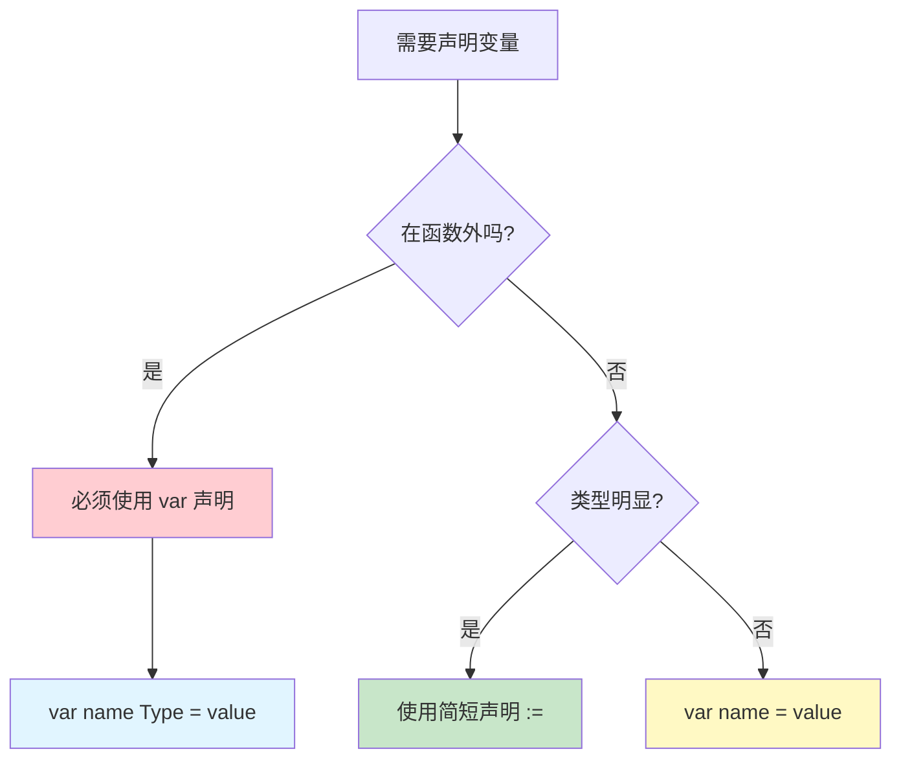

import { Badge } from "@rspress/core/theme";

# 声明与初始化 - 变量与常量

[← 返回基础概念](../)

理解 Go 中变量和常量的声明方式是编写代码的基础。

---

## <Badge text="变量声明" type="tip" />

### 三种声明方式

```go
package main

import "fmt"

func main() {
    // 方式1：标准声明（var 变量名 类型）
    var name string = "Go"
    var age int = 10

    // 方式2：类型推断（var 变量名 = 值）
    var language = "Go"  // 自动推断为 string
    var version = 1.26   // 自动推断为 float64

    // 方式3：简短声明（:= 只能在函数内使用）
    year := 2026         // 自动推断为 int
    isActive := true     // 自动推断为 bool

    fmt.Println(name, age, language, version, year, isActive)
}
```

### 声明方式选择



---

## <Badge text="零值机制" type="info" />

### 默认零值

Go 中每个类型都有默认的"零值"：

```go
package main

import "fmt"

func main() {
    var (
        name      string   // ""  (空字符串)
        age       int      // 0
        price     float64  // 0
        isActive  bool     // false
        numbers   []int    // nil
        userInfo  map[string]string  // nil
    )

    fmt.Printf("string: '%s'\\n", name)
    fmt.Printf("int: %d\\n", age)
    fmt.Printf("float64: %f\\n", price)
    fmt.Printf("bool: %t\\n", isActive)
    fmt.Printf("slice: %v\\n", numbers)
    fmt.Printf("map: %v\\n", userInfo)
}
```

**零值速查表**：

| 类型 | 零值 | 说明 |
|-----|------|-----|
| `int`, `int8`...`int64` | `0` | 数值零 |
| `uint`, `uint8`...`uint64` | `0` | 数值零 |
| `float32`, `float64` | `0` | 数值零 |
| `string` | `""` | 空字符串（不是 nil） |
| `bool` | `false` | 布尔假 |
| 指针 | `nil` | 空指针 |
| slice | `nil` | 空切片 |
| map | `nil` | 空映射 |
| channel | `nil` | 空通道 |
| interface | `nil` | 空接口 |
| function | `nil` | 空函数 |

<Badge text="重要" type="warning" /> **Go 没有未初始化的变量**，声明后自动获得零值，避免了"未定义行为"。

---

## <Badge text="常量声明" type="info" />

### const 基础

```go
package main

import "fmt"

// 包级常量
const Pi = 3.14159
const Greeting = "Hello"

func main() {
    // 函数内常量
    const MaxUsers = 1000
    const Timeout = 30

    fmt.Println(Pi, Greeting, MaxUsers, Timeout)
}
```

### const 与 var 的区别

| 特性 | var | const |
|-----|-----|-------|
| 值可变性 | 可修改 | 不可修改 |
| 初始化 | 可以延迟初始化 | 必须在声明时初始化 |
| 类型推断 | 支持 | 支持 |
| 计算时机 | 运行时 | 编译时 |

---

## <Badge text="iota 枚举" type="warning" />

### iota 基础用法

```go
package main

import "fmt"

// 定义日志级别
const (
    LevelDebug = iota  // 0
    LevelInfo          // 1
    LevelWarn          // 2
    LevelError         // 3
    LevelFatal         // 4
)

// 定义权限位
const (
    ReadPermission  = 1 << iota  // 1 (二进制: 0001)
    WritePermission              // 2 (二进制: 0010)
    ExecutePermission            // 4 (二进制: 0100)
    AdminPermission              // 8 (二进制: 1000)
)

func main() {
    fmt.Println("日志级别:", LevelDebug, LevelInfo, LevelError)
    fmt.Println("权限:", ReadPermission, WritePermission, AdminPermission)
}
```

### iota 高级用法

```go
package main

import "fmt"

const (
    // iota = 0
    A = iota  // 0
    B         // 1
    C         // 2
)

const (
    // iota 重置为 0
    D = iota * 10  // 0
    E              // 10
    F              // 20
)

const (
    // 跳过值
    G = iota  // 0
    _         // 1 (使用 _ 跳过)
    I         // 2
)

const (
    // 表达式中使用 iota
    J = 1 << iota  // 1 (二进制: 0001)
    K              // 2 (二进制: 0010)
    L              // 4 (二进制: 0100)
)

func main() {
    fmt.Println(A, B, C)      // 0 1 2
    fmt.Println(D, E, F)      // 0 10 20
    fmt.Println(G, I)         // 0 2
    fmt.Println(J, K, L)      // 1 2 4
}
```

<Badge text="iota 规则" type="info" />
- 每个 `const` 块中，`iota` 从 0 开始
- 每新增一行，`iota` 自动加 1
- 同一行的多个常量共享相同的 `iota` 值

---

## <Badge text="批量声明" type="warning" outline />

### var 批量声明

```go
package main

import "fmt"

func main() {
    // 方式1：因式分解
    var (
        name     string = "Go"
        age      int    = 10
        isActive bool   = true
    )

    // 方式2：多变量短声明
    x, y := 10, 20
    firstName, lastName := "John", "Doe"

    fmt.Println(name, age, isActive)
    fmt.Println(x, y, firstName, lastName)
}
```

### 函数多返回值

```go
package main

import "fmt"

// 返回多个值
func divide(a, b int) (int, int) {
    quotient := a / b
    remainder := a % b
    return quotient, remainder
}

func main() {
    q, r := divide(10, 3)
    fmt.Printf("10 / 3 = %d ... %d\\n", q, r)

    // 使用 _ 忽略不需要的返回值
    q2, _ := divide(10, 3)
    fmt.Printf("10 / 3 = %d\\n", q2)
}
```

---

## <Badge text="变量作用域" type="danger" />

### 作用域示例

```go
package main

import "fmt"

// 包级变量（全局作用域）
var globalVar = "I am global"

func main() {
    // 函数级变量
    localVar := "I am local"

    fmt.Println(globalVar)  // ✅ 可访问
    fmt.Println(localVar)   // ✅ 可访问

    // 块级作用域
    if true {
        blockVar := "I am in a block"
        fmt.Println(localVar)   // ✅ 可访问外层
        fmt.Println(blockVar)   // ✅ 可访问
    }

    // fmt.Println(blockVar)  // ❌ 超出作用域
}

func anotherFunction() {
    fmt.Println(globalVar)  // ✅ 可访问
    // fmt.Println(localVar)  // ❌ 超出作用域
}
```

### 变量遮蔽

```go
package main

import "fmt"

var x = "global x"

func main() {
    fmt.Println(x)  // "global x"

    x := "local x"  // 遮蔽全局变量
    fmt.Println(x)  // "local x"

    {
        x := "block x"  // 再次遮蔽
        fmt.Println(x)  // "block x"
    }

    fmt.Println(x)  // "local x" (回到函数级)
}
```

<Badge text="警告" type="danger" /> **变量遮蔽**可能导致难以发现的 bug，建议使用不同的变量名避免遮蔽。

---

## 快速参考

| 声明类型 | 语法 | 使用场景 |
|---------|------|----------|
| 标准声明 | `var name Type` | 包级变量、需要明确类型 |
| 类型推断 | `var name = value` | 包级变量、类型不明显 |
| 简短声明 | `name := value` | 函数内局部变量（推荐） |
| 常量声明 | `const name = value` | 不可改变的值 |
| iota 枚举 | `const ( A = iota )` | 相关常量序列 |

---

## 练习

1. **声明一个表示用户的变量**，包含姓名、年龄和邮箱
2. **使用 iota 定义一周的七天**
3. **编写函数返回两数之和与积**

---

[← 返回基础概念](../) | [命名规则](../naming/) | [继续：类型系统 →](../types/)
