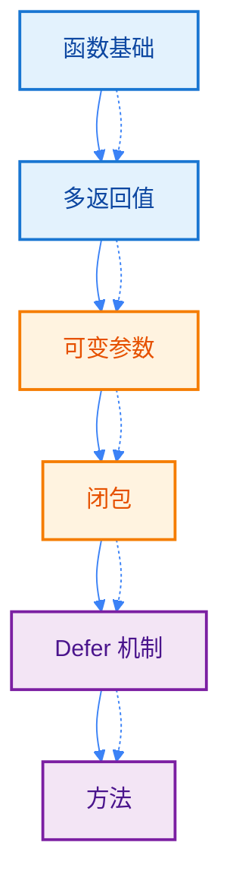
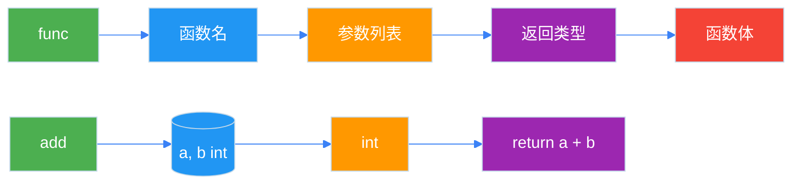
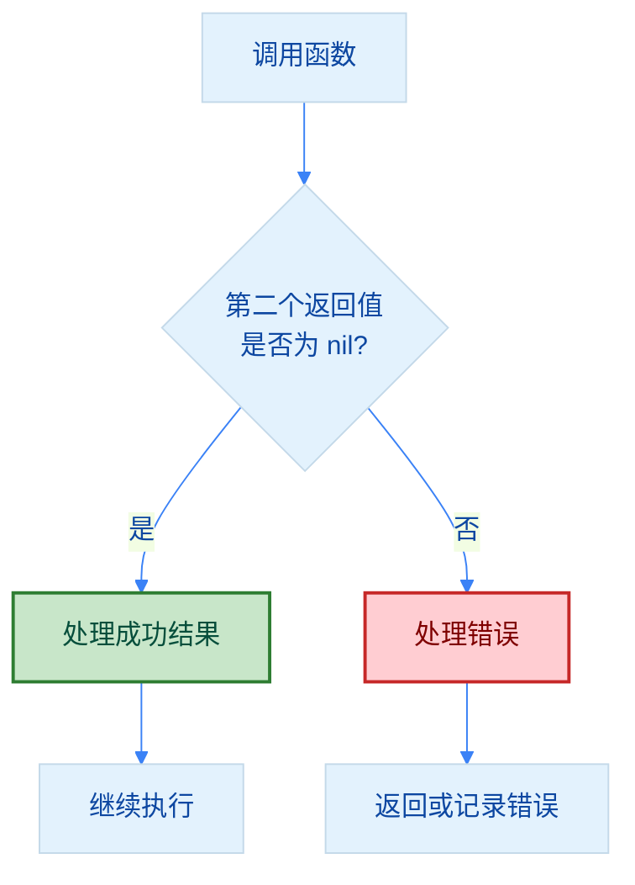
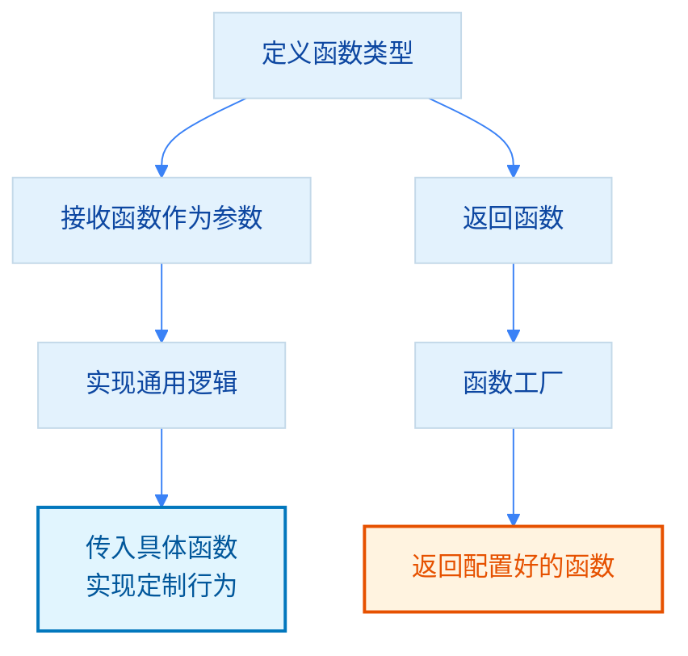
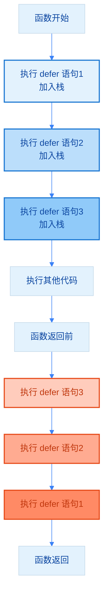
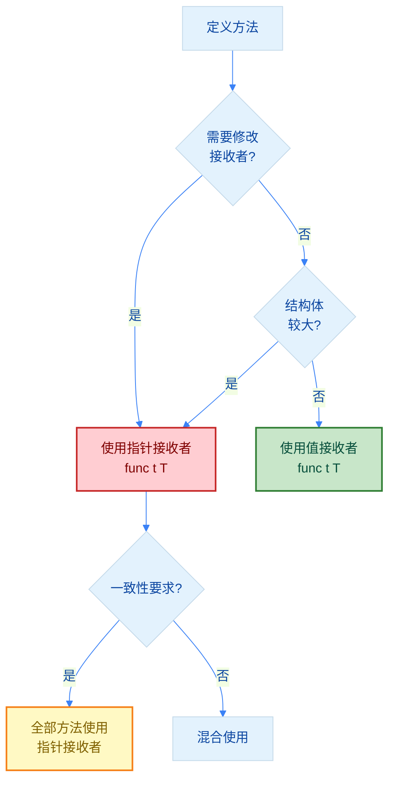

import { Badge } from "@rspress/core/theme";
import { Callout } from "@rspress/core/theme-original";

# 函数与方法 - Functions and Methods

[← 返回基础概念](overview/)

函数是 Go 代码的基本构建块，理解函数的各种特性对于编写高质量的 Go 代码至关重要。

## 学习路径



## <Badge text="函数基础" type="tip" />

### 函数声明

<Badge text="无技术背景" type="tip" /> 函数是一段可重复使用的代码块，用于执行特定任务。

```go
package main

import "fmt"

// 基本函数
func greet() {
    fmt.Println("Hello, World!")
}

// 带参数的函数
func greetUser(name string) {
    fmt.Printf("Hello, %s!\n", name)
}

// 带返回值的函数
func add(a int, b int) int {
    return a + b
}

// 参数类型相同时可简写
func subtract(a, b int) int {
    return a - b
}

// 多返回值
func divide(a, b int) (int, int) {
    quotient := a / b
    remainder := a % b
    return quotient, remainder
}

func main() {
    greet()
    greetUser("Alice")
    fmt.Println(add(5, 3))
    q, r := divide(10, 3)
    fmt.Printf("10 / 3 = %d ... %d\n", q, r)
}
```

### 函数结构图解



### 命名返回值

```go
package main

import "fmt"

// 命名返回值
func divideWithNamed(a, b int) (quotient int, remainder int) {
    quotient = a / b
    remainder = a % b
    return  // 隐式返回（返回所有命名返回值）
}

func main() {
    q, r := divideWithNamed(10, 3)
    fmt.Printf("10 / 3 = %d ... %d\n", q, r)
}
```

<Callout type="danger" title={<Badge text="不推荐" type="danger" />}>
  <strong>不推荐使用命名返回值</strong>。虽然命名返回值可以提高代码可读性，但也会带来以下问题：

  • <strong>遮蔽风险</strong>：函数内部使用同名变量时容易产生遮蔽
  • <strong>可读性下降</strong>：`return` 不带返回值时，不清楚返回了什么
  • <strong>调试困难</strong>：难以追踪返回值的来源

  除非有特殊需求（如 defer 修改返回值），否则应使用<strong>显式返回</strong>。
</Callout>


## <Badge text="多返回值" type="info" />

<Badge text="初级开发者" type="info" /> Go 的多返回值是其特色功能，常用于错误处理。

### 错误处理模式

```go
package main

import (
    "errors"
    "fmt"
)

// Go 的惯用错误处理
func divideSafe(a, b int) (int, error) {
    if b == 0 {
        return 0, errors.New("division by zero")
    }
    return a / b, nil
}

func main() {
    result, err := divideSafe(10, 0)
    if err != nil {
        fmt.Println("错误:", err)
        return
    }
    fmt.Println("结果:", result)
}
```

### 错误处理流程



### 忽略返回值

```go
package main

import "fmt"

func getValues() (int, string, bool) {
    return 42, "hello", true
}

func main() {
    // 使用 _ 忽略不需要的返回值
    num, _, _ := getValues()
    fmt.Println("数字:", num)
}
```


## <Badge text="可变参数" type="info" />

### 可变参数函数

<Badge text="中级开发者" type="warning" /> 可变参数让你创建灵活的函数，接收任意数量的参数。

```go
package main

import "fmt"

// 可变参数：...int 表示可以接收任意数量的 int 参数
func sum(numbers ...int) int {
    total := 0
    for _, num := range numbers {
        total += num
    }
    return total
}

// 混合参数：可变参数必须是最后一个
func greet(prefix string, names ...string) {
    for _, name := range names {
        fmt.Printf("%s, %s!\n", prefix, name)
    }
}

func main() {
    fmt.Println(sum(1, 2, 3))        // 6
    fmt.Println(sum(1, 2, 3, 4, 5))  // 15

    greet("Hello", "Alice", "Bob", "Charlie")
}
```

### 可变参数工作原理

```mermaid
%%{init: {'theme':'base', 'themeVariables': { 'lineColor':'#3b82f6', 'primaryColor':'#e3f2fd', 'primaryTextColor':'#0d47a1'}}}%%
flowchart LR
    A[调用 sum<br/>sum1, 2, 3] --> B[参数打包成<br/>slice int{1, 2, 3}]
    B --> C[函数内部<br/>遍历 slice]

    D[调用 sum<br/>nums...] --> E[展开 slice<br/>传递参数]
    E --> F[同单参数调用]

    style B fill:#e1f5fe,stroke:#0277bd,stroke-width:2px,color:#01579b
    style E fill:#fff3e0,stroke:#e65100,stroke-width:2px,color:#e65100
```

### 传递切片给可变参数

```go
package main

import "fmt"

func sum(numbers ...int) int {
    total := 0
    for _, num := range numbers {
        total += num
    }
    return total
}

func main() {
    nums := []int{1, 2, 3, 4, 5}
    // 使用 ... 展开切片
    fmt.Println(sum(nums...))  // 15
}
```


## <Badge text="函数类型" type="warning" />

<Badge text="高级开发者" type="warning" /> 函数在 Go 中是**一等公民**，可以像其他类型一样被传递和赋值。

### 函数作为变量

```go
package main

import "fmt"

// 函数类型
type Operation func(int, int) int

func add(a, b int) int {
    return a + b
}

func multiply(a, b int) int {
    return a * b
}

func main() {
    // 将函数赋值给变量
    var op Operation
    op = add
    fmt.Println(op(5, 3))  // 8

    op = multiply
    fmt.Println(op(5, 3))  // 15
}
```

### 函数作为参数

```go
package main

import "fmt"

// 接收函数作为参数
func apply(numbers []int, op func(int) int) []int {
    result := make([]int, len(numbers))
    for i, num := range numbers {
        result[i] = op(num)
    }
    return result
}

func double(x int) int {
    return x * 2
}

func square(x int) int {
    return x * x
}

func main() {
    nums := []int{1, 2, 3, 4, 5}

    doubled := apply(nums, double)
    fmt.Println("翻倍:", doubled)  // [2 4 6 8 10]

    squared := apply(nums, square)
    fmt.Println("平方:", squared)  // [1 4 9 16 25]
}
```

### 函数作为返回值（高阶函数）

```go
package main

import "fmt"

// 返回函数
func makeAdder(x int) func(int) int {
    return func(y int) int {
        return x + y
    }
}

// 工厂模式：创建不同功能的函数
func getComparator(operator string) func(int, int) bool {
    switch operator {
    case ">":
        return func(a, b int) bool { return a > b }
    case "<":
        return func(a, b int) bool { return a < b }
    case "==":
        return func(a, b int) bool { return a == b }
    default:
        return func(a, b int) bool { return false }
    }
}

func main() {
    add5 := makeAdder(5)
    add10 := makeAdder(10)

    fmt.Println(add5(3))   // 8 (5 + 3)
    fmt.Println(add10(3))  // 13 (10 + 3)

    greaterThan := getComparator(">")
    fmt.Println(greaterThan(5, 3))  // true
}
```

### 高阶函数应用流程




## <Badge text="匿名函数与闭包" type="warning" />

### 匿名函数

```go
package main

import "fmt"

func main() {
    // 定义并立即调用匿名函数
    func(msg string) {
        fmt.Println(msg)
    }("Hello from anonymous function!")

    // 将匿名函数赋值给变量
    add := func(a, b int) int {
        return a + b
    }
    fmt.Println(add(5, 3))
}
```

### 闭包

<Badge text="专业开发者" type="danger" /> 闭包可以捕获外部变量，创建带状态的函数。

```go
package main

import "fmt"

// 闭包：函数可以访问其外部作用域的变量
func makeAdder(x int) func(int) int {
    return func(y int) int {
        return x + y  // 访问外部变量 x
    }
}

// 计数器闭包
func makeCounter() func() int {
    count := 0
    return func() int {
        count++
        return count
    }
}

func main() {
    add5 := makeAdder(5)
    add10 := makeAdder(10)

    fmt.Println(add5(3))   // 8 (5 + 3)
    fmt.Println(add10(3))  // 13 (10 + 3)

    counter := makeCounter()
    fmt.Println(counter())  // 1
    fmt.Println(counter())  // 2
    fmt.Println(counter())  // 3
}
```

### 闭包陷阱

```go
package main

import "fmt"

func main() {
    // 错误示例：闭包捕获循环变量
    var funcs []func()
    for i := 0; i < 3; i++ {
        funcs = append(funcs, func() {
            fmt.Println(i)  // 所有闭包共享同一个 i
        })
    }

    for _, f := range funcs {
        f()  // 输出: 3 3 3 (不是 0 1 2!)
    }

    // 正确示例：为每次迭代创建新变量
    var funcs2 []func()
    for i := 0; i < 3; i++ {
        i := i  // 创建新的局部变量
        funcs2 = append(funcs2, func() {
            fmt.Println(i)
        })
    }

    for _, f := range funcs2 {
        f()  // 输出: 0 1 2
    }
}
```

<Callout type="tip" title="Go 1.22+ 改进">
  从 Go 1.22 开始，for 循环每次迭代都会创建新的变量，上述"陷阱"已自动修复。
</Callout>


## <Badge text="Defer 机制" type="warning" />

### defer 基础

<Badge text="中级开发者" type="warning" /> `defer` 用于确保函数返回前执行某段代码，常用于资源清理。

```go
package main

import "fmt"

func main() {
    // defer 会在函数返回前执行
    defer fmt.Println("最后执行")
    fmt.Println("首先执行")

    // 多个 defer 按后进先出（LIFO）顺序执行
    defer fmt.Println("1")
    defer fmt.Println("2")
    defer fmt.Println("3")

    fmt.Println("中间代码")

    // 输出顺序：
    // 首先执行
    // 中间代码
    // 3
    // 2
    // 1
    // 最后执行
}
```

### defer 执行流程



### defer 实际应用

```go
package main

import (
    "fmt"
    "os"
)

// 资源清理
func processFile(filename string) error {
    file, err := os.Open(filename)
    if err != nil {
        return err
    }
    // 确保文件最终被关闭
    defer file.Close()

    // 处理文件...
    fmt.Printf("处理文件: %s\n", filename)
    return nil
}

// panic 恢复
func safeExecute() {
    defer func() {
        if r := recover(); r != nil {
            fmt.Println("从 panic 恢复:", r)
        }
    }()

    // 可能引发 panic 的代码
    panic("出错了!")
}

func main() {
    processFile("example.txt")
    safeExecute()
    fmt.Println("程序继续执行")
}
```

### defer 的注意事项

```go
package main

import "fmt"

func main() {
    // defer 语句会立即计算参数值
    x := 10
    defer fmt.Println(x)  // 输出 10，不是 20
    x = 20
    fmt.Println(x)

    // defer 中修改返回值（使用命名返回值）
    fmt.Println(f())  // 输出 20
}

func f() (result int) {
    defer func() {
        result = 20  // 修改返回值
    }()
    return 10  // 实际返回 20
}
```


## <Badge text="泛型函数" type="danger" />

<Badge text="高级开发者" type="danger" /> Go 1.18+ 支持泛型函数，让你编写更通用的代码。

### 泛型基础

```go
package main

import "fmt"

// 泛型函数：T 是类型参数
func min[T comparable](a, b T) T {
    if a < b {
        return a
    }
    return b
}

// 多个类型参数
func Pair[T, U any](first T, second U) {
    fmt.Printf("First: %v, Second: %v\n", first, second)
}

func main() {
    fmt.Println(min(3, 5))           // int: 3
    fmt.Println(min(3.14, 2.71))     // float64: 2.71
    fmt.Println(min("hello", "world"))  // string: "hello"

    Pair(1, "one")       // int, string
    Pair("key", 42)      // string, int
}
```

### 类型约束

```go
package main

import "fmt"

// 自定义类型约束
type Number interface {
    int | int64 | float64
}

func sum[T Number](a, b T) T {
    return a + b
}

// 使用 ~ 支持底层类型
type MyInt int

type SignedInt interface {
    ~int | ~int8 | ~int16 | ~int32 | ~int64
}

func abs[T SignedInt](n T) T {
    if n < 0 {
        return -n
    }
    return n
}

func main() {
    fmt.Println(sum(1, 2))          // 3
    fmt.Println(sum(1.5, 2.5))      // 4.0

    var x MyInt = -5
    fmt.Println(abs(x))  // 5
}
```

### 泛型函数选择图

```mermaid
%%{init: {'theme':'base', 'themeVariables': { 'lineColor':'#3b82f6', 'primaryColor':'#e3f2fd', 'primaryTextColor':'#0d47a1'}}}%%
flowchart TD
    A[需要处理多种类型] --> B{类型是否<br/>有限?}
    B -->|是| C[使用类型约束<br/>interface]
    B -->|否| D[使用 any]

    C --> E[定义类型约束<br/>int | string | ...]
    E --> F[声明泛型函数<br/>func T constraint]

    D --> G[声明泛型函数<br/>func T any]

    F --> H[使用类型断言<br/>或反射处理]
    G --> H

    style C fill:#e3f2fd,stroke:#1976d2,stroke-width:2px,color:#0d47a1
    style D fill:#fff3e0,stroke:#e65100,stroke-width:2px,color:#e65100
    style E fill:#c8e6c9,stroke:#2e7d32,stroke-width:2px,color:#064e3b
```


## <Badge text="方法" type="warning" outline />

### 方法基础

方法是带接收者的函数，用于为类型定义行为。

```go
package main

import "fmt"

// 定义结构体
type Rectangle struct {
    width  float64
    height float64
}

// 值接收者方法
func (r Rectangle) Area() float64 {
    return r.width * r.height
}

// 指针接收者方法
func (r *Rectangle) Scale(factor float64) {
    r.width *= factor
    r.height *= factor
}

func main() {
    rect := Rectangle{width: 3, height: 4}

    // 调用值接收者方法
    fmt.Println("面积:", rect.Area())  // 12

    // 调用指针接收者方法
    rect.Scale(2)
    fmt.Printf("缩放后: %.1f x %.1f\n", rect.width, rect.height)  // 6.0 x 8.0
}
```

### 值接收者 vs 指针接收者

```go
package main

import "fmt"

type Counter struct {
    count int
}

// 值接收者：不会修改原始值
func (c Counter) IncrementValue() int {
    c.count++
    return c.count  // 返回副本的值
}

// 指针接收者：会修改原始值
func (c *Counter) IncrementPointer() int {
    c.count++
    return c.count
}

func main() {
    c := Counter{count: 0}

    fmt.Println(c.IncrementValue())  // 1
    fmt.Println(c.count)             // 0 (原始值未变)

    fmt.Println(c.IncrementPointer())  // 1
    fmt.Println(c.count)              // 1 (原始值已修改)
}
```

### 接收者选择决策图



<Badge text="选择指南" type="info" />
| 场景 | 使用值接收者 | 使用指针接收者 |
|-----|-------------|---------------|
| 需要修改接收者 | ❌ | ✅ |
| 结构体较大 | ❌ | ✅ |
| 一致性要求 | - | ✅ 通常全部使用 |
| 只读操作 | ✅ | ❌ |

### 方法值与方法表达式

```go
package main

import "fmt"

type Math struct {
    value int
}

func (m Math) Add(x int) int {
    return m.value + x
}

func (m *Math) Multiply(x int) {
    m.value *= x
}

func main() {
    m := Math{value: 10}

    // 方法值：常用方式
    addFunc := m.Add
    fmt.Println(addFunc(5))  // 15

    // 方法表达式：需要显式传递接收者
    addExpr := Math.Add
    fmt.Println(addExpr(m, 5))  // 15

    multiplyExpr := (*Math).Multiply
    multiplyExpr(&m, 2)
    fmt.Println(m.value)  // 20
}
```


## <Badge text="最佳实践" type="success" />

### 函数设计原则

<Badge text="专业开发者" type="danger" />

```go
// ✅ 好的函数命名：动词开头，语义清晰
func getUserByID(id int64) (*User, error)
func validateEmail(email string) bool
func calculateTotal(items []Item) float64

// ❌ 不好的命名
func get(id int64) interface{}
func check(s string) bool
func do(items []interface{}) float64

// ✅ 函数应该短小精悍
func processUserData(user *User) error {
    if err := validateUser(user); err != nil {
        return err
    }
    if err := saveUser(user); err != nil {
        return err
    }
    return notifyUser(user)
}

// ❌ 函数过长，职责不清
func processUserData(user *User) error {
    // 100 行代码...
}

// ✅ 使用包装器处理常见错误模式
func withLogging(fn func() error) error {
    start := time.Now()
    err := fn()
    fmt.Printf("Operation took %v\n", time.Since(start))
    return err
}
```

### 错误处理最佳实践

```go
// ✅ 优先返回 error，不要 panic
func divide(a, b float64) (float64, error) {
    if b == 0 {
        return 0, fmt.Errorf("division by zero")
    }
    return a / b, nil
}

// ❌ 不要用 panic 处理可预见的错误
func divide(a, b float64) float64 {
    if b == 0 {
        panic("division by zero")  // 不要这样做
    }
    return a / b
}

// ✅ 尽早返回，减少嵌套
func process(data string) error {
    if data == "" {
        return errors.New("empty data")
    }

    if len(data) > 1000 {
        return errors.New("data too long")
    }

    // 主逻辑...
    return nil
}

// ❌ 深层嵌套
func process(data string) error {
    if data == "" {
        // ...
    } else {
        if len(data) > 1000 {
            // ...
        } else {
            // 主逻辑...
        }
    }
    return nil
}
```


## 函数类型速查

| 类型 | 语法 | 示例 |
|-----|------|-----|
| 无参数无返回值 | `func()` | `func greet()` |
| 单参数 | `func(T)` | `func square(n int)` |
| 多参数 | `func(T1, T2)` | `func add(a, b int)` |
| 单返回值 | `func(...) T` | `func getName() string` |
| 多返回值 | `func(...) (T1, T2)` | `func divide() (int, int)` |
| 命名返回值 | `func(...) (name T)` | `func get() (result int)` |
| 可变参数 | `func(...T)` | `func sum(nums ...int)` |
| 泛型函数 | `func[T C](...)` | `func min[T comparable](a, b T) T` |


## 练习

<Badge text="初级" type="tip" />
1. **编写函数判断一个数是否为质数**
2. **实现一个计算器函数**，支持加减乘除和错误处理

<Badge text="中级" type="info" />
3. **创建一个 BankAccount 类型**，使用方法实现存款、取款、查询余额
4. **实现一个高阶函数**，用于过滤切片中的元素

<Badge text="高级" type="warning" />
5. **实现一个泛型函数**，找出切片中的最大值
6. **创建一个带缓存的函数**，使用闭包缓存计算结果


[← 返回基础概念](overview/) | [类型系统](type-system/) | [继续：包系统 →](package-system/)
