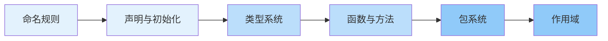

import { Badge } from "@rspress/core/theme";

# Go 语言基础概念

本模块系统介绍 Go 语言的核心基础概念，帮助你建立扎实的编程基础。

[← 返回模块概览](../)

---

## 为什么要学习基础概念？

<Badge text="无技术背景" type="tip" /> 理解编程的基本思维方式，掌握与计算机沟通的规则

<Badge text="有编程经验" type="info" /> 理解 Go 与其他语言的区别，掌握 Go 的惯用法

<Badge text="深入掌握" type="warning" outline /> 理解设计决策背后的原因，优化代码性能

---

## 学习路径

---

## 主题概览

  <a class="kb-card" href="naming">
    命名规则
    理解 Go 的命名约定和可见性规则
  </a>
  <a class="kb-card" href="declarations">
    声明与初始化
    掌握变量、常量的声明方式和零值机制
  </a>
  <a class="kb-card" href="types">
    类型系统
    深入理解 Go 的静态类型系统
  </a>
  <a class="kb-card" href="functions">
    函数与方法
    学习函数、闭包、方法和 defer 机制
  </a>
  <a class="kb-card" href="packages">
    包系统
    掌握包的组织和依赖管理
  </a>
  <a class="kb-card" href="scopes">
    作用域
    理解变量的生命周期和可见范围
  </a>

---

## 快速导航

| 主题 | 核心概念 | 预计时间 | 难度 |
|-----|---------|---------|------|
| 命名规则 | 驼峰命名、可见性 | 30分钟 | <Badge text="简单" type="tip" /> |
| 声明与初始化 | var、const、:= | 45分钟 | <Badge text="简单" type="tip" /> |
| 类型系统 | 基础类型、复合类型 | 2小时 | <Badge text="中等" type="info" /> |
| 函数与方法 | 函数、方法、闭包 | 1.5小时 | <Badge text="中等" type="info" /> |
| 包系统 | import、go.mod | 1小时 | <Badge text="中等" type="info" /> |
| 作用域 | 作用域链、生命周期 | 1小时 | <Badge text="较难" type="warning" /> |

---

## 配套内容

每个主题都包含：
- ✅ 概念解释
- ✅ 代码示例
- ✅ 常见错误分析
- ✅ 最佳实践

---

[返回模块概览](../) | [继续：命名规则 →](naming/)
