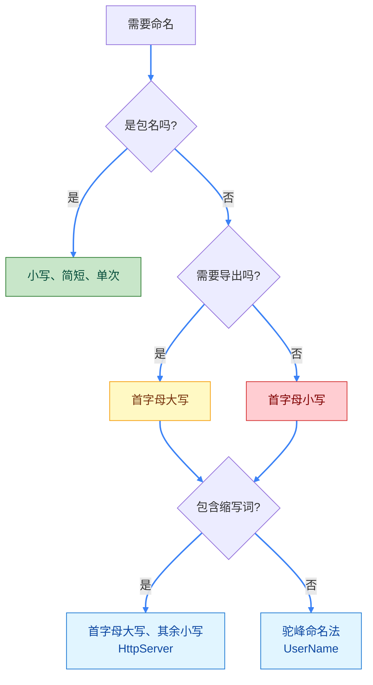

import { Badge } from "@rspress/core/theme";

# 命名规则 - Go 语言的命名约定

[← 返回基础概念](overview/)

良好的命名是代码可读性的基础。Go 语言有一套简洁明确的命名规则。


## <Badge text="核心规则" type="tip" />

### 命名可见性

Go 通过标识符首字母大小写控制访问权限：

```go
// 公开（导出）- 首字母大写
type User struct {
    Name string  // 公开字段
    email string // 私有字段
}

func GetUser() string {  // 公开函数
    return "user"
}

func getUser() string {  // 私有函数
    return "user"
}
```

<Badge text="规则" type="info" /> **首字母大写 = 公开（可导出）**，**首字母小写 = 私有（包内可见）**


## <Badge text="命名约定" type="info" />

### 包名

```go
// ✅ 推荐：简短、小写、单个单词
package fmt
package http
package strings

// ❌ 避免：下划线、混合大小写、过长
package my_package
package myPackage
package verylongpackagename
```

### 变量名

```go
// ✅ 推荐：驼峰命名法
userName := "Go"
isValid := true
totalCount := 100

// ❌ 避免：下划线命名（非 Go 惯用法）
user_name := "Go"
is_valid := true
```

### 常量名

```go
// ✅ 推荐：驼峰命名法
const maxRetries = 3
const defaultTimeout = 30

// ✅ 特殊情况：枚举常量可使用前缀
const (
    LevelDebug = iota
    LevelInfo
    LevelError
)
```

### 函数名

```go
// ✅ 推荐：动词或动词短语，驼峰命名
func getUser() string { }
func validateInput() bool { }
func processData() { }

// ✅ 接口方法命名
type Reader interface {
    Read(p []byte) (n int, err error)  // 单一方法通常用动词
}

type Stringer interface {
    String() string  // 转换方法通常用 er 结尾的名词
}
```

### 接口名

```go
// ✅ 单方法接口：方法名 + er 后缀
type Reader interface {
    Read([]byte) (int, error)
}

type Writer interface {
    Write([]byte) (int, error)
}

// ✅ 多方法接口：描述性名称
type ReadWriter interface {
    Reader
    Writer
}

type HttpClient interface {
    Get(url string) (Response, error)
    Post(url string, body []byte) (Response, error)
}
```


## <Badge text="缩写规则" type="warning" />

### 常见缩写处理

```go
// ✅ 推荐：缩写词首字母大写，其余小写
type HttpServer struct {}   // 不是 HTTPServer
type XmlDocument struct {}  // 不是 XMLDocument
type UserId int             // 不是 UserID

var apiUrl string           // 不是 APIURL
var xmlContent []byte       // 不是 XMLContent
```

<Badge text="常见缩写词" type="info" />
- **Http** → Http
- **Xml** → Xml
- **Json** → Json
- **Id** → Id
- **Url** → Url
- **Sql** → Sql


## <Badge text="命名最佳实践" type="warning" outline />

### 1. 简洁胜于冗长

```go
// ✅ 简洁清晰
func (r *Request) Write() { }
type User struct { }

// ❌ 过度冗长
func (r *HttpRequest) WriteToResponse() { }
type UserAccount struct { }
```

### 2. 语境优先

```go
// ✅ 在 User 结构体内，不需要重复前缀
type User struct {
    Name     string
    Email    string
    Password string
}

// ❌ 避免
type User struct {
    UserName     string
    UserEmail    string
    UserPassword string
}
```

### 3. 有意义的命名

```go
// ✅ 清晰表达意图
func isActive() bool { }
const maxConnections = 100

// ❌ 含义模糊
func check() bool { }
const n = 100
```


## <Badge text="常见错误" type="danger" />

### 错误1：使用下划线命名

```go
// ❌ Go 风格
var user_name string

// ✅ Go 惯用法
var userName string
```

### 错误2：私有字段使用大写开头

```go
// ❌ 错误：看似私有但实际导出
type User struct {
    Name string
    Password string  // 大写开头，其他包可访问
}

// ✅ 正确
type User struct {
    Name     string
    password string  // 小写开头，包内私有
}
```

### 错误3：过度使用缩写

```go
// ❌ 难以理解
var usrCnt int
func procData() { }

// ✅ 清晰明确
var userCount int
func processData() { }
```


## 命名决策树




## 快速参考

| 类型 | 规则 | 示例 |
|-----|------|------|
| 包名 | 小写、简短 | `package http` |
| 公开标识符 | 首字母大写 | `func GetUser()` |
| 私有标识符 | 首字母小写 | `func getUser()` |
| 变量/常量 | 驼峰命名 | `userName`, `maxCount` |
| 接口 | 动词+er 或描述性 | `Reader`, `HttpClient` |
| 缩写词 | 首字母大写 | `HttpServer`, `userId` |


[← 返回基础概念](overview/) | [继续：声明与初始化 →](variables-constants/)
