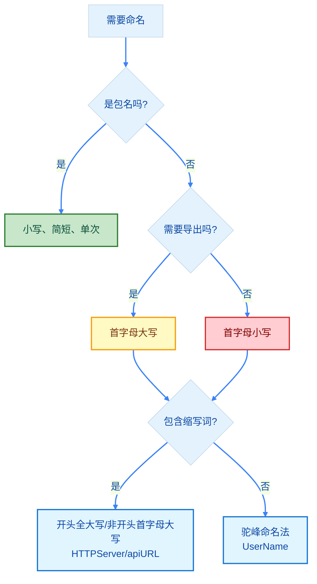

import { Badge } from "@rspress/core/theme";

# 命名规则 - Go 语言的命名约定

[← 返回基础概念](overview/)

良好的命名是代码可读性的基础。Go 语言有一套简洁明确的命名规则。


## <Badge text="核心规则" type="tip" />

### 命名可见性

Go 通过标识符首字母大小写控制访问权限：

```go
// 公开（导出）- 首字母大写
type User struct {
    Name string  // 公开字段
    email string // 私有字段
}

func GetUser() string {  // 公开函数
    return "user"
}

func getUser() string {  // 私有函数
    return "user"
}
```

<Badge text="规则" type="info" /> **首字母大写 = 公开（可导出）**，**首字母小写 = 私有（包内可见）**


## <Badge text="命名约定" type="info" />

### 包名

```go
// ✅ 推荐：简短、小写、单个单词
package fmt
package http
package strings

// ❌ 避免：下划线、混合大小写、过长
package my_package
package myPackage
package verylongpackagename
```

### 变量名

```go
// ✅ 推荐：驼峰命名法
userName := "Go"
isValid := true
totalCount := 100

// ❌ 避免：下划线命名（非 Go 惯用法）
user_name := "Go"
is_valid := true
```

### 常量名

```go
// ✅ 推荐：驼峰命名法
const maxRetries = 3
const defaultTimeout = 30

// ✅ 特殊情况：枚举常量可使用前缀
const (
    LevelDebug = iota
    LevelInfo
    LevelError
)
```

### 函数名

```go
// ✅ 推荐：动词或动词短语，驼峰命名
func getUser() string { }
func validateInput() bool { }
func processData() { }

// ✅ 接口方法命名
type Reader interface {
    Read(p []byte) (n int, err error)  // 单一方法通常用动词
}

type Stringer interface {
    String() string  // 转换方法通常用 er 结尾的名词
}
```

### 接口名

```go
// ✅ 单方法接口：方法名 + er 后缀
type Reader interface {
    Read([]byte) (int, error)
}

type Writer interface {
    Write([]byte) (int, error)
}

// ✅ 多方法接口：描述性名称
type ReadWriter interface {
    Reader
    Writer
}

type HttpClient interface {
    Get(url string) (Response, error)
    Post(url string, body []byte) (Response, error)
}
```


## <Badge text="缩写规则" type="warning" />

### 常见缩写处理

```go
// ✅ 推荐：缩写词在开头全大写，在其他位置只首字母大写
type HTTPServer struct {}   // 开头全大写
type XMLParser struct {}    // 开头全大写
type UserID int             // 开头全大写

var apiURL string           // 非开头，只首字母大写
var xmlContent []byte       // 非开头，只首字母大写
var userID int              // 非开头，只首字母大写
```

<Badge text="常见缩写词" type="info" />
- **开头**：`HTTP`、`XML`、`ID`、`URL`、`JSON`、`SQL`
- **非开头**：`apiURL`、`xmlContent`、`userID`、`jsonParser`


## <Badge text="命名最佳实践" type="warning" outline />

### 1. 简洁胜于冗长

```go
// ✅ 简洁清晰
func (r *Request) Write() { }
type User struct { }

// ❌ 过度冗长
func (r *HttpRequest) WriteToResponse() { }
type UserAccount struct { }
```

### 2. 语境优先

```go
// ✅ 在 User 结构体内，不需要重复前缀
type User struct {
    Name     string
    Email    string
    Password string
}

// ❌ 避免
type User struct {
    UserName     string
    UserEmail    string
    UserPassword string
}
```

### 3. 有意义的命名

```go
// ✅ 清晰表达意图
func isActive() bool { }
const maxConnections = 100

// ❌ 含义模糊
func check() bool { }
const n = 100
```


## <Badge text="State vs Status" type="warning" />

### 核心区别

| 类型 | 含义 | 使用场景 | 示例 |
|-----|------|---------|------|
| **State** | 单一状态值 | 枚举、布尔值 | `On/Off`, `Running/Paused` |
| **Status** | 位运算组合 | 一个值表达多个状态 | `1<<0 \| 1<<2` |

### State - 单一状态

表示某个时刻的**单一状态**。

```go
// State - 单一状态枚举
type State int
const (
    StateOff State = iota
    StateOn
    StatePaused
)
```

### Status - 位运算组合

使用位运算将**多个 state**组合成一个值。

```go
// Status - 位运算组合多个状态
type Status uint32

const (
    StatusReady     Status = 1 << iota  // 1
    StatusRunning                       // 2
    StatusPaused                        // 4
    StatusError                         // 8
    StatusCompleted                     // 16
)

// 检查状态
if status&StatusRunning != 0 {
    // 正在运行
}

// 组合多个状态
status := StatusReady | StatusRunning  // 3
```

<Badge text="记忆" type="tip" /> **State** = 单一状态 / **Status** = 位运算组合多状态

### 快速判断

```mermaid
%%{init: {'theme':'base', 'themeVariables': { 'lineColor':'#3b82f6', 'primaryColor':'#e3f2fd', 'primaryTextColor':'#0d47a1'}}}%%
flowchart TD
    A[需要状态] --> B{单一还是组合?}
    B -->|单一| C[State 枚举/bool]
    B -->|组合| D[Status 位运算]

    C --> E[On/Off, Running/Paused]
    D --> F[1<<0 | 1<<2<br/>StatusReady | StatusRunning]

    linkStyle default stroke:#3b82f6,stroke-width:2px
    classDef state fill:#e1f5ff,stroke:#1976d2,stroke-width:2px,color:#0d47a1
    classDef status fill:#c8e6c9,stroke:#2e7d32,stroke-width:2px,color:#064e3b
    class C,E state
    class D,F status
```

### 场景对照

| 场景 | 使用 | 示例 |
|-----|------|------|
| 开关状态 | `bool` | `Enabled`, `Active` |
| 模式选择 | `State` | `StateOn/Off/Paused` |
| 多状态组合 | `Status` | `StatusReady \| StatusRunning` |
| 权限标志 | `Status` | `Read \| Write \| Execute` |


## <Badge text="时间字段命名" type="warning" />

### 核心原则

| 含义 | 命名 | 类型 | 示例 |
|-----|------|------|------|
| 事件时刻 | `At` 后缀 | `int64` | `CreatedAt`, `UpdatedAt` |
| 时间值 | `Time` 后缀 | `time.Time` | `StartTime`, `EndTime` |
| 持续时间 | `Duration` | `time.Duration` | `Timeout`, `Delay` |
| 过期时间 | `ExpiresAt` | `int64` | `ExpiresAt` |

```go
// ✅ 推荐：At 后缀表示时间点（Unix 时间戳）
type User struct {
    CreatedAt int64  // 创建时间（Unix 秒）
    UpdatedAt int64  // 更新时间（Unix 秒）
    DeletedAt int64  // 删除时间（0 表示未删除）
}

// Time 后缀使用 time.Time
type Event struct {
    StartTime time.Time
    EndTime   time.Time
}

// 持续时间（Duration 仍用 time.Duration）
type Task struct {
    Duration time.Duration  // 持续时长
    Timeout  time.Duration  // 超时时长
}
```

### 类型选择

| 后缀 | 推荐类型 | 允许类型 | 说明 |
|-----|---------|---------|------|
| `At` | `int64` | `int64`, `uint64`, `int32`, `uint32` | Unix 时间戳（秒或毫秒） |
| `Time` | `time.Time` | `time.Time` | Go 原生时间类型 |
| `Duration` | `time.Duration` | `time.Duration` | 持续时间 |

<Badge text="注意" type="danger" /> **`At` 后缀用 `int64` 时间戳，`Time` 后缀用 `time.Time`**

### 零值处理

```go
// 使用 0 表示未设置
type User struct {
    DeletedAt int64  // 0 = 未删除，非 0 = 删除时间戳
}

// 检查是否已删除
if user.DeletedAt != 0 {
    // 已删除
}

// 使用负数表示特殊含义（可选）
const TimestampNotSet = -1

type Order struct {
    PaidAt int64  // -1 = 未支付，0 = 未知，>0 = 支付时间
}
```

<Badge text="记忆" type="tip" /> **`At` 用 int64 时间戳，`Time` 用 time.Time，`Duration` 用 time.Duration**


## <Badge text="常见错误" type="danger" />

### 错误1：使用下划线命名

```go
// ❌ Go 风格
var user_name string

// ✅ Go 惯用法
var userName string
```

### 错误2：私有字段使用大写开头

```go
// ❌ 错误：看似私有但实际导出
type User struct {
    Name string
    Password string  // 大写开头，其他包可访问
}

// ✅ 正确
type User struct {
    Name     string
    password string  // 小写开头，包内私有
}
```

### 错误3：过度使用缩写

```go
// ❌ 难以理解
var usrCnt int
func procData() { }

// ✅ 清晰明确
var userCount int
func processData() { }
```


## 命名决策树




## 快速参考

| 类型 | 规则 | 示例 |
|-----|------|------|
| 包名 | 小写、简短 | `package http` |
| 公开标识符 | 首字母大写 | `func GetUser()` |
| 私有标识符 | 首字母小写 | `func getUser()` |
| 变量/常量 | 驼峰命名 | `userName`, `maxCount` |
| 接口 | 动词+er 或描述性 | `Reader`, `HttpClient` |
| 缩写词 | 开头全大写，非开头首字母大写 | `HTTPServer`, `userID` |
| 单一状态 | `State` / `bool` | 枚举或布尔 | `Enabled`, `StateOn` |
| 组合状态 | `Status` | 位运算组合多个状态 | `Status | StatusRunning`, `StatusReady | StatusError` |
| 时间点 | `At` 后缀 | `int64` 时间戳 | `CreatedAt int64`, `UpdatedAt int64` |
| 时间值 | `Time` 后缀 | `time.Time` | `StartTime time.Time`, `EndTime time.Time` |
| 持续时间 | `Duration` | `time.Duration` | `Timeout time.Duration`, `Delay time.Duration` |


[← 返回基础概念](overview/) | [继续：声明与初始化 →](variables/)
