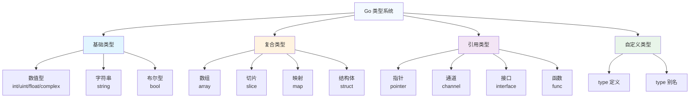

import { Badge } from "@rspress/core/theme";

# 类型系统 - Go 的静态类型系统

[← 返回基础概念](overview/)

Go 是静态类型语言，每个变量都有明确的类型，类型系统是 Go 的核心特性之一。

---

## <Badge text="类型系统概览" type="tip" />



---

## <Badge text="基础类型" type="tip" />

### 数值类型

```go
package main

import "fmt"

func main() {
    // 整型
    var i int = 42           // 平台相关（32位或64位）
    var i8 int8 = 127        // -128 到 127
    var i16 int16 = 32767    // -32768 到 32767
    var i32 int32 = 1000000  // -21亿到21亿
    var i64 int64 = 9000000  // 更大范围

    // 无符号整型
    var u uint = 42          // 平台相关
    var u8 uint8 = 255       // 0 到 255（也叫 byte）
    var u16 uint16 = 65535   // 0 到 65535
    var u32 uint32           // 0 到 42亿
    var u64 uint64           // 更大范围

    // 浮点型
    var f32 float32 = 3.14   // IEEE-754 32位
    var f64 float64 = 3.14159265359  // IEEE-754 64位

    // 复数型
    var c64 complex64 = 1 + 2i
    var c128 complex128 = 1 + 2i

    fmt.Println(i, u, f32, f64, c64, c128)
}
```

### 数值类型选择指南

| 类型 | 大小 | 范围 | 使用场景 |
|-----|------|-----|---------|
| `int` | 平台相关 | 取决于平台 | 一般整数，优先选择 |
| `int64` | 8字节 | -900万兆到900万兆 | 大数值，时间戳 |
| `float64` | 8字节 | IEEE-754 | 一般浮点数，优先选择 |
| `byte` | 1字节 | 0-255 | 字节数据，ASCII |
| `rune` | 4字节 | Unicode码点 | Unicode字符 |

### 字符串类型

```go
package main

import "fmt"

func main() {
    // 字符串是不可变的字节序列
    var s1 string = "Hello"
    s2 := "世界"

    // 多行字符串
    s3 := `这是一个
多行字符串
可以包含换行`

    // 字符串拼接
    s4 := s1 + " " + s2

    // 字符串长度（字节数）
    fmt.Println(len(s1))  // 5

    // 遍历字符串（按 rune 遍历）
    for i, r := range s2 {
        fmt.Printf("索引 %d: %c (码点 %d)\\n", i, r, r)
    }
}
```

### 布尔类型

```go
package main

import "fmt"

func main() {
    var isTrue bool = true
    var isFalse bool = false
    var defaultBool bool  // 零值为 false

    fmt.Println(isTrue, isFalse, defaultBool)  // true false false
}
```

---

## <Badge text="复合类型" type="info" />

### 数组 (Array)

```go
package main

import "fmt"

func main() {
    // 声明方式
    var arr1 [5]int                    // 零值数组
    arr2 := [3]int{1, 2, 3}            // 初始化
    arr3 := [...]int{1, 2, 3, 4, 5}    // 自动推断长度

    // 访问元素
    fmt.Println(arr2[0])  // 1
    arr2[0] = 10

    // 数组长度
    fmt.Println(len(arr3))  // 5

    // 数组是值类型
    a := [3]int{1, 2, 3}
    b := a  // 复制整个数组
    b[0] = 100
    fmt.Println(a)  // [1 2 3] (原数组不变)
    fmt.Println(b)  // [100 2 3]
}
```

<Badge text="注意" type="warning" /> **数组长度是类型的一部分**，`[3]int` 和 `[4]int` 是不同类型！

### 切片 (Slice)

```go
package main

import "fmt"

func main() {
    // 创建切片
    s1 := []int{1, 2, 3, 4, 5}
    s2 := make([]int, 3)        // [0 0 0] 长度3
    s3 := make([]int, 3, 5)     // [0 0 0] 长度3，容量5

    // 切片操作
    fmt.Println(s1[1:3])        // [2 3] (从索引1到3，不包含3)
    fmt.Println(s1[:3])         // [1 2 3] (从开头到3)
    fmt.Println(s1[2:])         // [3 4 5] (从2到结尾)

    // 追加元素
    s2 = append(s2, 4)
    fmt.Println(s2)             // [0 0 0 4]

    // 遍历
    for i, v := range s1 {
        fmt.Printf("索引 %d: 值 %d\\n", i, v)
    }
}
```

<Badge text="切片 vs 数组" type="info" />
| 特性 | 数组 | 切片 |
|-----|------|-----|
| 长度 | 固定 | 动态 |
| 作为参数 | 值拷贝 | 引用传递 |
| 常用度 | 较少 | 非常常用 |

### 映射 (Map)

```go
package main

import "fmt"

func main() {
    // 创建 map
    m1 := make(map[string]int)
    m2 := map[string]int{
        "apple":  5,
        "banana": 3,
    }

    // 添加/修改
    m1["orange"] = 2
    m2["apple"] = 10

    // 读取
    v, ok := m1["orange"]
    if ok {
        fmt.Println("orange 数量:", v)
    }

    // 删除
    delete(m2, "banana")

    // 遍历
    for k, v := range m2 {
        fmt.Printf("%s: %d\\n", k, v)
    }
}
```

### 结构体 (Struct)

```go
package main

import "fmt"

// 定义结构体
type User struct {
    ID       int
    Name     string
    Email    string
    IsActive bool
}

func main() {
    // 创建结构体
    u1 := User{1, "Alice", "alice@example.com", true}
    u2 := User{
        ID:       2,
        Name:     "Bob",
        Email:    "bob@example.com",
        IsActive: false,
    }

    // 访问字段
    fmt.Println(u1.Name)
    u2.IsActive = true

    // 匿名结构体
    p := struct {
        Name string
        Age  int
    }{"Charlie", 30}

    fmt.Println(p)
}
```

---

## <Badge text="引用类型" type="warning" />

### 指针 (Pointer)

```go
package main

import "fmt"

func main() {
    // 声明指针
    var p *int

    // 获取地址
    x := 42
    p = &x  // p 指向 x

    // 解引用
    fmt.Println(*p)  // 42
    *p = 100         // 修改 x 的值
    fmt.Println(x)   // 100

    // 指针的零值是 nil
    var p2 *int
    fmt.Println(p2 == nil)  // true
}
```

### 指针与函数

```go
package main

import "fmt"

// 传值
func modifyValue(x int) {
    x = 100  // 只影响副本
}

// 传指针
func modifyPointer(x *int) {
    *x = 100  // 修改原值
}

func main() {
    a := 1
    modifyValue(a)
    fmt.Println(a)  // 1

    modifyPointer(&a)
    fmt.Println(a)  // 100
}
```

### 接口 (Interface)

```go
package main

import "fmt"

// 定义接口
type Speaker interface {
    Speak() string
}

// 实现接口
type Dog struct{}

func (d Dog) Speak() string {
    return "汪汪"
}

type Cat struct{}

func (c Cat) Speak() string {
    return "喵喵"
}

func main() {
    // 接口变量
    var s Speaker

    s = Dog{}
    fmt.Println(s.Speak())  // 汪汪

    s = Cat{}
    fmt.Println(s.Speak())  // 喵喵
}
```

---

## <Badge text="类型转换" type="warning" outline />

### 基础类型转换

```go
package main

import "fmt"

func main() {
    var i int = 42
    var f float64 = float64(i)
    var s string = string(i)  // 警告：不是数字转字符串！

    // 数字转字符串
    numStr := fmt.Sprintf("%d", i)
    fmt.Println(numStr)  // "42"

    // 字符串转数字
    str := "123"
    var num int
    fmt.Sscanf(str, "%d", &num)
    fmt.Println(num)  // 123

    // 使用 strconv
    import "strconv"
    num2, _ := strconv.Atoi(str)
    fmt.Println(num2)  // 123
}
```

<Badge text="重要" type="danger" /> **Go 不支持隐式类型转换**，必须显式转换！

---

## 类型系统速查表

| 类型分类 | 类型 | 示例 | 零值 |
|---------|------|-----|------|
| 数值 | `int`, `int64`, `float64` | `42`, `3.14` | `0` |
| 字符串 | `string` | `"hello"` | `""` |
| 布尔 | `bool` | `true`, `false` | `false` |
| 数组 | `[N]T` | `[5]int` | 各元素零值 |
| 切片 | `[]T` | `[]int` | `nil` |
| 映射 | `map[K]V` | `map[string]int` | `nil` |
| 结构体 | `struct{...}` | `User{...}` | 各字段零值 |
| 指针 | `*T` | `*int` | `nil` |
| 接口 | `interface{}` | `Speaker` | `nil` |

---

## 练习

1. **创建一个表示"书"的结构体**，包含书名、作者、ISBN、价格
2. **使用切片存储多本书**，并遍历打印
3. **编写函数接收接口参数**，实现不同的打印方式

---

[← 返回基础概念](overview/) | [声明与初始化](variables-constants/) | [继续：函数与方法 →](functions-methods/)
