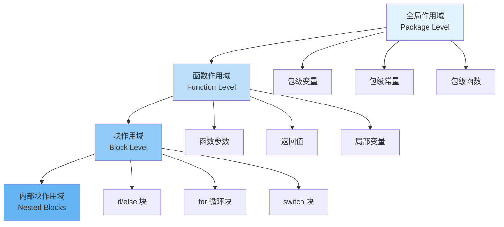
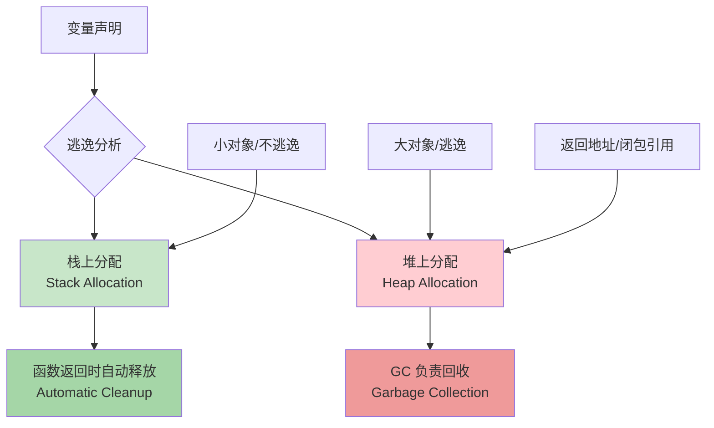

import { Badge } from "@rspress/core/theme";

# 作用域 - 变量的生命周期与可见性

[← 返回基础概念](overview/)

理解作用域是掌握 Go 语言的关键，它决定了变量的可见范围和生命周期。

---

## <Badge text="作用域层次" type="tip" />

### 作用域层级



### 作用域示例

```go
package main

import "fmt"

// 全局作用域（包级）
var packageVar = "I am package-level"
const packageConst = 100

func main() {
    // 函数作用域
    fmt.Println(packageVar)  // ✅ 可访问全局变量

    var functionVar = "I am function-level"

    if true {
        // 块作用域
        var blockVar = "I am block-level"
        fmt.Println(functionVar)  // ✅ 可访问外层变量
        fmt.Println(blockVar)     // ✅ 可访问当前块变量
    }

    // fmt.Println(blockVar)  // ❌ 超出作用域

    for i := 0; i < 3; i++ {
        // 循环作用域
        fmt.Println(i)  // i 在每次迭代中重新创建
    }

    // fmt.Println(i)  // ❌ i 超出作用域
}
```

---

## <Badge text="词法作用域" type="info" />

### 作用域链

```go
package main

import "fmt"

var x = "global x"

func outer() {
    var y = "outer y"

    fmt.Println(x)  // ✅ "global x" - 从外层查找
    // fmt.Println(z)  // ❌ z 未定义

    func inner() {
        var z = "inner z"

        fmt.Println(x)  // ✅ "global x" - 沿作用域链查找
        fmt.Println(y)  // ✅ "outer y" - 外层函数变量
        fmt.Println(z)  // ✅ "inner z" - 当前作用域
    }

    inner()
    // fmt.Println(z)  // ❌ z 不可访问
}

func main() {
    outer()
}
```

### 变量遮蔽

```go
package main

import "fmt"

var x = "global x"

func main() {
    fmt.Println(x)  // "global x"

    // 遮蔽全局变量
    x := "local x"
    fmt.Println(x)  // "local x"

    {
        // 再次遮蔽
        x := "block x"
        fmt.Println(x)  // "block x"
    }

    fmt.Println(x)  // "local x" - 回到函数级
}
```

<Badge text="警告" type="danger" /> **变量遮蔽**可能导致难以发现的 bug，应尽量避免。

---

## <Badge text="块作用域" type="info" />

### if 语句作用域

```go
package main

import "fmt"

func main() {
    // 条件变量仅在 if 块内可见
    if x := 10; x > 5 {
        fmt.Println(x)  // ✅ x 可见
    }
    // fmt.Println(x)  // ❌ x 超出作用域

    // if-else 共享作用域
    if y := 20; y > 5 {
        fmt.Println(y)  // ✅ y 在 if 块中可见
    } else {
        fmt.Println(y)  // ✅ y 在 else 块中也可见
    }
    // fmt.Println(y)  // ❌ y 超出作用域
}
```

### for 循环作用域

```go
package main

import "fmt"

func main() {
    // 循环变量在每次迭代中重新创建
    for i := 0; i < 3; i++ {
        fmt.Println(&i)  // 每次打印的地址可能不同
    }

    // range 循环
    nums := []int{1, 2, 3}
    for i, v := range nums {
        fmt.Printf("索引 %d: 值 %d\\n", i, v)
    }
    // i, v 在循环后不可访问

    // 使用现有变量（共享变量）
    var i int
    for i = 0; i < 3; i++ {
        fmt.Println(i)
    }
    fmt.Println(i)  // ✅ i 仍然可见，值为 3
}
```

### switch 语句作用域

```go
package main

import "fmt"

func main() {
    // switch 中的变量声明
    switch x := 5; x {
    case 5:
        fmt.Println(x)  // ✅ x 可见
        y := 10
        fmt.Println(y)  // ✅ y 在此 case 中可见
    case 10:
        fmt.Println(x)  // ✅ x 可见
        // fmt.Println(y)  // ❌ y 不可见（其他 case）
    }
    // fmt.Println(x)  // ❌ x 超出作用域
}
```

---

## <Badge text="变量生命周期" type="warning" />

### 栈与堆

```go
package main

import "fmt"

// 返回局部变量的地址
func createInt() *int {
    x := 42
    return &x  // Go 会将 x 分配到堆上
}

func main() {
    p := createInt()
    fmt.Println(*p)  // 42 - 仍然有效
}
```

### 逃逸分析



<Badge text="逃逸场景" type="info" />
1. **返回局部变量的地址**
2. **将局部变量赋值给接口**
3. **闭包捕获局部变量**
4. **发送到 channel**
5. **切片/map 容量扩容**

### 生命周期示例

```go
package main

import "fmt"

// 不逃逸：栈上分配
func stackAlloc() int {
    x := 42
    return x  // 返回值拷贝，x 在栈上
}

// 逃逸：堆上分配
func heapAlloc() *int {
    x := 42
    return &x  // 返回地址，x 逃逸到堆上
}

func main() {
    // 栈分配
    y := stackAlloc()
    fmt.Println(y)

    // 堆分配
    z := heapAlloc()
    fmt.Println(*z)
}
```

---

## <Badge text="闭包与作用域" type="warning" outline />

### 闭包捕获变量

```go
package main

import "fmt"

func main() {
    // 闭包捕获外部变量
    x := 10

    func() {
        fmt.Println(x)  // 10 - 捕获外部变量
    }()

    // 闭包修改变量
    func() {
        x = 20
    }()
    fmt.Println(x)  // 20 - 闭包修改了外层变量
}
```

### 循环中的闭包陷阱

```go
package main

import "fmt"

func main() {
    // 错误示例：所有闭包共享同一个变量
    var funcs []func()
    for i := 0; i < 3; i++ {
        funcs = append(funcs, func() {
            fmt.Println(i)  // 所有闭包共享 i
        })
    }

    for _, f := range funcs {
        f()  // 输出: 3 3 3
    }

    // 正确示例：为每次迭代创建新变量
    var funcs2 []func()
    for i := 0; i < 3; i++ {
        i := i  // 创建新的局部变量
        funcs2 = append(funcs2, func() {
            fmt.Println(i)
        })
    }

    for _, f := range funcs2 {
        f()  // 输出: 0 1 2
    }
}
```

---

## <Badge text="作用域最佳实践" type="danger" />

### 1. 最小化作用域

```go
// ✅ 好：作用域尽可能小
func process(data []string) {
    for _, s := range data {
        result := strings.ToUpper(s)
        fmt.Println(result)
    }
}

// ❌ 差：作用域过大
func process(data []string) {
    var result string
    for _, s := range data {
        result = strings.ToUpper(s)
        fmt.Println(result)
    }
    // result 仍然可见，但没有必要
}
```

### 2. 避免变量遮蔽

```go
// ✅ 好：使用不同的变量名
func process() {
    userCount := 10
    if adminCount := 2; adminCount > 0 {
        fmt.Println(userCount, adminCount)
    }
}

// ❌ 差：不必要的遮蔽
func process() {
    count := 10
    if count := 2; count > 0 {
        fmt.Println(count)  // 哪个 count？
    }
}
```

### 3. 尽晚声明变量

```go
// ✅ 好：在使用时声明
func process(data string) error {
    if data == "" {
        return fmt.Errorf("empty data")
    }

    result := processData(data)
    return saveResult(result)
}

// ❌ 差：过早声明
func process(data string) error {
    var result string  // 可能未使用

    if data == "" {
        return fmt.Errorf("empty data")
    }

    result = processData(data)
    return saveResult(result)
}
```

---

## 作用域速查表

| 作用域类型 | 范围 | 生命周期 | 示例 |
|-----------|-----|---------|------|
| 全局作用域 | 整个包 | 程序运行期 | `var x int` |
| 函数作用域 | 整个函数 | 函数执行期 | `func f() { var y }` |
| 块作用域 | 代码块 | 块执行期 | `if { var z }` |
| 循环作用域 | 单次迭代 | 迭代期 | `for i := 0; ...` |

---

## 练习

1. **编写函数展示变量遮蔽**，并说明输出原因
2. **创建闭包函数**，演示外部变量的捕获和修改
3. **实现计数器**，使用闭包维护状态

---

[← 返回基础概念](overview/) | [包系统](package-system/) | [返回模块概览](overview/)
