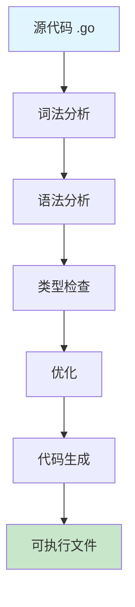

import { Badge } from "@rspress/core/theme";

# Hello World - 第一个 Go 程序

欢迎来到 Go 语言的第一个程序！本教程将引导你编写、运行和理解你的第一个 Go 程序。

## 📋 前置要求

在开始之前，请确保你已经：

- ✅ 安装了 Go 语言（[安装指南](/golang/install/install)）
- ✅ 验证安装成功（`go version` 命令可用）

---

## 🚀 快速开始（3分钟版）

### 第一步：创建项目

```bash
# 创建项目目录
mkdir hello-go
cd hello-go

# 初始化 Go Module
go mod init example.com/hello-go
```

### 第二步：编写代码

创建 `main.go` 文件：

```go title="main.go"
package main

import "fmt"

func main() {
    fmt.Println("Hello, World!")
}
```

### 第三步：整理依赖

```bash
# 整理 go.mod 依赖（自动添加缺失的依赖）
go mod tidy
```

### 第四步：运行程序

```bash
# 方法1：直接运行
go run main.go

# 方法2：编译后运行
go build -o hello
./hello        # Linux/macOS
# 或
hello.exe      # Windows
```

**预期输出**：

```
Hello, World!
```

🎉 恭喜！你已经运行了你的第一个 Go 程序！

---

## 📖 代码详解

### 逐行解析

```go
// 1. 包声明：每个 Go 文件必须声明所属的包
package main

// 2. 导入格式化输出包
import "fmt"

// 3. 主函数：程序执行的入口点
func main() {
    // 4. 打印输出
    fmt.Println("Hello, World!")
}
```

### 关键概念

#### <Badge text="基础概念" type="tip" />

**1. package（包）**
- `package main`：表示这是一个可执行程序
- 其他包：`package utils`、`package models` 等

**2. import（导入）**
- 用于引入其他包的功能
- `fmt`：格式化 I/O 包（输入输出）

**3. func（函数）**
- `main()`：特殊函数，程序入口
- 格式：`func 函数名() { }`

**4. Println（打印）**
- `fmt.Println()`：打印一行文本，自动换行

---

#### <Badge text="进阶知识" type="info" />

**main 包的特殊性**
- `package main`：可执行程序的入口
- `func main()`：程序开始执行的地方
- 没有 main 函数的程序无法作为独立程序运行

**导入多个包**
```go
import (
    "fmt"
    "os"
    "strings"
)
```

**格式化打印**
- `fmt.Printf()`：格式化打印（类似 C 的 printf）
```go
fmt.Printf("Hello, %s!\n", "World")
```

---

#### <Badge text="深入理解" type="warning" outline />

**Go 编译过程**



**查看编译细节**
```bash
# 查看汇编代码
go tool compile -S main.go

# 查看编译优化详情
go build -gcflags="-m" main.go
```

---

## 深入学习

### <Badge text="编程入门" type="tip" />

**什么是编程？**

编程就是用计算机能理解的语言，告诉计算机要做什么。

**本程序做了什么？**

1. **包声明**：告诉 Go 这是一个独立程序
2. **导入工具**：引入打印工具（fmt 包）
3. **定义任务**：在 main 函数中写具体要做什么
4. **执行任务**：打印 "Hello, World!"

**为什么要从 Hello World 开始？**

- ✅ 最简单的程序
- ✅ 验证环境配置正确
- ✅ 了解基本程序结构
- ✅ 获得第一个成就感！

---

### <Badge text="常见错误" type="info" />

**Go 程序的基本结构**

```
Go 程序
├── 包声明 (package)
├── 导入包 (import)
└── 函数定义 (func)
    └── 语句和表达式
```

**常见错误**

*错误1：缺少 main 函数*
```go
package main

import "fmt"

// 缺少 func main() - 无法运行
```

*错误2：包名不是 main*
```go
package hello  // 错误：不是 main 包

import "fmt"

func main() {
    fmt.Println("Hello, World!")
}
```

*错误3：大小写错误*
```go
package main

import "fmt"

func Main() {  // 错误：main 必须小写
    fmt.Println("Hello, World!")
}
```

---

---

### <Badge text="Go Modules" type="warning" />

**Go Modules 基础**

Go Modules 是 Go 的依赖管理系统，类似于：
- JavaScript 的 npm
- Python 的 pip
- Java 的 Maven

*go.mod 文件*

初始化时生成的 `go.mod` 文件：

```go title="go.mod"
module example.com/hello-go

go 1.26
```

**说明**：
- `module`：模块名称（通常是项目路径）
- `go 1.26`：最低 Go 版本要求

*常用命令*

```bash
# 初始化模块
go mod init example.com/myproject

# 下载依赖
go mod download

# 整理依赖
go mod tidy

# 查看依赖
go list -m all
```

**程序运行方式**

<Badge text="go run" type="info" /> 直接运行，不生成可执行文件，适合快速测试

<Badge text="go build" type="info" /> 生成可执行文件，编译一次多次运行，适合部署

<Badge text="go install" type="info" /> 编译并安装到 `$GOPATH/bin`，可全局运行

**变量和类型**

```go
package main

import "fmt"

func main() {
    // 变量声明
    var name string = "Go"
    var version = 1.26  // 类型推断
    year := 2026        // 简短声明（只能在函数内使用）

    // 打印变量
    fmt.Println("Language:", name)
    fmt.Println("Version:", version)
    fmt.Println("Year:", year)

    // 格式化输出
    fmt.Printf("Welcome to %s %g in %d\n", name, version, year)
}
```

---

---

### <Badge text="性能优化" type="warning" outline />

**内存布局**

```go
package main

import "fmt"

func main() {
    // 栈上分配（小对象，逃逸分析）
    x := 42

    // 堆上分配（大对象或逃逸）
    data := make([]byte, 1024*1024)

    fmt.Printf("x: %p, data: %p\n", &x, &data)
}
```

**性能优化技巧**

```go
package main

import "strings"

// ❌ 低效版本
func slowConcat(n int) string {
    s := ""
    for i := 0; i < n; i++ {
        s += "a"  // 每次都创建新字符串
    }
    return s
}

// ✅ 高效版本
func fastConcat(n int) string {
    var b strings.Builder
    b.Grow(n)
    for i := 0; i < n; i++ {
        b.WriteString("a")
    }
    return b.String()
}
```

---

---

### <Badge text="项目结构" type="danger" />

**项目结构**

```
hello-go/                    # 项目根目录
├── go.mod                   # 模块定义
├── go.sum                   # 依赖校验和锁定
├── main.go                  # 程序入口（小型项目可放根目录）
├── internal/                # 内部包（不可被外部导入）
│   └── core/                # 核心业务逻辑
├── pkg/                     # 公共包（可被外部导入）
│   ├── utils/               # 工具函数
│   └── api/                 # API 定义和类型
├── cmd/                     # 多个可执行程序时使用
│   ├── hello/               # hello 命令
│   └── server/              # server 命令
├── scripts/                 # 构建和部署脚本
├── configs/                 # 配置文件
└── deployments/             # 部署配置（Docker、K8s）
```

**关键规则**：
- 小型项目：`main.go` 可放在根目录
- 多个可执行程序：使用 `cmd/` 目录，每个子目录包含一个 `main.go`
- `pkg/utils/`：通用工具函数，可被外部导入
- `internal/core/`：核心业务逻辑，仅限内部使用

**错误处理**

```go
package main

import (
    "errors"
    "fmt"
)

func greet(name string) (string, error) {
    if name == "" {
        return "", errors.New("name cannot be empty")
    }
    return "Hello, " + name, nil
}

func main() {
    msg, err := greet("World")
    if err != nil {
        fmt.Println("Error:", err)
        return
    }
    fmt.Println(msg)
}
```

**测试**

```go title="main_test.go"
package main

import "testing"

func TestGreet(t *testing.T) {
    msg, err := greet("World")
    if err != nil {
        t.Fatalf("unexpected error: %v", err)
    }
    if msg != "Hello, World" {
        t.Errorf("expected 'Hello, World', got '%s'", msg)
    }
}

func BenchmarkGreet(b *testing.B) {
    for i := 0; i < b.N; i++ {
        greet("World")
    }
}
```

运行测试：
```bash
go test -v
go test -bench=.
```

---

## 🎯 练习

### 练习1：修改输出

修改程序，输出你的名字：

```go
package main

import "fmt"

func main() {
    fmt.Println("Hello, [你的名字]!")
}
```

### 练习2：多行输出

```go
package main

import "fmt"

func main() {
    fmt.Println("第一行")
    fmt.Println("第二行")
    fmt.Println("第三行")
}
```

### 练习3：使用变量

```go
package main

import "fmt"

func main() {
    name := "你的名字"
    age := 25
    fmt.Printf("我是 %s，今年 %d 岁\n", name, age)
}
```

### 练习4：交互输入

```go
package main

import "fmt"

func main() {
    var name string
    fmt.Print("请输入你的名字：")
    fmt.Scanln(&name)
    fmt.Printf("你好，%s！\n", name)
}
```

---

## 🚀 下一步

现在你已经掌握了基础，可以继续学习：

### <Badge text="基础概念" type="tip" />

[**Go 语言基础概念**](/golang/fundamentals/) - 系统学习 Go 的核心基础

<div class="kb-card-grid">
  <a class="kb-card" href="/golang/fundamentals/naming">
    <span class="kb-card-title">命名规则</span>
    <span class="kb-card-desc">驼峰命名、可见性规则</span>
  </a>
  <a class="kb-card" href="/golang/fundamentals/declarations">
    <span class="kb-card-title">声明与初始化</span>
    <span class="kb-card-desc">变量、常量、零值机制</span>
  </a>
  <a class="kb-card" href="/golang/fundamentals/types">
    <span class="kb-card-title">类型系统</span>
    <span class="kb-card-desc">基础类型、复合类型</span>
  </a>
  <a class="kb-card" href="/golang/fundamentals/functions">
    <span class="kb-card-title">函数与方法</span>
    <span class="kb-card-desc">函数、闭包、defer</span>
  </a>
  <a class="kb-card" href="/golang/fundamentals/packages">
    <span class="kb-card-title">包系统</span>
    <span class="kb-card-desc">导入、依赖管理</span>
  </a>
  <a class="kb-card" href="/golang/fundamentals/scopes">
    <span class="kb-card-title">作用域</span>
    <span class="kb-card-desc">变量生命周期、可见范围</span>
  </a>
</div>

### <Badge text="进阶主题" type="info" />

- **控制流程**：if、for、switch 语句
- **结构体**：自定义数据类型
- **接口**：Go 的多态实现

**祝你学习愉快！** 🎉
