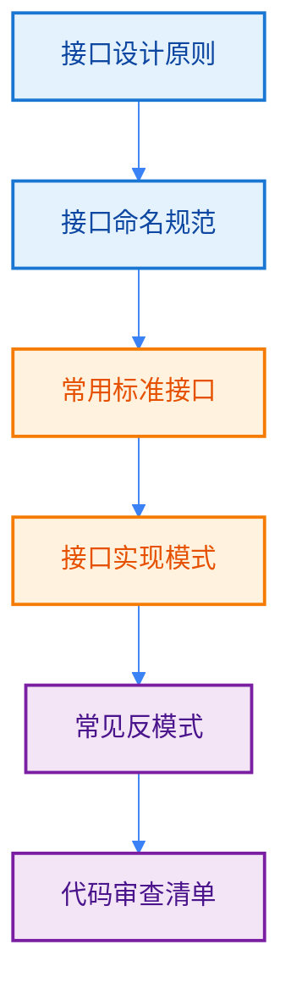

import { Badge } from "@rspress/core/theme";
import { Callout } from "@rspress/core/theme-original";

# 接口最佳实践 - Best Practices

[← 返回接口](./)

编写高质量的 Go 接口需要理解设计原则和最佳实践。

## 学习路径



## <Badge text="接口设计原则" type="tip" />

### 接口应该小而专注

<Badge text="专业开发者" type="danger" /> 接口应该只包含必要的方法。

```go
// ❌ 不好：接口过大
type BadInterface interface {
    Method1()
    Method2()
    Method3()
    Method4()
    Method5()
    // ... 很多方法
}

// ✅ 好：接口小而专注
type Writer interface {
    Write(p []byte) (n int, err error)
}

type Reader interface {
    Read(p []byte) (n int, err error)
}
```

<Badge text="经验法则" type="tip" />
- 大多数接口应该只有<strong>1 个方法</strong>
- 避免超过 5 个方法的接口
- 如果接口太大，考虑拆分成多个小接口

### 接口由使用者定义

```go
// ✅ 好：接口定义在使用者包中
package storage

// 定义在调用方
type Writer interface {
    Write(data []byte) error
}

// SaveData 接受 Writer 接口
func SaveData(w Writer, data []byte) error {
    return w.Write(data)
}

// 实现者只需要实现 Writer 接口
package disk

import "storage"

type DiskWriter struct {
    path string
}

func (d *DiskWriter) Write(data []byte) error {
    // 实现写入逻辑
    return nil
}

// 编译时检查
var _ storage.Writer = (*DiskWriter)(nil)
```

<Badge text="重要" type="danger" /> <strong>接口应该由使用者定义</strong>，而非实现者：

```go
// ❌ 不好：接口定义在实现者包中
package disk

type Writer interface {
    Write(data []byte) error
}

// ✅ 好：接口定义在使用者包中
package storage

type Writer interface {
    Write(data []byte) error
}
```

### 接口定义的时机

<Badge text="建议" type="warning" /> 不要预先定义接口，等<strong>需要两个以上实现</strong>时再定义：

```go
// 第一步：先写具体实现
type MySQLStorage struct {
    conn *sql.DB
}

func (m *MySQLStorage) Save(data []byte) error {
    // 实现
    return nil
}

// 第二步：当需要第二个实现时再定义接口
type Storage interface {
    Save(data []byte) error
}

type PostgresStorage struct {
    conn *sql.DB
}

func (p *PostgresStorage) Save(data []byte) error {
    // 实现
    return nil
}
```

## <Badge text="接口命名规范" type="info" />

### 单方法接口命名

<Badge text="中级开发者" type="warning" /> 接口命名应该清晰表达其用途。

```go
// 单方法接口：方法名 + er
type Reader interface {
    Read(p []byte) (n int, err error)
}

type Writer interface {
    Write(p []byte) (n int, err error)
}

type Stringer interface {
    String() string
}

type Cleaner interface {
    Clean() error
}

// 特殊情况：以 able 结尾
type Runnable interface {
    Run() error
}

type Convertible interface {
    Convert() interface{}
}
```

### 多方法接口命名

```go
// 多方法接口：描述功能
type ReadWriter interface {
    Reader
    Writer
}

type ReadWriteCloser interface {
    Reader
    Writer
    Closer
}

type HTTPHandler interface {
    ServeHTTP(w ResponseWriter, r *Request)
}

// 或者使用描述性名称
type Database interface {
    Query(query string, args ...any) (*Rows, error)
    Exec(query string, args ...any) (Result, error)
    Close() error
}
```

### 动词 vs 名词

```go
// ✅ 好的命名：动词开头
type Reader interface {}
type Writer interface {}
type Closer interface {}
type Flusher interface {}

// ✅ 好的命名：描述性名词
type Stringer interface {}
type Error interface {}
type Handler interface {}
type Database interface {}
```

## <Badge text="常用标准接口" type="info" />

### io 包接口

```go
// io.Reader - 读取接口
type Reader interface {
    Read(p []byte) (n int, err error)
}

// io.Writer - 写入接口
type Writer interface {
    Write(p []byte) (n int, err error)
}

// io.Closer - 关闭接口
type Closer interface {
    Close() error
}

// io.Seeker - 位置控制接口
type Seeker interface {
    Seek(offset int64, whence int) (int64, error)
}

// 组合接口
type ReadWriter interface {
    Reader
    Writer
}

type ReadWriteCloser interface {
    Reader
    Writer
    Closer
}
```

### fmt 包接口

```go
// fmt.Stringer - 字符串化接口
type Stringer interface {
    String() string
}

// fmt.GoStringer - Go 语法字符串化接口
type GoStringer interface {
    GoString() string
}

// 实现 Stringer
type Person struct {
    Name string
    Age  int
}

func (p Person) String() string {
    return fmt.Sprintf("%s (%d岁)", p.Name, p.Age)
}

p := Person{Name: "Alice", Age: 25}
fmt.Println(p)  // Alice (25岁)
```

### error 接口

```go
// error - 错误接口
type error interface {
    Error() string
}

// 自定义错误类型
type ValidationError struct {
    Field   string
    Message string
}

func (e *ValidationError) Error() string {
    return fmt.Sprintf("validation failed for field %s: %s", e.Field, e.Message)
}

func (e *ValidationError) Unwrap() error {
    return e.Err
}
```

## <Badge text="接口实现模式" type="warning" />

### 模式1：适配器模式

```go
// 目标接口
type Target interface {
    Request() string
}

// 被适配者
type Adaptee struct{}

func (a *Adaptee) SpecificRequest() string {
    return "Adaptee's specific request"
}

// 适配器
type Adapter struct {
    adaptee *Adaptee
}

func (a *Adapter) Request() string {
    return a.adaptee.SpecificRequest()
}
```

### 模式2：装饰器模式

```go
// 基础接口
type Writer interface {
    Write(p []byte) (n int, err error)
}

// 装饰器：添加缓冲
type BufferedWriter struct {
    writer Writer
    buffer []byte
}

func (b *BufferedWriter) Write(p []byte) (n int, err error) {
    b.buffer = append(b.buffer, p...)
    if len(b.buffer) > cap(b.buffer) {
        return b.writer.Write(b.buffer)
    }
    return len(p), nil
}

// 装饰器：添加压缩
type CompressWriter struct {
    writer Writer
}

func (c *CompressWriter) Write(p []byte) (n int, err error) {
    compressed := compress(p)
    return c.writer.Write(compressed)
}
```

### 模式3：接口断言

```go
func Process(w Writer) error {
    // 检查是否实现 Flush
    if flusher, ok := w.(Flusher); ok {
        flusher.Flush()
    }

    // 检查是否实现 Close
    if closer, ok := w.(Closer); ok {
        defer closer.Close()
    }

    return w.Write([]byte("data"))
}
```

## <Badge text="常见反模式" type="danger" />

### 反模式1：过度使用空接口

```go
// ❌ 不好的设计：使用空接口
func Process(data any) {
    // 不知道 data 的类型
}

// ✅ 好的设计：使用具体接口
type Processor interface {
    Process() error
}

func Process(p Processor) error {
    return p.Process()
}
```

### 反模式2：接口过于复杂

```go
// ❌ 不好的设计：接口包含太多方法
type UserProcessor interface {
    Create(user *User) error
    Update(user *User) error
    Delete(id int) error
    Get(id int) (*User, error)
    List() ([]*User, error)
    Search(query string) ([]*User, error)
    Validate(user *User) error
}

// ✅ 好的设计：拆分成多个小接口
type UserCreator interface {
    Create(user *User) error
}

type UserUpdater interface {
    Update(user *User) error
}

type UserDeleter interface {
    Delete(id int) error
}

type UserGetter interface {
    Get(id int) (*User, error)
    List() ([]*User, error)
}
```

### 反模式3：过早定义接口

```go
// ❌ 不好的设计：只有一个实现就定义接口
type Database interface {
    Query(query string) (*Rows, error)
}

type MySQL struct{}

func (m *MySQL) Query(query string) (*Rows, error) {
    // 实现
}

// ✅ 好的设计：等有多个实现再定义接口
type MySQL struct{}

func (m *MySQL) Query(query string) (*Rows, error) {
    // 实现
}

// 当需要 PostgreSQL 时再定义接口
type Database interface {
    Query(query string) (*Rows, error)
}
```

## <Badge text="代码审查清单" type="success" />

### 接口设计

- [ ] 接口只包含必要的方法（< 5 个）
- [ ] 接口由使用者定义，而非实现者
- [ ] 等有两个以上实现再定义接口
- [ ] 接口命名清晰表达意图

### 接口实现

- [ ] 使用 `var _` 编译时检查
- [ ] 实现符合接口语义
- [ ] 方法实现正确处理错误
- [ ] 考虑线程安全性

### 接口使用

- [ ] 避免过度使用空接口
- [ ] 优先使用具体类型
- [ ] 类型断言使用安全模式
- [ ] 正确处理 nil 接口值

## <Badge text="总结" type="success" />

编写高质量 Go 接口的关键：

1. **保持简单**：接口应该小而专注
2. **使用者定义**：接口由调用方定义，而非实现者
3. **避免过早**：等有多个实现再定义接口
4. **清晰命名**：使用有意义的名字，表达意图
5. **标准接口**：优先使用标准库接口
6. **持续改进**：定期重构，提升接口设计

<Callout type="danger" title={<Badge text="核心原则" type="danger" />}>
  <strong>Accept interfaces, return structs</strong>

  • 函数参数接受接口<br/>
  • 函数返回具体类型<br/>
  • 这提供了最大的灵活性和性能
</Callout>

## 练习

1. 设计一个日志接口，支持不同级别输出

<details>
<summary>查看答案</summary>

```go
package main

import "fmt"

// LogLevel 日志级别
type LogLevel int

const (
    DEBUG LogLevel = iota
    INFO
    WARN
    ERROR
)

// String 实现 Stringer 接口
func (l LogLevel) String() string {
    switch l {
    case DEBUG:
        return "DEBUG"
    case INFO:
        return "INFO"
    case WARN:
        return "WARN"
    case ERROR:
        return "ERROR"
    default:
        return "UNKNOWN"
    }
}

// Logger 日志接口
type Logger interface {
    Debug(msg string)
    Info(msg string)
    Warn(msg string)
    Error(msg string)
}

// WithLevel 带级别的日志接口
type WithLevel interface {
    Log(level LogLevel, msg string)
}

// ConsoleLogger 控制台日志
type ConsoleLogger struct {
    minLevel LogLevel
}

func NewConsoleLogger(minLevel LogLevel) *ConsoleLogger {
    return &ConsoleLogger{minLevel: minLevel}
}

func (c *ConsoleLogger) log(level LogLevel, msg string) {
    if level < c.minLevel {
        return
    }
    fmt.Printf("[%s] %s\n", level, msg)
}

func (c *ConsoleLogger) Debug(msg string) {
    c.log(DEBUG, msg)
}

func (c *ConsoleLogger) Info(msg string) {
    c.log(INFO, msg)
}

func (c *ConsoleLogger) Warn(msg string) {
    c.log(WARN, msg)
}

func (c *ConsoleLogger) Error(msg string) {
    c.log(ERROR, msg)
}

// 编译时检查
var _ Logger = (*ConsoleLogger)(nil)

func main() {
    logger := NewConsoleLogger(INFO)

    logger.Debug("这条不会显示")
    logger.Info("应用启动")
    logger.Warn("配置文件不存在")
    logger.Error("连接失败")
}
```

**解释**：展示了小接口设计和多级别日志的实现。
</details>

2. 实现一个缓存接口，支持多种缓存策略

<details>
<summary>查看答案</summary>

```go
package main

import "fmt"

// Cache 缓存接口
type Cache interface {
    Get(key string) (any, bool)
    Set(key string, value any)
    Delete(key string)
    Clear()
}

// ExpireCache 带过期时间的缓存接口
type ExpireCache interface {
    Cache
    SetWithExpire(key string, value any, seconds int)
}

// MemoryCache 内存缓存
type MemoryCache struct {
    data map[string]any
}

func NewMemoryCache() *MemoryCache {
    return &MemoryCache{
        data: make(map[string]any),
    }
}

func (m *MemoryCache) Get(key string) (any, bool) {
    value, ok := m.data[key]
    return value, ok
}

func (m *MemoryCache) Set(key string, value any) {
    m.data[key] = value
}

func (m *MemoryCache) Delete(key string) {
    delete(m.data, key)
}

func (m *MemoryCache) Clear() {
    m.data = make(map[string]any)
}

// 编译时检查
var _ Cache = (*MemoryCache)(nil)

func main() {
    cache := NewMemoryCache()

    cache.Set("name", "Alice")
    cache.Set("age", 30)

    if value, ok := cache.Get("name"); ok {
        fmt.Println("name:", value)
    }

    cache.Delete("age")
    cache.Clear()
}
```

**解释**：展示了简洁接口设计和缓存实现。
</details>

3. 创建一个可插拔的存储系统

<details>
<summary>查看答案</summary>

```go
package main

import "fmt"

// Storage 存储接口
type Storage interface {
    Save(key string, data []byte) error
    Load(key string) ([]byte, error)
    Delete(key string) error
}

// ListStorage 支持列表的存储接口
type ListStorage interface {
    Storage
    List() ([]string, error)
}

// BatchStorage 支持批量的存储接口
type BatchStorage interface {
    Storage
    BatchSave(items map[string][]byte) error
    BatchDelete(keys []string) error
}

// MemoryStorage 内存存储
type MemoryStorage struct {
    data map[string][]byte
}

func NewMemoryStorage() *MemoryStorage {
    return &MemoryStorage{
        data: make(map[string][]byte),
    }
}

func (m *MemoryStorage) Save(key string, data []byte) error {
    m.data[key] = data
    return nil
}

func (m *MemoryStorage) Load(key string) ([]byte, error) {
    data, ok := m.data[key]
    if !ok {
        return nil, fmt.Errorf("key not found: %s", key)
    }
    return data, nil
}

func (m *MemoryStorage) Delete(key string) error {
    delete(m.data, key)
    return nil
}

func (m *MemoryStorage) List() ([]string, error) {
    keys := make([]string, 0, len(m.data))
    for key := range m.data {
        keys = append(keys, key)
    }
    return keys, nil
}

func (m *MemoryStorage) BatchSave(items map[string][]byte) error {
    for key, data := range items {
        m.data[key] = data
    }
    return nil
}

func (m *MemoryStorage) BatchDelete(keys []string) error {
    for _, key := range keys {
        delete(m.data, key)
    }
    return nil
}

// 编译时检查
var _ Storage = (*MemoryStorage)(nil)
var _ ListStorage = (*MemoryStorage)(nil)
var _ BatchStorage = (*MemoryStorage)(nil)

// 使用存储的函数（接受接口）
func SaveData(s Storage, key string, data []byte) error {
    return s.Save(key, data)
}

func main() {
    storage := NewMemoryStorage()

    // 基础操作
    err := SaveData(storage, "user:1", []byte("Alice"))
    if err != nil {
        fmt.Println("错误:", err)
        return
    }

    data, err := storage.Load("user:1")
    if err != nil {
        fmt.Println("错误:", err)
        return
    }
    fmt.Println("数据:", string(data))

    // 批量操作
    err = storage.BatchSave(map[string][]byte{
        "user:2": []byte("Bob"),
        "user:3": []byte("Charlie"),
    })
    if err != nil {
        fmt.Println("错误:", err)
        return
    }

    // 列表操作
    keys, err := storage.List()
    if err != nil {
        fmt.Println("错误:", err)
        return
    }
    fmt.Println("所有键:", keys)
}
```

**解释**：展示了接口层次设计和组合使用。
</details>

---

[← 接口组合](./interface-composition.mdx)
