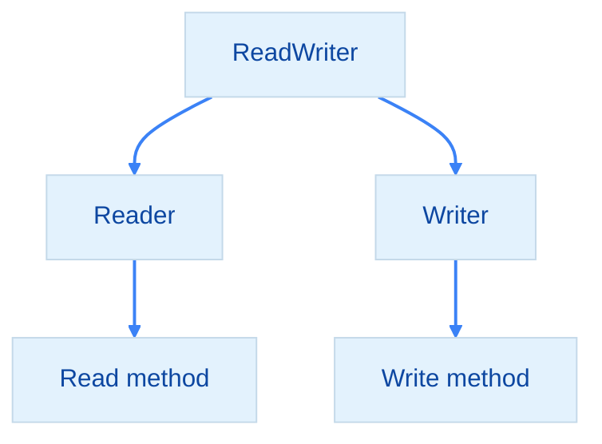
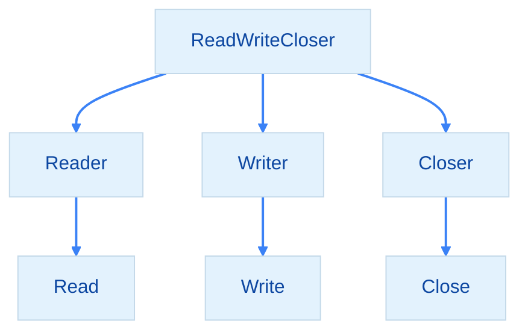
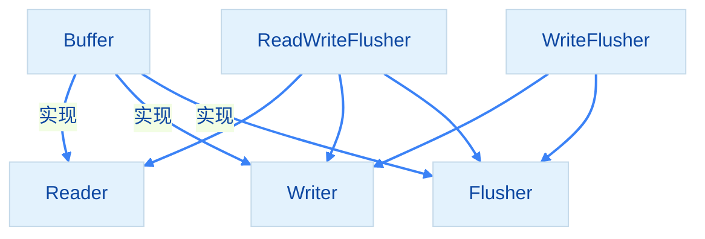

import { Badge } from "@rspress/core/theme";

# 接口组合 - Interface Composition

[← 返回接口](./)

接口组合通过嵌入现有接口来创建新接口，实现接口的复用和扩展。

## <Badge text="接口嵌入" type="tip" />

### 基本组合

```go
// 定义基础接口
type Reader interface {
    Read(p []byte) (n int, err error)
}

type Writer interface {
    Write(p []byte) (n int, err error)
}

// 通过嵌入组合接口
type ReadWriter interface {
    Reader  // 嵌入 Reader
    Writer  // 嵌入 Writer
}

// ReadWriter 包含 Read 和 Write 两个方法
```



<Badge text="重要" type="danger" /> 接口嵌入是<strong>匿名的</strong>，没有字段名。

### 组合效果

```go
// 查看 ReadWriter 的方法集
func main() {
    var rw ReadWriter

    // 可以调用嵌入接口的方法
    rw.Read(nil)   // 来自 Reader
    rw.Write(nil)  // 来自 Writer
}
```

## <Badge text="多层组合" type="info" />

### 层次化接口设计

```go
type Reader interface {
    Read(p []byte) (n int, err error)
}

type Writer interface {
    Write(p []byte) (n int, err error)
}

type Closer interface {
    Close() error
}

// 组合多个接口
type ReadWriter interface {
    Reader
    Writer
}

type ReadWriteCloser interface {
    Reader
    Writer
    Closer
}

// 甚至可以组合已组合的接口
type FullReadWriteCloser interface {
    ReadWriter
    Closer
}
```



### 标准库示例

```go
// io 包中的接口组合
import "io"

type ReadWriter interface {
    io.Reader
    io.Writer
}

type ReadSeeker interface {
    io.Reader
    io.Seeker
}

type WriteCloser interface {
    io.Writer
    io.Closer
}

type ReadWriteCloser interface {
    io.Reader
    io.Writer
    io.Closer
}
```

<Badge text="标准库" type="tip" /> Go 标准库大量使用接口组合：
- `io.ReadWriter` = `Reader` + `Writer`
- `io.ReadSeeker` = `Reader` + `Seeker`
- `io.ReadWriteCloser` = `Reader` + `Writer` + `Closer`

## <Badge text="添加新方法" type="info" />

### 组合 + 扩展

```go
type Reader interface {
    Read(p []byte) (n int, err error)
}

type Writer interface {
    Write(p []byte) (n int, err error)
}

// 组合后添加新方法
type ReadWriter interface {
    Reader
    Writer

    // 添加自己的方法
    Flush() error
}
```

### 实现组合接口

```go
type Buffer struct {
    data []byte
    pos  int
}

// 实现 Reader
func (b *Buffer) Read(p []byte) (n int, err error) {
    if b.pos >= len(b.data) {
        return 0, nil
    }
    n = copy(p, b.data[b.pos:])
    b.pos += n
    return n, nil
}

// 实现 Writer
func (b *Buffer) Write(p []byte) (n int, err error) {
    b.data = append(b.data, p...)
    n = len(p)
    return n, nil
}

// 实现 Flush
func (b *Buffer) Flush() error {
    b.data = b.data[:0]
    b.pos = 0
    return nil
}

// 编译时检查
var _ Reader = &Buffer{}
var _ Writer = &Buffer{}
var _ ReadWriter = &Buffer{}
```

## <Badge text="接口命名" type="warning" />

### 组合命名规范

```go
// 单方法接口：方法名 + er
type Reader interface {
    Read(p []byte) (n int, err error)
}

type Writer interface {
    Write(p []byte) (n int, err error)
}

// 组合接口：简单拼接
type ReadWriter interface {
    Reader
    Writer
}

type ReadWriteCloser interface {
    Reader
    Writer
    Closer
}

type StringReadWriter interface {
    Reader
    Writer
    String() string  // 添加自定义方法
}
```

<Badge text="命名建议" type="tip" />
- 组合接口名称通常是各接口名称的拼接
- 按字母顺序或逻辑顺序排列
- 避免名称过长，超过 3 个接口考虑重构

## <Badge text="组合 vs 继承" type="info" />

### Go 的组合模型

```go
// Java 风格（不推荐）
type Dog struct {
    Animal  // 继承
}

// Go 风格（推荐）
type Dog struct {
    noiseMaker NoiseMaker  // 组合
}

// 或者使用接口
type Noisy interface {
    MakeNoise() string
}

type Dog struct{}

func (d Dog) MakeNoise() string {
    return "汪汪"
}
```

### 组合的优势

```go
// 小接口，易于实现
type Reader interface {
    Read(p []byte) (n int, err error)
}

type Writer interface {
    Write(p []byte) (n int, err error)
}

type Flusher interface {
    Flush() error
}

// 按需组合
type WriteFlusher interface {
    Writer
    Flusher
}

type ReadWriteFlusher interface {
    Reader
    Writer
    Flusher
}

type Buffer struct{}

func (b *Buffer) Read(p []byte) (n int, err error) { /* ... */ }
func (b *Buffer) Write(p []byte) (n int, err error) { /* ... */ }
func (b *Buffer) Flush() error { /* ... */ }

// Buffer 自动实现所有组合接口
var _ ReadWriteFlusher = &Buffer{}
```



<Badge text="优势" type="tip" />
- **灵活性**：按需组合，不需要全部实现
- **可测试**：小接口易于 mock
- **可维护**：每个接口职责单一
- **可扩展**：新接口通过组合创建

## <Badge text="接口组合模式" type="danger" />

### 模式1：功能分层

```go
// 最小接口
type Reader interface {
    Read(p []byte) (n int, err error)
}

// 扩展接口
type BufferedReader interface {
    Reader
    Peek(n int) []byte
    Buffered() int
}

type BufferedReader struct {
    reader Reader
    buffer []byte
}
```

### 模式2：可选功能

```go
// 核心功能
type Writer interface {
    Write(p []byte) (n int, err error)
}

// 可选功能
type Flusher interface {
    Flush() error
}

type StringWriter interface {
    WriteString(s string) (n int, err error)
}

// 使用时检查可选功能
func writeTo(w Writer, data string) {
    // 尝试使用优化方法
    if sw, ok := w.(StringWriter); ok {
        sw.WriteString(data)
        return
    }
    // 降级到标准方法
    w.Write([]byte(data))
}
```

### 模式3：约束接口

```go
// 通用接口
type Writer interface {
    Write(p []byte) (n int, err error)
}

// 约束接口（只用于特定场景）
type LimitWriter struct {
    writer Writer
    limit  int64
    count  int64
}

func (l *LimitWriter) Write(p []byte) (n int, err error) {
    remaining := l.limit - l.count
    if remaining <= 0 {
        return 0, errors.New("write limit exceeded")
    }
    if int64(len(p)) > remaining {
        p = p[:remaining]
    }
    n, err = l.writer.Write(p)
    l.count += int64(n)
    return n, err
}
```

## 练习

1. 创建一个文件接口，组合读写和关闭操作

<details>
<summary>查看答案</summary>

```go
package main

import "fmt"

// Reader 读取接口
type Reader interface {
    Read(p []byte) (n int, err error)
}

// Writer 写入接口
type Writer interface {
    Write(p []byte) (n int, err error)
}

// Closer 关闭接口
type Closer interface {
    Close() error
}

// File 文件接口（组合）
type File interface {
    Reader
    Writer
    Closer
}

// MyFile 实现 File 接口
type MyFile struct {
    name string
    data []byte
    pos  int
}

func (f *MyFile) Read(p []byte) (n int, err error) {
    if f.pos >= len(f.data) {
        return 0, nil
    }
    n = copy(p, f.data[f.pos:])
    f.pos += n
    return n, nil
}

func (f *MyFile) Write(p []byte) (n int, err error) {
    f.data = append(f.data, p...)
    n = len(p)
    return n, nil
}

func (f *MyFile) Close() error {
    fmt.Printf("文件 %s 已关闭\n", f.name)
    return nil
}

func main() {
    file := &MyFile{name: "test.txt"}

    // 实现所有接口
    var r Reader = file
    var w Writer = file
    var c Closer = file
    var f File = file

    w.Write([]byte("Hello, World!"))
    f.Close()
}
```

**解释**：展示了接口组合的定义和实现。
</details>

2. 设计一个网络连接接口层次结构

<details>
<summary>查看答案</summary>

```go
package main

import "fmt"

// Reader 读取接口
type Reader interface {
    Read(p []byte) (n int, err error)
}

// Writer 写入接口
type Writer interface {
    Write(p []byte) (n int, err error)
}

// Closer 关闭接口
type Closer interface {
    Close() error
}

// Conn 连接基础接口
type Conn interface {
    Reader
    Writer
    Closer
}

// Dialer 拨号接口
type Dialer interface {
    Dial(address string) (Conn, error)
}

// Listener 监听接口
type Listener interface {
    Accept() (Conn, error)
    Close() error
    Addr() string
}

// PacketConn 数据包连接接口
type PacketConn interface {
    Reader
    Writer
    Closer

    // 数据包特有方法
    ReadFrom(p []byte) (n int, addr string, err error)
    WriteTo(p []byte, addr string) (n int, err error)
}

func main() {
    // 使用组合接口
    var conn Conn
    var listener Listener
    var packetConn PacketConn

    fmt.Printf("Conn 方法集: %T\n", conn)
    fmt.Printf("Listener 方法集: %T\n", listener)
    fmt.Printf("PacketConn 方法集: %T\n", packetConn)
}
```

**解释**：展示了网络接口的层次化设计。
</details>

3. 实现一个带缓冲的写入器

<details>
<summary>查看答案</summary>

```go
package main

import "fmt"

// Writer 写入接口
type Writer interface {
    Write(p []byte) (n int, err error)
}

// Flusher 刷新接口
type Flusher interface {
    Flush() error
}

// BufferedWriter 带缓冲的写入器
type BufferedWriter struct {
    writer Writer
    buffer []byte
}

// NewBufferedWriter 创建缓冲写入器
func NewBufferedWriter(w Writer, size int) *BufferedWriter {
    return &BufferedWriter{
        writer: w,
        buffer: make([]byte, 0, size),
    }
}

// Write 写入数据到缓冲区
func (b *BufferedWriter) Write(p []byte) (n int, err error) {
    // 如果数据超过缓冲区大小，直接写入
    if len(p) >= cap(b.buffer) {
        err = b.Flush()
        if err != nil {
            return 0, err
        }
        return b.writer.Write(p)
    }

    // 如果缓冲区不够，先刷新
    if len(b.buffer)+len(p) > cap(b.buffer) {
        err = b.Flush()
        if err != nil {
            return 0, err
        }
    }

    // 写入缓冲区
    b.buffer = append(b.buffer, p...)
    return len(p), nil
}

// Flush 刷新缓冲区
func (b *BufferedWriter) Flush() error {
    if len(b.buffer) == 0 {
        return nil
    }

    _, err := b.writer.Write(b.buffer)
    if err != nil {
        return err
    }

    b.buffer = b.buffer[:0]
    return nil
}

// StringWriter 优化字符串写入
type StringWriter interface {
    Writer
    WriteString(s string) (n int, err error)
}

func (b *BufferedWriter) WriteString(s string) (n int, err error) {
    return b.Write([]byte(s))
}

func main() {
    // 模拟底层写入器
    type mockWriter struct{}
    func (m *mockWriter) Write(p []byte) (n int, err error) {
        fmt.Printf("写入 %d 字节: %s\n", len(p), string(p))
        return len(p), nil
    }

    // 创建缓冲写入器
    bw := NewBufferedWriter(&mockWriter{}, 10)

    // 小数据写入缓冲区
    bw.Write([]byte("Hello"))
    bw.Write([]byte(" "))
    bw.Write([]byte("World"))

    // 刷新
    bw.Flush()

    // 大数据直接写入
    bw.Write([]byte("This is a long string"))
}
```

**解释**：展示了接口组合在实际应用中的使用。
</details>

---

[← 空接口](./empty-interface.mdx) | [继续：最佳实践 →](./best-practices.mdx)
