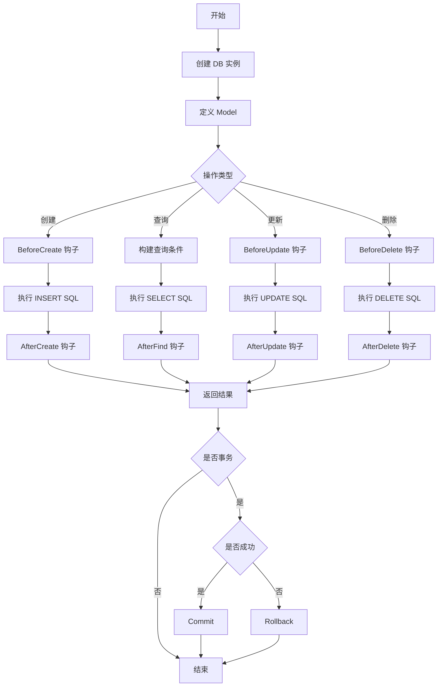

import Badge from '@site/src/components/Badge';

# GORM 接口

GORM 是 Go 语言中最流行的 ORM 库，提供了丰富的接口和功能。

<Badge text="推荐" type="success" /> <Badge text="ORM" type="info" />

## 核心接口

### gorm.Interface

GORM 的核心接口定义了数据库操作的基本行为：

```go
type Interface interface {
    // 获取数据库连接信息
    GetDB() *gorm.DB

    // 创建记录
    Create(value interface{}) *gorm.DB

    // 查询单条记录
    First(dest interface{}, conds ...interface{}) *gorm.DB

    // 查询多条记录
    Find(dest interface{}, conds ...interface{}) *gorm.DB

    // 更新记录
    Save(value interface{}) *gorm.DB
    Update(column string, value interface{}) *gorm.DB
    Updates(values interface{}) *gorm.DB

    // 删除记录
    Delete(value interface{}, conds ...interface{}) *gorm.DB

    // 原始查询
    Raw(sql string, values ...interface{}) *gorm.DB
    Exec(sql string, values ...interface{}) *gorm.DB

    // 关联操作
    Association(column string) *Association

    // 事务
    Begin() *gorm.DB
    Commit() *gorm.DB
    Rollback() *gorm.DB
}
```

### gorm.Session

会话接口用于配置数据库操作的会话级别设置：

```go
type Session struct {
    // 查询配置
    SkipHooks        bool
    SkipDefaultTransaction bool
    DryRun           bool
    PrepareStmt      bool

    // 新建会话
    NewDB            bool

    // 查询选项
    SkipLazyAssociation   bool
    AllowGlobalUpdate     bool

    // 上下文
    Context         context.Context

    // 并发安全
    // ... 更多配置
}

// 使用示例
db.Session(&gorm.Session{
    SkipHooks: true,
    DryRun: true,
}).Create(&user)
```

## DB 常用方法

### 查询方法

```go
// 基础查询
db.First(&user)                    // 查询第一条记录
db.Last(&user)                     // 查询最后一条记录
db.Take(&user)                     // 随机查询一条记录
db.Find(&users)                   // 查询所有记录

// 条件查询
db.Where("name = ?", "John").First(&user)
db.Where("age > ?", 18).Find(&users)
db.Where("name LIKE ?", "%John%").Find(&users)

// 多条件查询
db.Where("name = ?", "John").Or("name = ?", "Jane").Find(&users)
db.Where("age >= ? AND age <= ?", 18, 30).Find(&users)

// 查询特定字段
db.Select("name", "email").Find(&users)

// 排序
db.Order("age desc").Find(&users)

// 限制和偏移
db.Limit(10).Offset(20).Find(&users)

// 计数
db.Model(&User{}).Count(&count)
db.Where("age > ?", 18).Count(&count)

// 分组
db.Model(&User{}).Select("age, count(*) as count").Group("age").Find(&results)
```

### 更新方法

```go
// 更新单个字段
db.Model(&user).Update("name", "New Name")

// 更新多个字段
db.Model(&user).Updates(User{Name: "New", Age: 30})
db.Model(&user).Updates(map[string]interface{}{
    "name": "New Name",
    "age": 30,
})

// 更新所有记录（慎用）
db.Model(&User{}).Update("age", 18)

// 批量更新
db.Where("age > ?", 18).Updates(map[string]interface{}{
    "status": "adult",
})

// 使用 SQL 表达式更新
db.Model(&user).Update("age", gorm.Expr("age * 2 + ?", 1))
```

### 删除方法

```go
// 删除单条记录
db.Delete(&user)  // user 需要包含主键

// 根据条件删除
db.Where("age < ?", 18).Delete(&User{})

// 批量删除
db.Delete(&users, []int{1, 2, 3})

// 软删除
db.Delete(&user)  // 设置 deleted_at，不真正删除

// 硬删除
db.Unscoped().Delete(&user)
```

## gorm.Model

GORM 提供了一个基础模型结构体，包含常用字段：

```go
type Model struct {
    ID        uint `gorm:"primarykey"`
    CreatedAt time.Time
    UpdatedAt time.Time
    DeletedAt gorm.DeletedAt `gorm:"index"`
}

// 使用示例
type User struct {
    gorm.Model
    Name  string
    Email string `gorm:"uniqueIndex"`
    Age   int
}
```

## 钩子接口

GORM 支持在数据库操作前后执行钩子函数：

```go
// 定义钩子方法
type User struct {
    gorm.Model
    Name string
}

// 创建前
func (u *User) BeforeCreate(tx *gorm.DB) error {
    // 验证或修改数据
    if u.Name == "" {
        return errors.New("name cannot be empty")
    }
    u.Name = strings.ToUpper(u.Name)
    return nil
}

// 创建后
func (u *User) AfterCreate(tx *gorm.DB) error {
    // 发送通知等
    return nil
}

// 更新前
func (u *User) BeforeUpdate(tx *gorm.DB) error {
    // 验证更新
    return nil
}

// 更新后
func (u *User) AfterUpdate(tx *gorm.DB) error {
    // 清理缓存等
    return nil
}

// 删除前
func (u *User) BeforeDelete(tx *gorm.DB) error {
    // 检查是否可以删除
    return nil
}

// 删除后
func (u *User) AfterDelete(tx *gorm.DB) error {
    // 清理关联数据
    return nil
}

// 查询后
func (u *User) AfterFind(tx *gorm.DB) error {
    // 处理查询结果
    return nil
}
```

### 钩子执行顺序

```
创建操作:
BeforeCreate → SQL执行 → AfterCreate

查询操作:
SQL执行 → AfterFind

更新操作:
BeforeUpdate → SQL执行 → AfterUpdate

删除操作:
BeforeDelete → SQL执行 → AfterDelete
```

## Plugin 接口

GORM 支持通过插件扩展功能：

```go
type Plugin interface {
    Name() string
    Initialize(*gorm.DB) error
}

// 自定义插件示例
type LoggerPlugin struct{}

func (p *LoggerPlugin) Name() string {
    return "logger"
}

func (p *LoggerPlugin) Initialize(db *gorm.DB) error {
    // 注册回调
    db.Callback().Create().Before("gorm:create").Register("logger:before_create", func(d *gorm.DB) {
        fmt.Println("Before create")
    })
    return nil
}

// 使用插件
db.Use(&LoggerPlugin{})
```

## 操作流程图



## CRUD 完整示例

```go
package main

import (
    "fmt"
    "gorm.io/driver/mysql"
    "gorm.io/gorm"
)

type User struct {
    gorm.Model
    Name  string
    Email string `gorm:"uniqueIndex"`
    Age   int
}

func main() {
    // 连接数据库
    dsn := "user:password@tcp(127.0.0.1:3306)/dbname?charset=utf8mb4&parseTime=True"
    db, err := gorm.Open(mysql.Open(dsn), &gorm.Config{})
    if err != nil {
        panic("failed to connect database")
    }

    // 自动迁移
    db.AutoMigrate(&User{})

    // ===== CREATE =====
    fmt.Println("=== 创建记录 ===")
    user := User{
        Name:  "Alice",
        Email: "alice@example.com",
        Age:   25,
    }
    result := db.Create(&user)
    fmt.Printf("创建成功，ID: %d, 行数: %d\n", user.ID, result.RowsAffected)

    // 批量创建
    users := []User{
        {Name: "Bob", Email: "bob@example.com", Age: 30},
        {Name: "Charlie", Email: "charlie@example.com", Age: 35},
    }
    db.Create(&users)
    fmt.Printf("批量创建 %d 条记录\n", len(users))

    // ===== READ =====
    fmt.Println("\n=== 查询记录 ===")

    // 查询单条
    var firstUser User
    db.First(&firstUser)
    fmt.Printf("第一条记录: %+v\n", firstUser)

    // 条件查询
    var bob User
    db.Where("name = ?", "Bob").First(&bob)
    fmt.Printf("Bob 的信息: %+v\n", bob)

    // 查询多条
    var allUsers []User
    db.Find(&allUsers)
    fmt.Printf("所有用户: %d 条\n", len(allUsers))

    // 复杂查询
    var adults []User
    db.Where("age >= ?", 18).
       Order("age desc").
       Limit(5).
       Find(&adults)
    fmt.Printf("成年用户: %d 条\n", len(adults))

    // ===== UPDATE =====
    fmt.Println("\n=== 更新记录 ===")

    // 更新单个字段
    db.Model(&firstUser).Update("Age", 26)
    fmt.Printf("更新年龄后: %+v\n", firstUser)

    // 更新多个字段
    db.Model(&firstUser).Updates(User{Name: "Alice Updated", Age: 27})
    fmt.Printf("更新多个字段后: %+v\n", firstUser)

    // 条件更新
    db.Model(&User{}).Where("age > ?", 30).Update("status", "senior")

    // ===== DELETE =====
    fmt.Println("\n=== 删除记录 ===")

    // 删除单条（软删除）
    db.Delete(&firstUser)
    fmt.Printf("用户 %d 已软删除\n", firstUser.ID)

    // 条件删除
    db.Where("age < ?", 18).Delete(&User{})

    // 查询包含软删除的记录
    var deletedUsers []User
    db.Unscoped().Find(&deletedUsers)
    fmt.Printf("包含软删除: %d 条\n", len(deletedUsers))

    // ===== 事务 =====
    fmt.Println("\n=== 事务操作 ===")
    err = db.Transaction(func(tx *gorm.DB) error {
        // 创建用户
        if err := tx.Create(&User{Name: "Dave", Email: "dave@example.com", Age: 40}).Error; err != nil {
            return err
        }

        // 更新统计
        if err := tx.Exec("UPDATE stats SET user_count = user_count + 1").Error; err != nil {
            return err
        }

        return nil
    })

    if err != nil {
        fmt.Println("事务失败:", err)
    } else {
        fmt.Println("事务成功")
    }

    // ===== 统计 =====
    var count int64
    db.Model(&User{}).Count(&count)
    fmt.Printf("\n总用户数: %d\n", count)
}
```

## 练习

### 练习 1：基础 CRUD

实现一个简单的用户管理系统，要求：
1. 创建用户表（包含姓名、邮箱、年龄）
2. 实现创建、查询、更新、删除功能
3. 使用事务确保数据一致性

```go
// TODO: 实现用户管理系统
type UserManager struct {
    db *gorm.DB
}

func NewManager(db *gorm.DB) *UserManager {
    // 初始化
}

func (m *UserManager) CreateUser(name, email string, age int) error {
    // 实现创建用户
}

func (m *UserManager) GetUser(id uint) (*User, error) {
    // 实现查询用户
}

func (m *UserManager) UpdateUser(id uint, name, email string, age int) error {
    // 实现更新用户
}

func (m *UserManager) DeleteUser(id uint) error {
    // 实现删除用户
}
```

### 练习 2：钩子函数

为用户模型添加钩子函数：
1. 创建前验证邮箱格式
2. 创建前将邮箱转为小写
3. 更新后记录修改日志

```go
// TODO: 添加钩子函数
func (u *User) BeforeCreate(tx *gorm.DB) error {
    // 验证邮箱
    // 转换为小写
}

func (u *User) AfterUpdate(tx *gorm.DB) error {
    // 记录修改日志
}
```

### 练习 3：复杂查询

实现以下查询功能：
1. 查询年龄在指定区间的用户
2. 按创建时间分组统计
3. 分页查询用户列表

```go
// TODO: 实现复杂查询
func (m *UserManager) GetUsersByAgeRange(minAge, maxAge int) ([]User, error) {
    // 实现按年龄区间查询
}

func (m *UserManager) GetStatsByDate() (map[string]int, error) {
    // 实现按日期统计
}

func (m *UserManager) GetUsersPaginated(page, pageSize int) ([]User, int, error) {
    // 实现分页查询，返回用户列表和总数
}
```

### 练习 4：插件开发

开发一个日志插件，要求：
1. 记录所有 SQL 操作
2. 记录操作耗时
3. 支持配置日志级别

```go
// TODO: 开发日志插件
type LogPlugin struct {
    level string
}

func (p *LogPlugin) Name() string {
    // 返回插件名称
}

func (p *LogPlugin) Initialize(db *gorm.DB) error {
    // 初始化插件
}
```

## 练习答案

### 答案 1：基础 CRUD

```go
package main

import (
    "errors"
    "gorm.io/gorm"
)

type User struct {
    gorm.Model
    Name  string
    Email string `gorm:"uniqueIndex"`
    Age   int
}

type UserManager struct {
    db *gorm.DB
}

func NewManager(db *gorm.DB) *UserManager {
    db.AutoMigrate(&User{})
    return &UserManager{db: db}
}

func (m *UserManager) CreateUser(name, email string, age int) error {
    user := User{
        Name:  name,
        Email: email,
        Age:   age,
    }
    return m.db.Create(&user).Error
}

func (m *UserManager) GetUser(id uint) (*User, error) {
    var user User
    err := m.db.First(&user, id).Error
    if err != nil {
        return nil, err
    }
    return &user, nil
}

func (m *UserManager) UpdateUser(id uint, name, email string, age int) error {
    updates := map[string]interface{}{}
    if name != "" {
        updates["name"] = name
    }
    if email != "" {
        updates["email"] = email
    }
    if age > 0 {
        updates["age"] = age
    }
    return m.db.Model(&User{}).Where("id = ?", id).Updates(updates).Error
}

func (m *UserManager) DeleteUser(id uint) error {
    return m.db.Delete(&User{}, id).Error
}

// 使用事务的批量操作
func (m *UserManager) BatchCreateUsers(users []User) error {
    return m.db.Transaction(func(tx *gorm.DB) error {
        for _, user := range users {
            if err := tx.Create(&user).Error; err != nil {
                return err
            }
        }
        return nil
    })
}
```

### 答案 2：钩子函数

```go
package main

import (
    "fmt"
    "regexp"
    "strings"
    "time"
    "gorm.io/gorm"
)

type User struct {
    gorm.Model
    Name  string
    Email string `gorm:"uniqueIndex"`
    Age   int
}

type AuditLog struct {
    gorm.Model
    UserID   uint
    Action   string
    OldData  string
    NewData  string
}

func (u *User) BeforeCreate(tx *gorm.DB) error {
    // 验证邮箱格式
    emailRegex := regexp.MustCompile(`^[a-zA-Z0-9._%+-]+@[a-zA-Z0-9.-]+\.[a-zA-Z]{2,}$`)
    if !emailRegex.MatchString(u.Email) {
        return fmt.Errorf("invalid email format: %s", u.Email)
    }

    // 转换为小写
    u.Email = strings.ToLower(u.Email)

    // 验证必填字段
    if u.Name == "" {
        return errors.New("name is required")
    }

    return nil
}

func (u *User) AfterCreate(tx *gorm.DB) error {
    // 记录创建日志
    return tx.Create(&AuditLog{
        UserID:  u.ID,
        Action:  "CREATE",
        NewData: fmt.Sprintf("Name: %s, Email: %s", u.Name, u.Email),
    }).Error
}

func (u *User) BeforeUpdate(tx *gorm.DB) error {
    // 获取旧数据
    var oldUser User
    tx.Model(&User{}).Where("id = ?", u.ID).First(&oldUser)

    // 存储到上下文，供 AfterUpdate 使用
    tx.Set("old_user", oldUser)
    return nil
}

func (u *User) AfterUpdate(tx *gorm.DB) error {
    // 从上下文获取旧数据
    oldUser, exists := tx.Get("old_user")
    if !exists {
        return nil
    }

    old := oldUser.(User)

    // 记录修改日志
    return tx.Create(&AuditLog{
        UserID:  u.ID,
        Action:  "UPDATE",
        OldData: fmt.Sprintf("Name: %s, Email: %s", old.Name, old.Email),
        NewData: fmt.Sprintf("Name: %s, Email: %s", u.Name, u.Email),
    }).Error
}
```

### 答案 3：复杂查询

```go
package main

import (
    "gorm.io/gorm"
)

type User struct {
    gorm.Model
    Name  string
    Email string
    Age   int
}

func (m *UserManager) GetUsersByAgeRange(minAge, maxAge int) ([]User, error) {
    var users []User
    err := m.db.Where("age >= ? AND age <= ?", minAge, maxAge).
        Order("age ASC, name ASC").
        Find(&users).Error
    return users, err
}

func (m *UserManager) GetStatsByDate() (map[string]int, error) {
    type Result struct {
        Date  string
        Count int
    }

    var results []Result
    err := m.db.Model(&User{}).
        Select("DATE(created_at) as date, COUNT(*) as count").
        Group("DATE(created_at)").
        Order("date DESC").
        Find(&results).Error

    if err != nil {
        return nil, err
    }

    stats := make(map[string]int)
    for _, r := range results {
        stats[r.Date] = r.Count
    }

    return stats, nil
}

func (m *UserManager) GetUsersPaginated(page, pageSize int) ([]User, int, error) {
    var users []User
    var total int64

    // 统计总数
    if err := m.db.Model(&User{}).Count(&total).Error; err != nil {
        return nil, 0, err
    }

    // 分页查询
    offset := (page - 1) * pageSize
    err := m.db.Order("created_at DESC").
        Limit(pageSize).
        Offset(offset).
        Find(&users).Error

    return users, int(total), err
}

// 更多复杂查询示例
func (m *UserManager) SearchUsers(keyword string) ([]User, error) {
    var users []User
    searchPattern := "%" + keyword + "%"
    err := m.db.Where("name LIKE ? OR email LIKE ?", searchPattern, searchPattern).
        Find(&users).Error
    return users, err
}

func (m *UserManager) GetAgeDistribution() (map[string]int, error) {
    type Result struct {
        AgeGroup string
        Count    int
    }

    var results []Result
    err := m.db.Model(&User{}).
        Select(`
            CASE
                WHEN age < 18 THEN 'minor'
                WHEN age < 30 THEN 'young'
                WHEN age < 50 THEN 'middle'
                ELSE 'senior'
            END as age_group,
            COUNT(*) as count
        `).
        Group("age_group").
        Find(&results).Error

    if err != nil {
        return nil, err
    }

    distribution := make(map[string]int)
    for _, r := range results {
        distribution[r.AgeGroup] = r.Count
    }

    return distribution, nil
}
```

### 答案 4：插件开发

```go
package main

import (
    "fmt"
    "time"
    "gorm.io/gorm"
)

type LogLevel string

const (
    LogLevelDebug LogLevel = "DEBUG"
    LogLevelInfo  LogLevel = "INFO"
    LogLevelWarn  LogLevel = "WARN"
    LogLevelError LogLevel = "ERROR"
)

type LogPlugin struct {
    level  LogLevel
    logger func(format string, args ...interface{})
}

func NewLogPlugin(level LogLevel) *LogPlugin {
    return &LogPlugin{
        level:  level,
        logger: fmt.Printf,
    }
}

func (p *LogPlugin) Name() string {
    return "logger"
}

func (p *LogPlugin) Initialize(db *gorm.DB) error {
    // 注册创建回调
    db.Callback().Create().Before("gorm:create").Register("logger:before_create", p.beforeCreate)
    db.Callback().Create().After("gorm:create").Register("logger:after_create", p.afterCreate)

    // 注册查询回调
    db.Callback().Query().Before("gorm:query").Register("logger:before_query", p.beforeQuery)
    db.Callback().Query().After("gorm:query").Register("logger:after_query", p.afterQuery)

    // 注册更新回调
    db.Callback().Update().Before("gorm:update").Register("logger:before_update", p.beforeUpdate)
    db.Callback().Update().After("gorm:update").Register("logger:after_update", p.afterUpdate)

    // 注册删除回调
    db.Callback().Delete().Before("gorm:delete").Register("logger:before_delete", p.beforeDelete)
    db.Callback().Delete().After("gorm:delete").Register("logger:after_delete", p.afterDelete)

    return nil
}

func (p *LogPlugin) log(level LogLevel, format string, args ...interface{}) {
    // 只记录配置级别及以上的日志
    levels := map[LogLevel]int{
        LogLevelDebug: 0,
        LogLevelInfo:  1,
        LogLevelWarn:  2,
        LogLevelError: 3,
    }

    if levels[level] >= levels[p.level] {
        p.logger("[%s] %s\n", level, fmt.Sprintf(format, args...))
    }
}

func (p *LogPlugin) beforeCreate(db *gorm.DB) {
    p.log(LogLevelDebug, "[CREATE] Before: %s", db.Statement.SQL.String())
}

func (p *LogPlugin) afterCreate(db *gorm.DB) {
    if db.Error == nil {
        p.log(LogLevelInfo, "[CREATE] Success: %d rows affected", db.RowsAffected)
    } else {
        p.log(LogLevelError, "[CREATE] Error: %v", db.Error)
    }
}

func (p *LogPlugin) beforeQuery(db *gorm.DB) {
    db.Statement.Set("start_time", time.Now())
    p.log(LogLevelDebug, "[QUERY] Before: %s", db.Statement.SQL.String())
}

func (p *LogPlugin) afterQuery(db *gorm.DB) {
    if startTime, ok := db.Statement.Get("start_time"); ok {
        duration := time.Since(startTime.(time.Time))
        p.log(LogLevelInfo, "[QUERY] Completed in %v", duration)
    }

    if db.Error != nil {
        p.log(LogLevelError, "[QUERY] Error: %v", db.Error)
    }
}

func (p *LogPlugin) beforeUpdate(db *gorm.DB) {
    p.log(LogLevelDebug, "[UPDATE] Before: %s", db.Statement.SQL.String())
}

func (p *LogPlugin) afterUpdate(db *gorm.DB) {
    if db.Error == nil {
        p.log(LogLevelInfo, "[UPDATE] Success: %d rows affected", db.RowsAffected)
    } else {
        p.log(LogLevelError, "[UPDATE] Error: %v", db.Error)
    }
}

func (p *LogPlugin) beforeDelete(db *gorm.DB) {
    p.log(LogLevelWarn, "[DELETE] Before: %s", db.Statement.SQL.String())
}

func (p *LogPlugin) afterDelete(db *gorm.DB) {
    if db.Error == nil {
        p.log(LogLevelInfo, "[DELETE] Success: %d rows affected", db.RowsAffected)
    } else {
        p.log(LogLevelError, "[DELETE] Error: %v", db.Error)
    }
}

// 使用示例
func main() {
    dsn := "user:password@tcp(127.0.0.1:3306)/dbname?charset=utf8mb4&parseTime=True"
    db, err := gorm.Open(mysql.Open(dsn), &gorm.Config{})
    if err != nil {
        panic(err)
    }

    // 使用日志插件
    db.Use(NewLogPlugin(LogLevelInfo))

    // 现在所有数据库操作都会被记录
    db.Create(&User{Name: "Test", Email: "test@example.com", Age: 25})
}
```

## 参考资源

- [GORM 官方文档](https://gorm.io/docs/)
- [GORM GitHub](https://github.com/go-gorm/gorm)

---

[← context 接口](./context.mdx)
