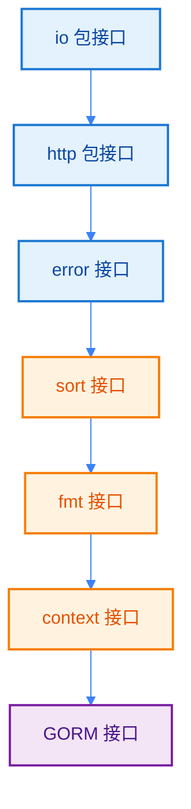

import { Badge } from "@rspress/core/theme";

# 标准库接口 - Standard Library Interfaces

[← 返回接口](../)

Go 标准库中定义了许多核心接口，这些接口是编写可复用、可测试代码的基础。

## 学习路径



## 接口概览

| 包 | 核心接口 | 用途 | 学习难度 |
|---|---------|------|---------|
| [io](./io.mdx) | Reader, Writer, Closer | 数据读写 | <Badge text="初级" type="tip" /> |
| [net/http](./http.mdx) | Handler, ResponseWriter | HTTP 服务 | <Badge text="中级" type="warning" /> |
| [errors](./error.mdx) | error | 错误处理 | <Badge text="初级" type="tip" /> |
| [sort](./sort.mdx) | sort.Interface | 自定义排序 | <Badge text="中级" type="warning" /> |
| [fmt](./fmt.mdx) | Stringer, Formatter | 格式化输出 | <Badge text="中级" type="warning" /> |
| [context](./context.mdx) | context.Context | 上下文管理 | <Badge text="高级" type="danger" /> |
| [gorm](./gorm.mdx) | Interface, Session | ORM 操作 | <Badge text="高级" type="danger" /> |

## <Badge text="核心设计原则" type="tip" />

### 接口由使用者定义

```go
// io 包定义了 Reader 接口
type Reader interface {
    Read(p []byte) (n int, err error)
}

// 任何实现了 Read 方法的类型都自动实现 Reader
type MyReader struct{}

func (m MyReader) Read(p []byte) (n int, err error) {
    // 实现读取逻辑
    return len(p), nil
}
```

### 小接口原则

Go 标准库的接口通常只有<strong>1-2 个方法</strong>，这使它们易于实现和组合：

```go
// 单方法接口
type Reader interface { Read(p []byte) (n int, err error) }
type Writer interface { Write(p []byte) (n int, err error) }
type Closer interface { Close() error }

// 组合接口
type ReadWriter interface {
    Reader
    Writer
}
```

### 接口组合

通过嵌入小接口来构建更大的接口：

```go
type ReadWriteCloser interface {
    Reader
    Writer
    Closer
}
```

## <Badge text="常用接口模式" type="info" />

### 1. 函数式接口

```go
// http.HandlerFunc 实现了 http.Handler
type HandlerFunc func(ResponseWriter, *Request)

func (f HandlerFunc) ServeHTTP(w ResponseWriter, r *Request) {
    f(w, r)
}
```

### 2. 适配器模式

```go
// io.TeeReader - 同时写入两个 Writer
func TeeReader(r Reader, w Writer) Reader

// io.LimitReader - 限制读取数量
func LimitReader(r Reader, n int64) Reader
```

### 3. 装饰器模式

```go
type loggingWriter struct {
    Writer
    logger *log.Logger
}

func (l *loggingWriter) Write(p []byte) (n int, err error) {
    l.logger.Printf("Writing %d bytes", len(p))
    return l.Writer.Write(p)
}
```

## <Badge text="学习建议" type="warning" />

### 推荐学习顺序

1. **先学基础接口**：error、sort、fmt
2. **再学 I/O 接口**：io 包的所有接口
3. **然后学 Web 接口**：net/http 包
4. **最后学高级接口**：context、GORM

### 实践建议

- <Badge text="建议" type="tip" /> 每学一个接口，动手实现一遍
- <Badge text="建议" type="tip" /> 阅读标准库的接口实现源码
- <Badge text="建议" type="tip" /> 在实际项目中应用这些接口

## <Badge text="接口对比" type="danger" />

### Reader vs Writer

| 特性 | Reader | Writer |
|-----|--------|--------|
| 方法 | Read(p []byte) | Write(p []byte) |
| 返回 | 读取字节数 | 写入字节数 |
| 错误 | io.EOF 表示结束 | nil 表示成功 |

### Handler vs HandlerFunc

| 特性 | Handler | HandlerFunc |
|-----|---------|-------------|
| 类型 | 接口 | 函数类型 |
| 方法 | ServeHTTP | ServeHTTP |
| 使用 | 类型需要实现 | 直接转换 |

## 练习

1. 实现一个带缓冲的 Reader

<details>
<summary>查看答案</summary>

```go
package main

import "io"

type BufferedReader struct {
    reader io.Reader
    buffer []byte
    pos    int
}

func NewBufferedReader(r io.Reader, size int) *BufferedReader {
    return &BufferedReader{
        reader: r,
        buffer: make([]byte, 0, size),
    }
}

func (b *BufferedReader) Read(p []byte) (n int, err error) {
    if b.pos >= len(b.buffer) {
        // 缓冲区为空，重新读取
        n, err = b.reader.Read(b.buffer[:cap(b.buffer)])
        if err != nil {
            return 0, err
        }
        b.buffer = b.buffer[:n]
        b.pos = 0
    }

    n = copy(p, b.buffer[b.pos:])
    b.pos += n
    return n, nil
}
```
</details>

2. 实现一个限速的 Writer

<details>
<summary>查看答案</summary>

```go
package main

import "io"

type RateLimitedWriter struct {
    writer    io.Writer
    rate      int  // 字节/秒
    lastWrite time.Time
}

func (r *RateLimitedWriter) Write(p []byte) (n int, err error) {
    now := time.Now()
    if !r.lastWrite.IsZero() {
        elapsed := now.Sub(r.lastWrite).Seconds()
        allowed := int(elapsed) * r.rate
        if len(p) > allowed {
            p = p[:allowed]
        }
    }

    n, err = r.writer.Write(p)
    r.lastWrite = time.Now()
    return n, err
}
```
</details>

---

[← 返回接口](..) | [开始：io 包接口 →](./io.mdx)
